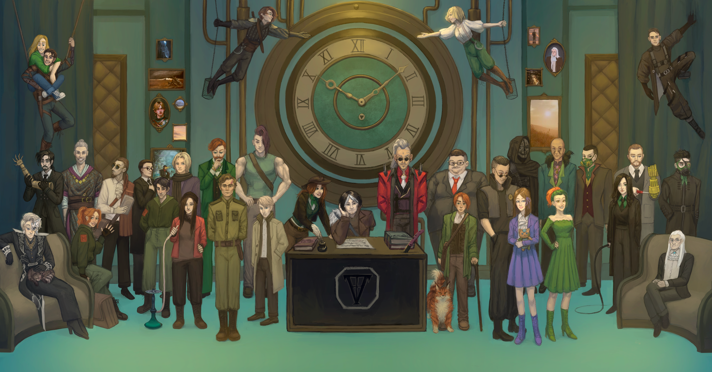

<link rel="stylesheet" href="style.css">

<nav class="navbar">
  <a href="start.html">Введение</a>
  <a href="SistemaVT.html">Основы игровой системы</a>
  <a href="Homerules.html">Правила «Тишины»</a>
  <a href="Game-Master-Code-of-Conduct.html">Кодекс Мастеров</a>
  <a href="Project-Organization.html">Организация проекта</a>
</nav>

[Основы игровой системы](SistemaVT.md) → → Описание Агентства

---

# Описание Агентства

Если вы читаете это, скорее всего, вы уже знаете главное: **«Тишина» - это агентство наёмников широкого профиля**.

Формально всё выглядит гораздо приличнее. «Тишина» занимается частным сыском и даже располагает официальными документами частных сыщиков. Благодаря этому перед Агентством открыты многие двери: можно обращаться к определённым архивам, получать доступ к некоторой ограниченной информации и официально заниматься тем, что в противном случае потребовало бы куда больше усилий.

Но это только то, что написано на бумаге.

На деле «Тишина» готова взяться практически за любой заказ, если найдётся человек, готовый за него заплатить. Иногда это расследование, иногда охрана, поиск человека или предмета, иногда - нечто такое, о чём лучше не рассказывать вслух. 

Закон в подобных вопросах оказывается скорее ориентиром, чем непреодолимой границей. Связи Агентства в чиновничьих кругах позволяют ему закрывать глаза на некоторые нарушения закона своих клиентов и агентов, а некоторым должностным лицам - закрывать глаза на деятельность самого Агентства.

Именно поэтому «Тишина» остаётся Агентством частного сыска - по крайней мере, официально.

---

<table class="simple-table center-all-table">

    <tr>
        <td class="center">
            
        </td>
    </tr>

</table>

Девиз агентства: **"Ваши тайны - наша репутация"**

---
<h2>Краткая история агентства</h2>

«Тишина» появилась в канун Великого праздника 75 года. У Агентства не было ни огромного капитала, ни какого-либо особого положения. Зато у него были люди, готовые помочь с самого начала.

Тремя главными покровителями молодой «Тишины» стали известная художница и меценатка Люцина Грифич, успешный предприниматель Вульпес Культро и Большая Семья - полулегальная организация и известная община степняков, обосновавшихся в Столице.

С тех пор прошло немало времени. Агентство пережило достаточно событий, чтобы о нём узнали далеко за пределами собственного кольца. Его успех оказался неожиданно стремительным: пускай сегодня «Тишина» остаётся организацией не самого высокого ранга, но при этом уже считается одной из наиболее известных и влиятельных среди Агентств Четвёртого кольца.

---

<h2>Где находится «Тишина»</h2> 

Штаб Агентства расположен в Четвёртом кольце, в Четвёртом радиусе, на Четырнадцатом ярусе. 

Впрочем, заказы агенство посещают представители самых разных Колец, и довольно часто выполнение задания требует отправиться в другое Кольцо. В исключительных случаях путь может привести даже за пределы города - в Степь.

Само Агентство за эти годы стало гораздо большим, чем место, где выдают задания. Здесь есть комнаты для работы, отдыха и лечения, места для хранения имущества, помещения для содержания пленных _(да, это незаконно)_ и множество других специализированных пространств. 

Здесь можно переночевать, если возвращаться домой слишком поздно _(или слишком опасно?)_, хотя большинство агентов всё же предпочитает собственные квартиры.

В Агентстве работают не только агенты. Здесь есть координаторы, которые связывают клиентов с исполнителями и следят за необходимыми документами и условиями заказов. Есть связные, работающие на акустонах и направляющие звонки. Есть охранники, уборщики, консьержи, сотрудники медпункта и множество других людей, без которых вся эта система просто не смогла бы работать.

---

<h2>Кто такой Фауст?</h2> 

Юридически владельцем «Тишины» является человек по имени "Немой" Фауст. И, пожалуй, это всё, что мы можем сказать о нём с уверенностью.

Никто из сотрудников Агентства толком не знает, как он выглядит. Фауст никогда не показывается работникам «Тишины», а когда-то связь с ним поддерживалась через специальный акустон, доступный координаторам Агентства. Несколько последних лет, однако, даже этот канал недоступен, Фауст перестал отвечать на сообщения.

О Фаусте ходят самые разные слухи. Говорят, что когда-то он обменял собственный голос на «Тишину». Некоторые утверждают, что за этим стоял договор с некой оккультной сущностью. Кто-то рассказывает совсем другие истории. Ни одну из них мы не можем подтвердить.

Но юридически именно Немой Фауст всё ещё остаётся владельцем Агентства.

---

<h2>Контролёр и исполнительный руководитель</h2> 

После вспышки Янтарной болезни, охватившей Четвёртое Кольцо, на «Тишину» впервые обратило серьёзное внимание правительство.

Причина была довольно странной. В ходе непонятных для правительства событий, связанных с Агентством, его представители помогли найти лекарство от болезни, которая до этого казалась практически неразрешимой проблемой.

После этого к «Тишине» был приставлен правительственный чиновник по имени **Симон Яклер**.

  

Некоторые полагали, что под видом "государственного контроля" скрыто желание чиновника закрыть агенство в связи с многочисленными нарушениями закона, в которых уже успело провиниться Агентство. Однако вместо этого Симон возглавил «Тишину» в качестве её исполнительного руководителя.   У Яклера достаточно связей, чтобы закрывать перед Агентством многие юридические вопросы - или, наоборот, открывать те двери, которые обычно были бы для него недоступны. И он не делает это бесплатно. Симон получает собственную выгоду от существования «Тишины», а «Тишина» получает человека, способного решать проблемы с законом.  Так возникло довольно странное, но устойчивое равновесие.

---

<h2>Защита</h2>

За годы своего существования Агентство пережило не один штурм и не одно серьёзное столкновение. Поэтому его безопасность - не формальность.

В здании есть ловушки, укрепления и другие системы защиты, которые могут быть приведены в действие в случае нападения. Никто не хочет повторения старых историй, поэтому к безопасности здесь относятся достаточно серьёзно.

  

Хотя есть  и такие вещи, которые нельзя обьяснить рационально. В гостиной «Тишины» висит портрет <strong>Анастаса </strong> - первого агента, погибшего при выполнении задания. Некоторые агенты утверждают, что рядом с этим портретом они чувствуют себя иначе.   По агентству ходит слух, что Анастас не "до конца умер". Говорят, что он всё ещё защищает Агентство - только теперь уже каким-то мистическим образом.  Впрочем, мы не уверены, что это правда.

---

<h2>«Тишина» и её агенты</h2>

У Агентства есть ещё одна особенность, которую довольно быстро замечает каждый новый сотрудник: «Тишина» готова помогать своим.

Если у агента возникли проблемы с законом, Агентство может попытаться прикрыть его - разумеется, если дело не настолько серьёзное, что вмешательство становится невозможным. У некоторых людей именно это стало причиной вступления в «Тишину».

Кто-то пришёл сюда, чтобы спрятаться от старой жизни, кто-то - прячется от долгов, а кто-то - прячется от закона. Иные просто хотят получить возможность начать всё заново. «Тишина» может дать такую возможность. Но взамен она ждёт лояльности.

Агентство способно многое простить своим людям. Оно может закрыть глаза на ошибки, помочь выбраться из неприятностей и даже дать человеку второй шанс.

Предательство - другое дело. Те, кто сознательно обращается против «Тишины», причиняет ей серьёзный вред или предаёт оказанное доверие, рано или поздно сталкиваются с обратной стороной этой организации. В таких случаях Агентство действует так же, как и другие влиятельные силы Столицы, - жёстко и без лишних сантиментов.

Помните, что «Тишина» существует потому, что люди внутри неё умеют держаться друг за друга. 

И пока это работает, у Агентства есть будущее.

---

<a href="SistemaVT.html" class="button">← Назад к Игровой системе</a>

