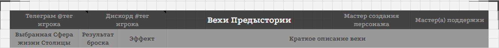
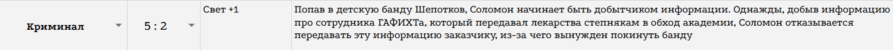

<link rel="stylesheet" href="style.css">

<nav class="navbar">
  <a href="index.html">Главная</a>
  <a href="SistemaVT.html">Игровая система</a>
  <a href="Homerules.html">Домашние правила</a>
</nav>
[Главная](index.md) → [Домашние правила](Homerules.md) → Лист Персонажа(Character-Sheet.md) → Вкладка "Предыстория" в Листе Персонажа

# Вкладка "Предыстория" в Листе Персонажа

**«Предыстория»** - страница, предназначенная для хранения истории вашего персонажа и информации, связанной с его созданием.

В верхней части страницы находятся 10 важных правил и принципов создания персонажа. Они помогают определить основные подходы к созданию героя - например, принципы «Агенты средней руки» и «Вы - владелец вашей истории». Перед созданием персонажа рекомендуется внимательно ознакомиться с ними.

---

<h2>Контактная информация</h2> 

<table class="simple-table center-all-table">

    <tr>
        <td class="center">
            
        </td>
    </tr>

</table>

Слева от надписи «Вехи Предыстории» расположены поля для вашего Telegram и Discord. Они нужны для того, чтобы Мастерам проекта было проще связаться с вами.

Указывать эти данные необязательно. Если вы не хотите размещать свои контакты в чарлисте, можете оставить эти поля пустыми.

Справа от надписи «Вехи Предыстории» указаны Ведущий Мастер и, если он есть, Мастер поддержки, принимавшие участие в создании вашего персонажа.

Если в дальнейшем вам понадобится что-то вспомнить о процессе создания персонажа, вы можете обратиться к этим Мастерам: вместе с ними можно восстановить забытые детали, уточнить договорённости или прояснить отдельные моменты предыстории.

---

<h2>Вехи Предыстории</h2> 

Ниже находятся Вехи Предыстории - важные события, из которых складывается предыстория вашего персонажа.

При создании персонажа необходимо заполнить пять Вех.

<table class="simple-table center-all-table">

    <tr>
        <td class="center">
            
        </td>
    </tr>

</table>

Пример заполненной Вехи Персонажа

Каждая Веха содержит:

  •  **Сферу** - область, с которой связана данная часть предыстории;
  
  •  **Результат броска** - выпавший при создании Вехи результат;
  
  •  **Игромеханические бонусы** - полученные персонажем преимущества, указанные в краткой форме;
  
  •  **Описание Вехи** - краткое описание произошедшего. Старайтесь уместить его в пару предложений, оставив только основную суть события.

В дальнейшем, при переходе персонажа на статусы Профессионала и Эксперта, у вас появится возможность пройти ещё две Вехи по тому же принципу.

Для создания этих Вех вы можете обратиться к любому подходящему Мастеру проекта, созвониться или списаться с ним и вместе обсудить события - примерно так же, как это происходило при первоначальной генерации персонажа.

---

<h2>Карточка персонажа</h2> 

Ниже Вех находится Карточка Персонажа. В отличие от Вех Предыстории, **заполнение Карточки Персонажа не является обязательным**. Это дополнительный инструмент для тех, кто хочет глубже проработать своего персонажа, лучше погрузиться в его образ или подробнее познакомить с ним Мастеров и других игроков.

Здесь можно указать, например, физические характеристики персонажа, долговременные цели, черты характера, ценности и многое другое.

Заполняйте эти поля настолько подробно, насколько вам самому хочется. Здесь нет необходимости создавать исчерпывающую биографию - достаточно тех деталей, которые помогают вам лучше понимать и отыгрывать своего персонажа.

**Темы**

Отдельное место в Карточке Персонажа занимают Темы.

Тема - это одно из главных направлений истории вашего персонажа. Это одновременно подсказка для Мастера и напоминание для вас самого о том, какие идеи, конфликты или мотивы особенно важны для героя.

Чтобы добавить Тему, замените «Тема Х» на её название, а рядом разместите более подробное описание.

Например:

**Наследие отца**: Мой отец был важным человеком в структуре Академий, и все ожидают от меня того же. Куда бы я ни пошёл - я всё больше чувствую его. Может, меня на самом деле и вовсе нет?

Тема не обязана описывать конкретное событие. Она может быть связана с внутренним конфликтом персонажа, его отношениями с другими людьми, жизненными обстоятельствами или идеей, которую вы хотите исследовать через его историю.

**Заметки**

Графу «Заметки» можно использовать по своему усмотрению.

Здесь можно хранить любые сведения, которые помогают вам помнить детали персонажа: идеи, наблюдения, небольшие факты, задумки для будущего развития или что-либо ещё.

**Детальное описание Вех**

В нижней части страницы находятся графы «Детальное описание Вех».

Если краткого описания в самой Вехе недостаточно, здесь вы можете подробно расписать каждую из них: описать обстоятельства события, участвовавших в нём людей, важные детали, последствия и любые другие сведения, которые считаете значимыми.

Таким образом, сама Веха содержит краткую и удобную для быстрого просмотра информацию, а её детальное описание позволяет сохранить полную историю события и вернуться к ней спустя время.

---

<h2>Что обязательно заполнять</h2> 

Обязательной для заполнения является информация, связанная непосредственно с Вехами Предыстории и созданием персонажа.

Карточка Персонажа, Темы, Заметки и Детальное описание Вех являются дополнительными инструментами и заполняются **по желанию игрока**.

Необязательно подробно расписывать персонажа только потому, что для этого существуют соответствующие поля. Однако если вам хочется глубже погрузиться в героя, раскрыть его характер, познакомить с ним других участников или просто лучше понять его самому - эта часть чарлиста создана именно для этого.

---

<a href="SistemaVT.html" class="button">← Назад к Игровой системе</a>

