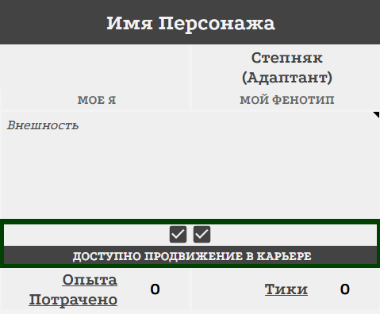
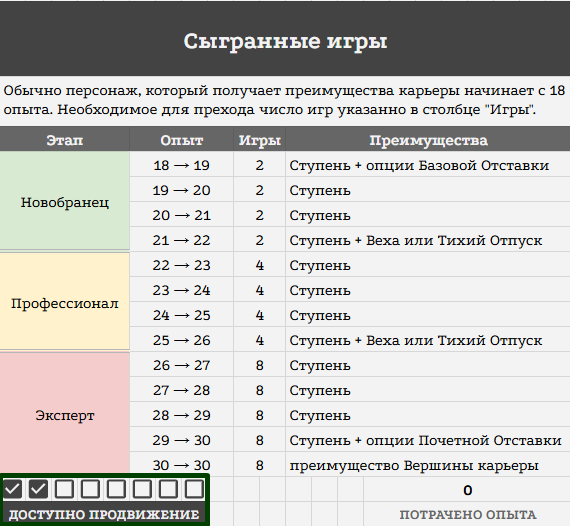
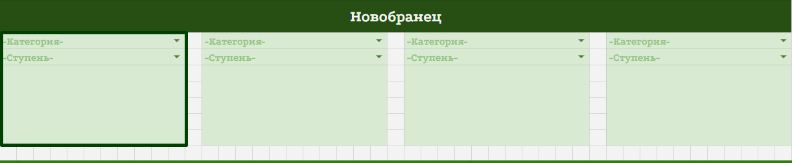
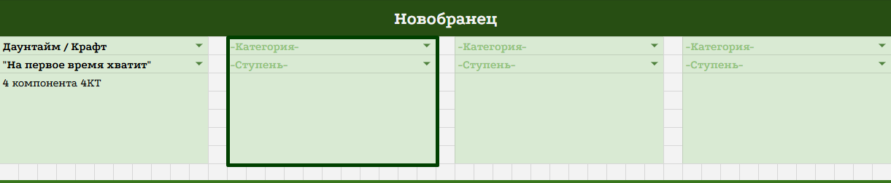
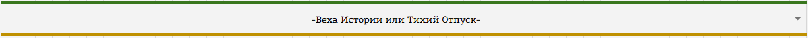
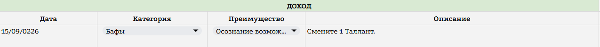
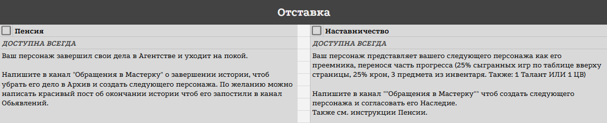
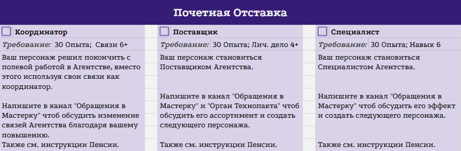

<link rel="stylesheet" href="style.css">

<nav class="navbar">
  <a href="start.html">Старт</a>
  <a href="SistemaVT.html">Основы игровой системы</a>
  <a href="Homerules.html">Правила «Тишины»</a>
  <a href="Game-Master-Code-of-Conduct.html">Кодекс Мастеров</a>
  <a href="Project-Organization.html">Организация проекта</a>
</nav>

[Главная](index.md) → [Домашние правила](Homerules.md) → [Лист Персонажа](Character-Sheet.md) → Вкладка «Карьера и Вершина Карьеры»

---

# Вкладка «Карьера и Вершина Карьеры»

<h2>Карьера</h2>

Вкладка «Карьера» содержит небольшой интерфейс, через который вы отслеживаете продвижение персонажа по карьерной лестнице и получаете привилегии, связанные с ростом его звания и опыта во время службы в Агентстве.

---

<h2>Звания агентов</h2>

Прогресс персонажа в Агентстве определяется его **званием**, которое зависит от количества накопленного опыта.

  •  **Новобранец** - менее 23 опыта. Для перехода на следующий уровень необходимо сыграть 2 игры.
  
  •  **Профессионал** - 23–27 опыта. Для перехода на следующий уровень необходимо сыграть 4 игры.
  
  •  **Эксперт** - 28–30 опыта. Для перехода на следующий уровень необходимо сыграть 8 игр. 

Каждый раз, когда персонаж достигает нового уровня и получает новое очко опыта, ему открывается возможность выбрать дополнительный игротехнический бонус.

---

<h2>Продвижение по карьерной лестнице</h2>

<table class="simple-table center-all-table">

    <colgroup>
        <col style="width:50%;">
        <col style="width:50%;">
    </colgroup>
    
    <tr>
        <td class="center">
            
        </td>

        <td class="center">
            
        </td>
    </tr>

</table>

Когда во вкладке «Дело» вы отмечаете сыгранные игры, в определённый момент вы закрываете необходимый кап. После этого в чарлисте появляется подсказка «Доступно продвижение», которая означает, что во вкладке «Карьера» вы можете получить новый карьерный бонус.

Для оформления продвижения в таблице Карьеры выполните следующие действия:

**Шаг 1**. В первой свободной верхней левой ячейке выберите необходимую Категорию.

**Шаг 2.** В ячейке «Ступень», расположенной сразу под ней, выберите бонус, который хотели бы получить.

<table class="simple-table center-all-table">

    <tr>
        <td class="center">
            
        </td>
    </tr>
    <tr>
        <td class="center">
            
        </td>
    </tr>

</table>

**Шаг 3.** Измените количество опыта персонажа:

  •  если ваш текущий опыт меньше 30, добавьте 1 пункт опыта в любой из блоков навыков на вкладке «Дело»;
  
  •  если ваш опыт уже равен 30, вместо получения нового пункта опыта выбирете бонус из вкладки «Вершина Карьеры» (Об этом ниже)
  
**Шаг 4.** После этого очистите все отмеченные сыгранные игры на вкладке «Дело». Подсказка «Доступно продвижение» изменится на «Сыгранно игр», и персонаж снова начнёт накапливать необходимое количество сыгранных игр для следующего продвижения.

Таким образом, каждая ступень карьерного развития связана с новым этапом накопления сыгранных игр и последующим получением очередного преимущества.

<h2>Веха или Тихий отпуск</h2> 

<table class="simple-table center-all-table">

    <tr>
        <td class="center">
            
        </td>
    </tr>

</table>

Когда вы получаете все ступени Новобранца или все ступени Профессионала, персонаж получает возможность пройти дополнительную Веху Предыстории.

Механика полностью аналогична созданию персонажа: вы находите свободного Мастера, вместе с ним проводите необходимые броски и на их основе создаёте событие из жизни персонажа.

Дополнительная Веха происходит между партиями, уже после того, как персонаж стал действующим агентом. Вместе с самой историей вы получаете все предусмотренные результатом броска игровые преимущества - в том числе Знания, Связи и игромеханические бонусы.

Однако Веха может принести не только положительные последствия. Если вы не хотите испытывать судьбу и получать возможные негативные результаты, вместо броска можно выбрать Тихий отпуск.

В этом случае персонаж просто некоторое время отдыхает от службы. Никаких особенных событий с ним не происходит, и дополнительная Веха не создаётся.

---

<h2> Особенности звания «Новобранец»</h2>

Персонажам со званием Новобранец предоставляется сниженная стоимость восстановления (25 крон, вместо 50). Кроме того, они получают возможность перераспределять свои пункты опыта между партиями. Это позволяет постепенно определить, какие навыки действительно подходят вашему персонажу, по какому пути вы хотите развиваться и какие направления развития вам наиболее интересны.

После получения звания Профессионала возможность перераспределять опыт закрывается. К этому моменту предполагается, что игрок уже достаточно хорошо знаком с системой и определился с основным направлением развития своего персонажа.

Вместе с тем, Новобранцы также могут заменять выбранные Таланты на другие, причём для этого им не требуется тратить 6 Тиков на использование механики «Комната тренировок».

Это правило введено специально для новых игроков. В первые партии ещё сложно заранее понять, насколько выбранный Талант подходит именно вашему персонажу и стилю игры. Возможность быстро заменить его позволяет попробовать разные механики, освоиться с системой и без серьёзных затрат отказаться от решения, которое впоследствии оказалось неудачным или просто перестало вам нравиться.

Таким образом, система развития постепенно переходит от свободы экспериментов к более осознанному и окончательному развитию персонажа: Новобранец может пробовать разные варианты, Профессионал - корректировать выбранный путь и развивать сформировавшегося персонажа.

---

<h2>Максимальный уровень и вкладка «Вершина Карьеры»</h2>

Когда вы получаете все ступени Эксперта, персонаж достигает вершины своего основного карьерного развития в Агентстве. 

После этого развитие не прекращается. За каждые 8 сыгранных игр вы можете получить одну из привилегий Вершины карьеры. Для этого укажите дату получения, выберите соответствующую Категорию и получите преимущество, предусмотренное выбранной привилегией. 

<table class="simple-table center-all-table">

    <tr>
        <td class="center">
            
        </td>
    </tr>

</table>

При этом действует тот же принцип, что и при обычном карьерном продвижении: необходимо последовательно пройти все Категории, формируя таким образом повторяющийся цикл. Нельзя постоянно выбирать одну и ту же категорию, пропуская остальные.

Вершина карьеры отражает положение заслуженного ветерана «Тишины». Персонаж уже не получает новых уровней развития, но его опыт и положение в Агентстве продолжают приносить ему небольшие, но приятные преимущества. Вы можете продолжать играть этим персонажем сколько вам угодно.

Также этом этапе персонаж также может завершить свою полевую карьеру и выбрать один из вариантов **Почётной отставки**, продолжив сотрудничество с Агентством уже в другом качестве.

---

<h2>Отставка</h2>

Персонаж в любой момент может завершить свой путь в качестве агента и уйти из «Тишины». Отставка не обязательно означает конец его истории: персонаж может продолжить существовать в мире и сохранять связь с Агентством.

<table class="simple-table center-all-table">

    <tr>
        <td class="center">
            
        </td>
    </tr>

</table>

---

<h2>Почётная отставка</h2>

Почётная отставка - это завершение полевой карьеры, при котором персонаж не покидает «Тишину», а продолжает сотрудничать с Агентством в новом качестве. В зависимости от своего опыта он может стать Координатором, Поставщиком или Специалистом Агентства. Важно: в отличие от Пенсии и Наставничества, **варианты Почётной отставки требуют выполнения указанных в чарнике условий**.

<table class="simple-table center-all-table">

    <tr>
        <td class="center">
            
        </td>
    </tr>

</table>

Таким образом, карьерный путь персонажа может продолжаться даже после завершения полевой службы: он может уйти на покой, передать часть своего наследия следующему поколению агентов или остаться частью «Тишины» уже в качестве Координатора, Поставщика или Специалиста.

---

<a href="SistemaVT.html" class="button">← Назад к Игровой системе</a>

