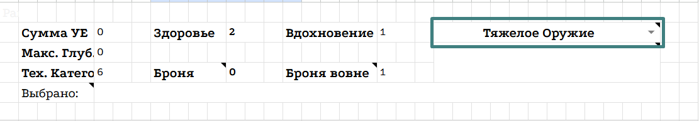

<link rel="stylesheet" href="style.css">

<nav class="navbar">
  <a href="start.html">Введение</a>
  <a href="SistemaVT.html">Основы игровой системы</a>
  <a href="Homerules.html">Правила «Тишины»</a>
  <a href="Game-Master-Code-of-Conduct.html">Кодекс Мастеров</a>
  <a href="Project-Organization.html">Организация проекта</a>
</nav>

[Основы игровой системы](SistemaVT.md) → [Лист Персонажа](Character-Sheet.md) → Вкладка «Калькулятор Крафта»

---

# Вкладка «Калькулятор Крафта»

**«Крафт-Калькулятор»** создан для того, чтобы упростить работу с нашей системой Создания предметов. Здесь всегда содержится актуальная информация о свойствах создаваемых предметов, а сам калькулятор автоматически рассчитывает множество связанных с ними характеристик.

Создание предметов - это углублённая механика нашей системы. Если вы читаете правила впервые, скорее всего, вы пока ещё не знакомы с принципами её работы. В таком случае не обязательно разбираться с калькулятором прямо сейчас: вы сможете вернуться к этой странице позже, когда познакомитесь с механикой крафта.

Подробнее о Создании предметов можно в будущем прочитать в разделе „Правила «Тишины»“ в главе <a href="https://theagencyofsilence.github.io/knowledge-archive/items-creation.html">«Процесс создания предметов»</a>.

---

<h2>Категория предмета</h2>

В первую очередь выберите Категорию создаваемого предмета в правом верхнем углу.

<table class="simple-table center-all-table">

    <tr>
        <td class="center">
            
        </td>
    </tr>

</table>

Каждая Категория имеет собственный набор доступных свойств, поэтому именно с неё начинается настройка будущего предмета.

---

<h2>Свойства</h2>

После выбора Категории вы можете добавить необходимые свойства, нажимая на соответствующие пункты.

  
Помните, что свойства влияют на стоимость и сложность создания предмета:
 
  
• каждое позитивное свойство увеличивает количество необходимых УЕ и Вдохновения;
 
  
• каждое негативное свойство, наоборот, уменьшает их количество.
 
  
• Робин Гуд из мифологии Британии

  
Крафт-Калькулятор автоматически рассчитывает итоговые показатели создаваемого предмета, в том числе:
 
  
• количество <strong>УЕ</strong> предмета;
 
  
• количество необходимого <strong>Вдохновения</strong>;
 
  
• <strong>Категорию Технопакта</strong>;
 
  
• количество <strong>Здоровья</strong> предмета;
 
  
• значение его <strong>Брони</strong>.

Если предмет создаётся вне Агентства, то есть без использования нашей Мастерской, его Броня автоматически увеличивается на 1. Это также отдельно отображается в ячейке «Броня вовне».

---

<h2>Глубина свойств</h2>

Некоторые свойства не имеют глубины - в таком случае напротив них есть лишь один пункт.

Другие свойства имеют несколько уровней глубины. Если свойство обладает глубиной, вы можете выбрать её значение, нажав на соответствующее количество пунктов рядом с названием свойства.

Чем больше глубина свойства, тем сильнее оно влияет на характеристики предмета и тем больше УЕ потребуется для его создания.

Все связанные с глубиной изменения Крафт-Калькулятор учитывает автоматически.

---

<a href="SistemaVT.html" class="button">← Назад к Игровой системе</a>

