<link rel="stylesheet" href="style.css">

<nav class="navbar">
  <a href="index.html">Главная</a>
  <a href="SistemaVT.html">Игровая система</a>
  <a href="Homerules.html">Домашние правила</a>
</nav>
[Главная](index.md) → [Домашние правила](Homerules.md) → Вкладка "Дело"

# Вкладка "Дело"

**«Дело»** - основная страница вашего Листа Персонажа. Здесь собрана ключевая информация о вашем персонаже, а также основные счётчики, связанные с его развитием и участием в игре.

---

<h2>Изображение и основные сведения</h2> 

В правом верхнем углу находится место для изображения вашего персонажа. Чтобы добавить изображение, выберите нужную ячейку, затем в верхней панели нажмите «Вставка» → «Изображение» → «Вставить изображение в таблицу».

<table class="simple-table image-text-table">

    <colgroup>
        <col style="width:50%;">
        <col style="width:50%;">
    </colgroup>

    <!-- Строка 1 -->
    <tr>
        <td class="image-cell">
            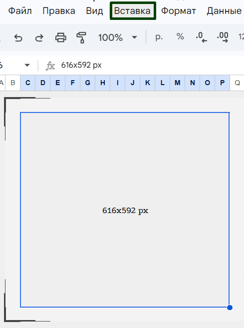
        </td>

        <td class="image-cell">
            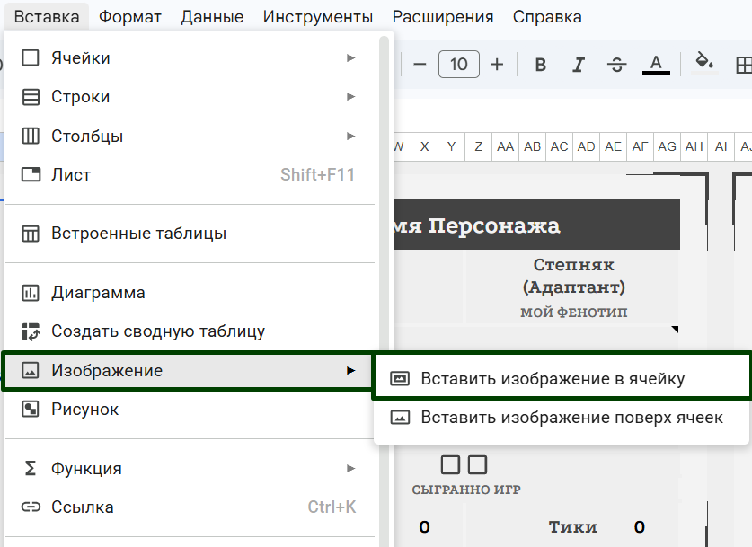
        </td>
    </tr>

</table>

Рядом расположены основные сведения о персонаже: имя и внешность. Заполните соответствующие поля информацией о своём герое.

---

<h2>Графа «Я»</h2> 

<table class="simple-table image-text-table">

    <colgroup>
        <col style="width:50%;">
        <col style="width:50%;">
    </colgroup>

    <!-- Строка 1 -->
    <tr>
        <td class="text-cell">
            Обратите внимание на графу <strong>"Я"</strong>, расположенную под именем. Это необязательный, но очень атмосферный элемент листа персонажа. Ваше «Я» - это короткое описание того, как персонаж воспринимает самого себя, его самоощущение и самоидентификация.  Постарайтесь придумать небольшое словосочетание, которое, по вашему мнению, лучше всего передаёт суть персонажа. Это не обязательно должно быть буквальное описание - наоборот, здесь особенно хорошо работают метафоры, парадоксы и неожиданные словосочетания. 
        </td>

        <td class="image-cell">
            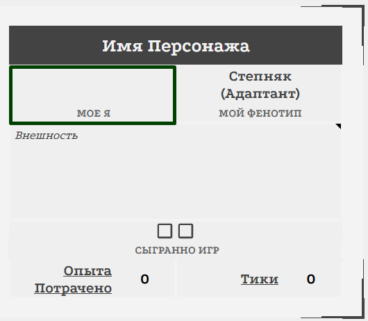
        </td>
    </tr>

</table>

  
<strong>Примеры:</strong>
  
  
 • Добродетель с ножом
 
  
 • Ваша серость
 
  
 • Из грязи в князи
 
  
 • Губительная правда
 
  
 • Актриса на замену
 
  
 • Детское любопытство
 
  
 • Угасший очаг
 
  
 • Голос разума на полставки
 
  
 • Искатель тайных троп
 
  
 • Чистый лист
 
  
 • Ни туды ни сюды
 
  
 • Быстрее ветра
 
  
 • Дважды предатель
 
  
 • Вор на колёсах - во всех смыслах!
 
  
 • Чистое сердце - кровавые руки

Не воспринимайте эту графу как ещё одно обязательное поле анкеты. Это небольшая возможность сформулировать персонажа в одной фразе - так, как он сам мог бы рассказать о себе.

---

<h2>Сыгранные игры</h2>

<table class="simple-table image-text-table">

    <colgroup>
        <col style="width:50%;">
        <col style="width:50%;">
    </colgroup>

    <!-- Строка 1 -->
    <tr>
        <td class="text-cell">
            Ниже находится счётчик «Сыгранные игры».  После каждой партии отмечайте одну сыгранную игру. Когда необходимое количество игр будет отмечено, персонаж получает новый уровень и соответствующий игромеханический бонус.
        </td>

        <td class="image-cell">
            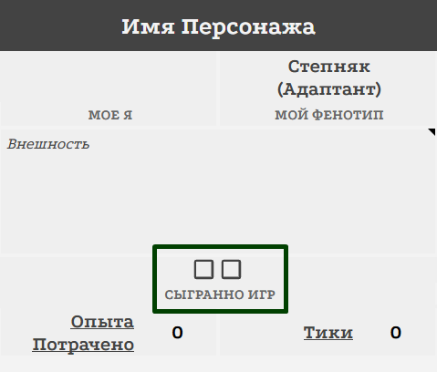
        </td>
    </tr>

</table>

Подробнее о системе уровней, званиях и развитии персонажа можно прочитать в главе <a href="https://theagencyofsilence.github.io/knowledge-archive/Char-Career.html">«Карьера и Вершина карьеры»</a>. 

---

<h2>Опыт</h2>

<table class="simple-table image-text-table">

    <colgroup>
        <col style="width:50%;">
        <col style="width:50%;">
    </colgroup>

    <!-- Строка 1 -->
    <tr>
        <td class="text-cell">
            Рядом находится счётчик потраченного опыта.  Вам не нужно самостоятельно подсчитывать количество вложенных пунктов опыта - счётчик делает это автоматически.  Обратите внимание: для столичников и полукровок первые пункты опыта являются бесплатными и поэтому не учитываются этим счётчиком как потраченный опыт.
        </td>

        <td class="image-cell">
            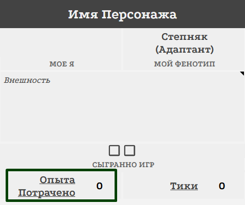
        </td>
    </tr>

</table>

---

<h2>Тики</h2>

<table class="simple-table image-text-table">

    <colgroup>
        <col style="width:50%;">
        <col style="width:50%;">
    </colgroup>

    <!-- Строка 1 -->
    <tr>
        <td class="text-cell">
            Здесь же расположен счётчик доступных Тиков.  Тики используются для различных действий между игровыми сессиями: восстановления, Инициатив, и других занятий персонажа в свободное время.
        </td>

        <td class="image-cell">
            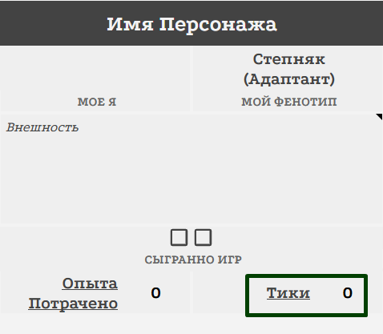
        </td>
    </tr>

</table>

Подробнее о том, что такое Тики и как ими пользоваться, можно прочитать в главе <a href="https://theagencyofsilence.github.io/knowledge-archive/Downtime.html">«Инициативы, Возможности и свободное время» (Даунтайм)</a>.

---

<h2>Блоки навыков</h2> 

Ниже расположены четыре блока навыков. Здесь вы распределяете начальный опыт, а в дальнейшем - весь новый опыт, который получает ваш персонаж.

Подробнее о самих навыках и правилах их использования можно прочитать в разделе <a href="https://theagencyofsilence.github.io/knowledge-archive/3-skills.html">«Навыки»</a>. 

---

<h2>Навыки</h2>

У каждого навыка есть дополнительное пояснение. Чтобы открыть его, нажмите на соответствующую ячейку - появится вкладка с информацией о навыке и его применении.

Обратите внимание на столбик "Б/Ш" рядом с навыками. Они предназначены для учёта Бонусов и Штрафов, которые персонаж может получать из различных источников.

Если Бонус или Штраф распространяется на какой-то, указывайте его именно в этой графе. 

<table class="simple-table image-text-table">

    <colgroup>
        <col style="width:50%;">
        <col style="width:50%;">
    </colgroup>

    <!-- Строка 1 -->
    <tr>
        <td class="text-cell">
            Совет 1: делайте это по такому принципу - сначала пишите цифру модификатора, а потом символ - плюс или минус. Если сначала запишите + или -, тогда ячейка начнет считывать это как формулу, что вам не нужно. Пример правильного написания: Рукопашный бой [2+].
        </td>

        <td class="image-cell">
            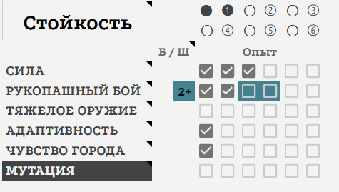
        </td>
    </tr>
    <!-- Строка 2 -->
    <tr>
        <td class="text-cell">
            Совет 2: отметьте цветом слабого оттенка плюсы или минусы к вашим навыкам. 
        </td>

        <td class="image-cell">
            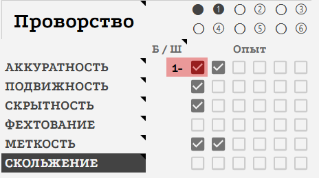
        </td>
    </tr>

</table>

---

<h2>Здоровье и Рассудок</h2>

<table class="simple-table image-text-table">

    <colgroup>
        <col style="width:50%;">
        <col style="width:50%;">
    </colgroup>

    <!-- Строка 1 -->
    <tr>
        <td class="text-cell">
            Под показателем Здоровья находится символ щитка. Он обозначает уровень Брони, надетой на персонаже.  Для агентов «Тишины» доступна Броня первого или второго уровня.   При этом Броню второго уровня уже невозможно скрыть под обычной одеждой.  Если по каким-либо причинам персонаж получил игромеханическую ментальную Броню, её можно отметить рядом с символом щитка под показателем Рассудка.
        </td>

        <td class="image-cell">
            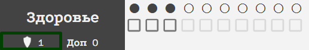
        </td>
    </tr>
    <!-- Строка 2 -->
    <tr>
        <td class="text-cell">
            Рядом с Здоровьем  и Рассудком также находится графа «Доп.». Используйте её, если персонаж получил дополнительное Здоровье или Рассудок из какого-либо источника.
        </td>

        <td class="image-cell">
            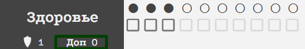
        </td>
    </tr>

</table>

---

<h2>Кризисы</h2>

<table class="simple-table image-text-table">

    <colgroup>
        <col style="width:50%;">
        <col style="width:50%;">
    </colgroup>

    <!-- Строка 1 -->
    <tr>
        <td class="text-cell">
            Обратите внимание на графу «Кризис», а также расположенный под ней показатель «Макс.».  Это автоматический счётчик, который определяет, сколько Кризисов потенциально способен вынести ваш персонаж. Вам не требуется рассчитывать это значение самостоятельно.
        </td>

        <td class="image-cell">
            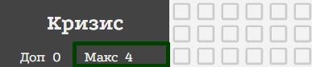
        </td>
    </tr>

</table>

Подробнее про <a href="https://theagencyofsilence.github.io/knowledge-archive/life-stats.html"> Здоровье, Рассудок и Кризисы</a>.

---

<h2>Травмы и Безумия</h2>

Ниже расположены блоки Травм и Безумий.

**Травмы**

<table class="simple-table image-text-table">

    <colgroup>
        <col style="width:50%;">
        <col style="width:50%;">
    </colgroup>

    <!-- Строка 1 -->
    <tr>
        <td class="text-cell">
            В блоке Травм укажите глубину каждой Травмы, выберите её тип и кратко опишите полученное повреждение.  Если стандартного размера ячейки недостаточно для описания Травмы, вы можете воспользоваться вкладкой ячейки, чтобы разместить там более подробную информацию.
        </td>

        <td class="image-cell">
            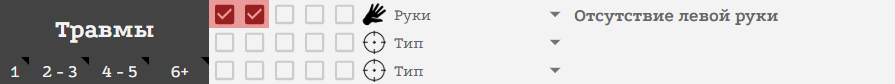
        </td>
    </tr>

</table>

Подробнее о правилах и последствиях <a href="https://theagencyofsilence.github.io/knowledge-archive/health-crisis.html">Травм</a>.

**Безумия**

<table class="simple-table image-text-table">

    <colgroup>
        <col style="width:50%;">
        <col style="width:50%;">
    </colgroup>

    <!-- Строка 1 -->
    <tr>
        <td class="text-cell">
            В блоке Безумий укажите суть вашей императивной установки - то внутреннее правило или побуждение, которое теперь влияет на поведение персонажа.  Если места в ячейке недостаточно, используйте вкладку ячейки для более подробного описания.
        </td>

        <td class="image-cell">
            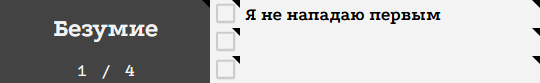
        </td>
    </tr>
    <!-- Строка 2 -->
    <tr>
        <td class="text-cell">
            Рядом с Безумиями находятся нажимаемые ячейки, которые можно отмечать каждый раз, когда вы воспользовались соответствующим перебросом.  Не забывайте "сбрасывать" ячейки, которые вы прожали во время игры после её окончания.
        </td>

        <td class="image-cell">
            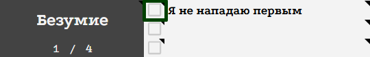
        </td>
    </tr>

</table>

Подробнее о правилах императивных установках и связанных с ними перебросах можно прочитать в разделе <a href="https://theagencyofsilence.github.io/knowledge-archive/madness.html">«Безумие»</a>.

---

<h2>Показатели Персонажа</h2>

Ниже представлены Жизненные Показатели и другие важные показатели вашего персонажа.

<table class="simple-table center-all-table">

    <tr>
        <td class="center">
            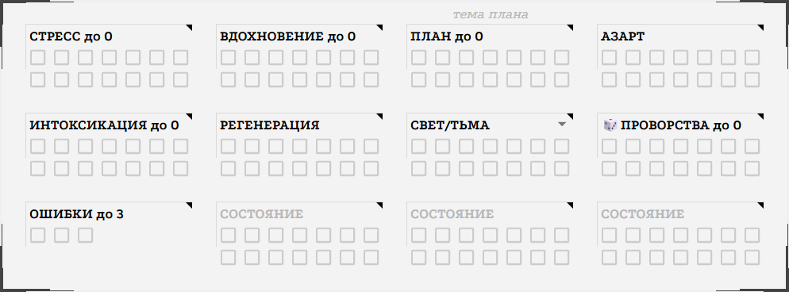
        </td>
    </tr>

</table>

Большинство счётчиков в этом разделе рассчитываются автоматически. Например, при увеличении количества пунктов опыта в блоке Разум автоматически изменяются ваш пул Стресса и его максимальное значение. Подобным образом автоматически рассчитываются показатели Вдохновения, Плана, Интоксикации и Проворства.

**Азарт** вы отмечаете самостоятельно, когда Мастер сообщает вам о необходимости получить определённое количество его пунктов. Помните, что весь накопленный Азарт теряется в конце сцены. Подробнее о нём можно прочитать в разделе <a href="https://theagencyofsilence.github.io/knowledge-archive/life-stats-and-how-to-play.html">«Состояния персонажа и как с ними играть»</a>.

**Свет/Тьма** также отмечаются по указанию Мастера. Подробнее эта механика описана в разделе <a href="https://theagencyofsilence.github.io/knowledge-archive/umbra.html">«Морок»</a>.

**Пункты Регенерации** вы чаще всего получаете в результате успешного лечения у медиков или применения соответствующих медицинских препаратов. Их количество необходимо отслеживать самостоятельно. Подробнее о Регенерации и правилах восстановления можно прочитать в разделе <a href="https://theagencyofsilence.github.io/knowledge-archive/Recovery-During-the-Game.html">«Восстановление во время игры»</a>.

---

<h2>Ошибки</h2>

Обратите внимание на отдельную графу «Ошибки».

Если персонаж совершает серьёзный проступок, наносящий существенный вред Агентству, один из координаторов «Тишины» может вынести ему выговор и зафиксировать Ошибку - если, конечно, Агентство узнает о произошедшем.

Подробнее о Выговорах, Ошибках и связанных с ними правилах можно прочитать в разделе <a href="https://theagencyofsilence.github.io/knowledge-archive/Agent-Statuses.html">«Статусы агентов»</a>.

---

<h2>Дополнительные состояния</h2>

В чарлисте также предусмотрены три незаполненных пула для состояний.

Они предназначены для ситуаций, когда ваш персонаж получает какой-либо нестандартный ресурс или состояние, для которого ещё не предусмотрена отдельная графа. Вы и Мастер можете использовать эти пулы по своему усмотрению, если этого требует конкретная партия или нарратив.

---

<h2>Инвентарь</h2> 

**Бумажник**

<table class="simple-table image-text-table">

    <colgroup>
        <col style="width:50%;">
        <col style="width:50%;">
    </colgroup>

    <!-- Строка 1 -->
    <tr>
        <td class="text-cell">
            В разделе Инвентаря находится Бумажник, который автоматически отображает текущее количество крон вашего персонажа.  Значение в этой ячейке обновляется автоматически каждый раз, когда вы получаете или тратите кроны и фиксируете соответствующую операцию на листе «Деньги».
        </td>

        <td class="image-cell">
            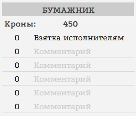
        </td>
    </tr>

</table>

Подробнее о работе с деньгами можно прочитать в соответствующей главе <a href="https://theagencyofsilence.github.io/knowledge-archive/Char-Money.html">«Деньги»</a>.

**Категории предметов**

Остальные категории Инвентаря предназначены для систематизации ваших вещей.

Здесь предусмотрена отдельная категория для Ценных вещей, а также категории для различных документов. Предполагается, что помимо основных документов персонаж может иметь при себе другие бумаги, в том числе поддельные.

Категории Помощь, Услуги и Ответы позволяют отслеживать количество доступных вам возможностей воспользоваться соответствующими ресурсами. Подробнее об этих механиках можно прочитать в разделе «Личное дело».

При этом в Инвентаре существует множество пустых категорий без названий. Используйте их для систематизации вещей так, как удобно именно вам: самостоятельно придумывайте названия и объединяйте предметы в любые подходящие категории.

**Инвентарь перед партией**

Обратите внимание, что некоторые Мастера могут перед началом партии попросить вас обозначить, какие именно предметы сейчас находятся при вашем персонаже.

Это означает, что вы не всегда сможете использовать весь накопленный Инвентарь, особенно если он со временем стал очень большим. Будьте готовы заранее определить, какие вещи находятся непосредственно при персонаже.

Для удобства вы можете, например, выделять предметы, которые находятся при вас, жирным шрифтом.

---

<h2>Таланты и особенности</h2>

Справа находится большой блок «Таланты и особенности».

Информация о ваших Талантах автоматически подгружается сюда из листа «Таланты и особенности». Поэтому для добавления или изменения Таланта используйте именно тот лист - вручную дублировать информацию здесь не требуется.

Подробнее об этом можно прочитать в соответствующем разделе <a href="https://theagencyofsilence.github.io/knowledge-archive/Char-Talents.html">«Таланты и особенности»</a>.

---

<h2>Полезные ссылки</h2>

Ещё правее находятся различные полезные ссылки, которые могут пригодиться вам во время игры.

При необходимости вы также можете самостоятельно добавить сюда собственные ссылки - например, на документы, материалы или другие ресурсы, которыми вы регулярно пользуетесь во время партии.

---

<h2>Знания, Связи и Преследование</h2>

Ниже расположен блок Знаний и Связей.

Каждый раз, когда Мастер или таблица Карьеры сообщает вам о получении Знания или Связи, отметьте соответствующий показатель в этом блоке.

Помните, что для Знаний и Связей действует правило возрастающей стоимости развития: чем выше уже имеющийся показатель, тем сложнее его увеличивать дальше.

Значения выше 6 доступны только в рамках цепочек игр и не могут быть получены в ваншотах.

**Преследование**

Под каждой Сферой также находится показатель Преследования.

Напомним, что Преследование работает как анти-Связи. Каждый пункт Преследования ухудшает броски Связей в соответствующей Сфере на 1.

Таким образом, чем выше Преследование в определённой Сфере, тем сложнее персонажу пользоваться своими Связями в ней.

---

<h2>Препараты</h2>

Ниже находится большой блок, предназначенный для Препаратов.

Этот блок дополняет Инвентарь, позволяя держать важную информацию об активных эффектах и свойствах препаратов непосредственно перед глазами и не искать её среди множества предметов.

Вы можете самостоятельно настраивать расположенные здесь ячейки и использовать их для хранения информации о препаратах, которыми ваш персонаж пользуется чаще всего.

Если уровень Интоксикации персонажа превышает допустимый предел, соответствующие последствия от препаратов автоматически подсвечиваются.

---

<h2>Заметки</h2>

В нижней части страницы находится большой блок «Заметки».

Используйте его по своему усмотрению. Здесь можно хранить любую информацию, которая может пригодиться вам во время игры: важные имена, текущие цели, напоминания, незавершённые дела, сведения о других персонажах или любые другие записи.

Не обязательно заполнять этот блок каким-либо определённым образом - это ваше личное рабочее пространство.

---

<a href="SistemaVT.html" class="button">← Назад к Игровой системе</a>

