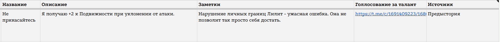

<link rel="stylesheet" href="style.css">

<nav class="navbar">
  <a href="index.html">Главная</a>
  <a href="SistemaVT.html">Игровая система</a>
  <a href="Homerules.html">Домашние правила</a>
</nav>
[Главная](index.md) → [Домашние правила](Homerules.md) → [Лист Персонажа](Character-Sheet.md) → Вкладка «Таланты и Особенности»

---

# Вкладка «Таланты и Особенности»

<h2>Оформление Талантов</h2>  

Здесь всё достаточно просто. Каждая строка представляет собой один потенциальный Талант, который затем автоматически отображается на вкладке «Дело» в соответствующем блоке.

<table class="simple-table center-all-table">

    <tr>
        <td class="center">
            
        </td>
    </tr>

</table>

Для каждого Таланта необходимо указать:

  •  **Название Таланта**;
  
  •  **Игромеханическое описание** - что именно делает Талант и какие преимущества или  возможности предоставляет;
  
  •  **Заметки** - необязательное поле, в котором можно оставить дополнительную информацию о таланте. Например, нарративное описание;
  
  •  **Голосование за Талант** - воизбежание путаницы, укажите ссылку на пост вашего таланта в канале "Создаем Талант";
  
  •  **Источник**; - укажите источник вашего Таланта. Об этом ниже;

---

<h2>Источник Таланта</h2>

Источник показывает, откуда персонаж получил данный Талант и при каких условиях он действует.

Например, если Талант был получен благодаря тому, что в блоке Разум накоплено 6 пунктов, в качестве источника следует указать **«Разум»**.

Это особенно важно при перераспределении опыта. Если вы по какой-то причине изменили распределение опыта и после этого в блоке Разум больше нет необходимых 6 пунктов, Талант, полученный за это значение, перестаёт действовать.

Другим источником может быть, например, **«Предыстория»**, если Талант был получен ещё во время создания персонажа. 

Третим источником может быть **«Предмет»**, если в ваш предмет встроена особая механика. 

Последним источником может быть **«Крафт»**, если вы создали "Талант-технику".

---

<h2>Согласование Талантов</h2> 

Помните главное правило: все Таланты в проекте должны быть предварительно согласованы с группой <a href="https://t.me/+jKr5gjU9ZkwzM2Qy">«Создаём талант»</a>.

В этой вкладке можно размещать только одобренные Таланты. Не добавляйте сюда Таланты, которые ещё находятся на обсуждении или не прошли согласование.

Подробнее о создании и согласовании <a href="https://theagencyofsilence.github.io/knowledge-archive/4-talents.html">«Таланты»</a>.

---

<h2>Напоминание</h2> 

При работе с Талантами помните о нескольких важных вещах:

  •  Количество Талантов ограничено. Вы не можете просто добавлять новые Таланты без учёта доступных вам источников и правил развития персонажа. Каждый Талант должен иметь конкретный источник, объясняющий, почему он доступен вашему персонажу.

  •  При этом Таланты можно менять. Для Новобранца замена Таланта не требует никаких затрат. После получения звания Профессионала для замены необходимо потратить 6 Тиков, воспользовавшись  «Тренировочной комнатой».

  •  Наконец, не обязательно стремиться заполнить все доступные Таланты как можно раньше. Вы вполне можете провести первые партии вообще без Талантов, чтобы сначала познакомиться с системой, понять особенности своего персонажа и только после этого решить, какие дополнительные возможности действительно вам подходят.
  
---

<a href="SistemaVT.html" class="button">← Назад к Игровой системе</a>

