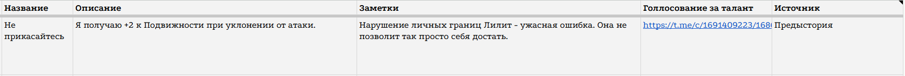

<link rel="stylesheet" href="style.css">

<nav class="navbar">
  <a href="start.html">Введение</a>
  <a href="SistemaVT.html">Основы игровой системы</a>
  <a href="Homerules.html">Правила «Тишины»</a>
  <a href="Game-Master-Code-of-Conduct.html">Кодекс Мастеров</a>
  <a href="Project-Organization.html">Организация проекта</a>
</nav>

[Основы игровой системы](SistemaVT.md) → [Лист Персонажа](Character-Sheet.md) → Вкладка «Таланты и Особенности»

---

<h1 class="center">Вкладка «Таланты и Особенности»</h1> 

<h2>Оформление Талантов</h2>  

Каждая строка в этой вкладке представляет собой один потенциальный Талант, который затем автоматически отображается на вкладке «Дело» в соответствующем блоке.

Напомним, что Создание Талантов - это углублённая механика нашей системы. Если вы читаете правила впервые, скорее всего, вы пока ещё не знакомы с принципами работы талантов. В таком случае не обязательно разбираться с этой вкладкой прямо сейчас: вы сможете вернуться к этой вкладке позже, когда познакомитесь с механикой талантов.

Подробнее о талантах можно в будущем прочитать в разделе „Правила «Тишины»“ в главе <a href="https://theagencyofsilence.github.io/knowledge-archive/4-talents.html">«Создание Талантов»</a>. 

<table class="simple-table center-all-table">

    <tr>
        <td class="center">
            
        </td>
    </tr>

</table>

  
Для каждого Таланта необходимо указать:
 
  
•  <strong>Название Таланта</strong>;
 
  
•  <strong>Игромеханическое описание</strong> - что именно делает Талант и какие преимущества или  возможности предоставляет;
 
  
•  <strong>Заметки</strong> - необязательное поле, в котором можно оставить дополнительную информацию о таланте. Например, нарративное описание;
 
  
•  <strong>Голосование за Талант</strong> - воизбежание путаницы, укажите ссылку на пост вашего таланта в канале "Создаем Талант";
 
  
•  <strong>Источник</strong> - укажите источник вашего Таланта. Об этом ниже.

---

<h2>Источник Таланта</h2>

Источник показывает, откуда персонаж получил данный Талант и при каких условиях он действует.

Например, если Талант был получен благодаря тому, что в блоке Разум накоплено 6 пунктов, в качестве источника следует указать «Разум».

Это особенно важно при перераспределении опыта. Если вы по какой-то причине изменили распределение опыта и после этого в блоке Разум больше нет необходимых 6 пунктов, Талант, полученный за это значение, перестаёт действовать.

Другим источником может быть, например, «Предыстория», если Талант был получен ещё во время создания персонажа. 

Третим источником может быть «Предмет», если в ваш предмет встроена особая механика. 

Последним источником может быть «Крафт», если вы создали "Талант-технику".

---

<h2>Согласование Талантов</h2> 

Помните главное правило: все Таланты в проекте должны быть предварительно согласованы в канале <a href="https://t.me/+jKr5gjU9ZkwzM2Qy">«Создаём талант»</a>.

В этой вкладке можно размещать только одобренные в этом канале Таланты. Не добавляйте сюда Таланты, которые ещё находятся на обсуждении или не прошли согласование.

---

<h2>Напоминание</h2> 

  

  
При работе с Талантами помните о нескольких важных вещах:
 
  
•  Количество Талантов ограничено. Вы не можете просто добавлять новые Таланты без учёта доступных вам источников и правил развития персонажа. Каждый Талант должен иметь конкретный источник, объясняющий, почему он доступен вашему персонажу.
 
  
•  При этом Таланты можно менять. Для Новобранца замена Таланта не требует никаких затрат. После получения звания Профессионала для замены необходимо потратить 6 Тиков, воспользовавшись  «Тренировочной комнатой».
 
  
•  Наконец, не обязательно стремиться заполнить все доступные Таланты как можно раньше. Вы вполне можете провести первые партии вообще без Талантов, чтобы сначала познакомиться с системой, понять особенности своего персонажа и только после этого решить, какие дополнительные возможности действительно вам подходят.

  
---

  

    
  

  

    
Агентство 
    «Тишина»

  

