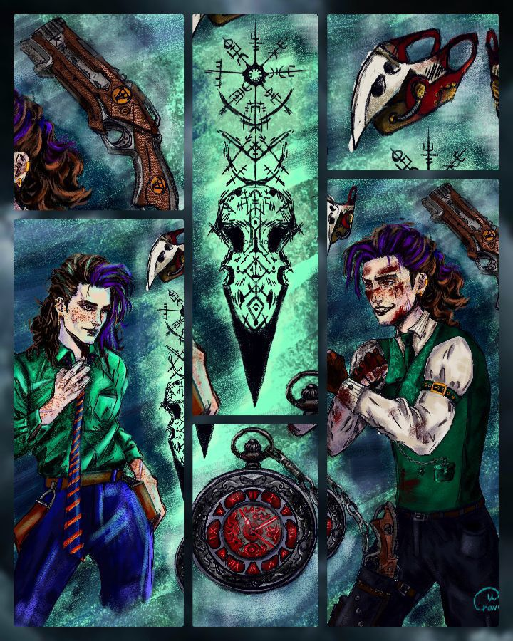
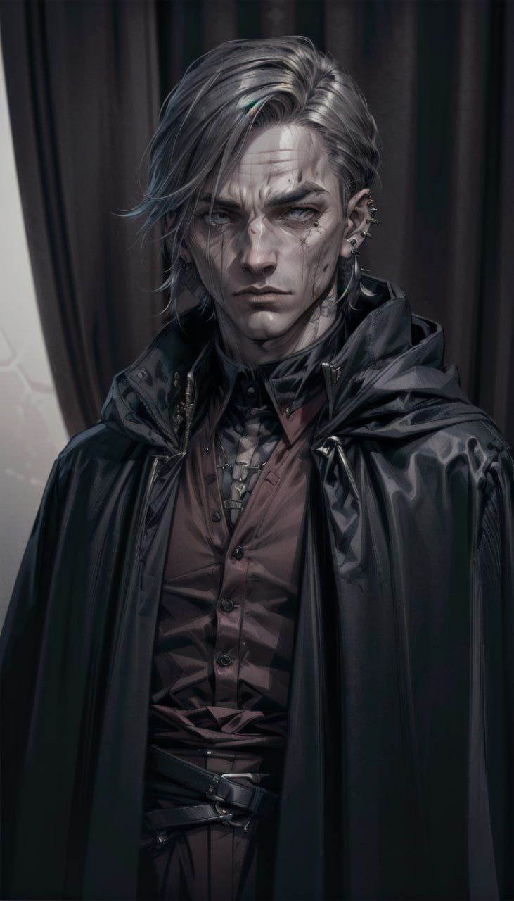
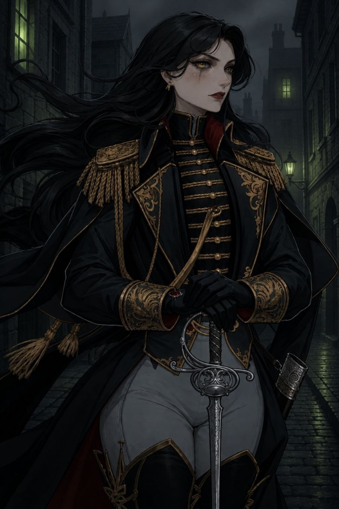

<link rel="stylesheet" href="style.css">

<nav class="navbar">
  <a href="start.html">Введение</a>
  <a href="SistemaVT.html">Основы игровой системы</a>
  <a href="Homerules.html">Правила «Тишины»</a>
  <a href="Game-Master-Code-of-Conduct.html">Кодекс Мастеров</a>
  <a href="Project-Organization.html">Организация проекта</a>
</nav>

[Кодекс Мастеров](Game-Master-Code-of-Conduct.md) → [Создание персонажей игроков](Character-Creation-Guidelines.md) → Процесс создания персонажа

---

# Процесс создания персонажа

---

<h2>Часть 1. Подготовка</h2>

В этом разделе изложен порядок проведения генережки. Некоторые шаги являются рекомендательными и могут быть применимы по вашему усмотрению. Помните, что остальные описанные здесь пункты являются ответственностью Ведущего мастера генережки.

**Шаг 1. Технический этаж.** 
Помните, что все генережки проходят в Технических этажах. Проводить их в другом чате – неуместно.

**Шаг 2. Разговор перед генережкой.**
Постарайтесь снять напряжение, разговорить игрока, создать комфортную атмосферу для новоприбывшего. Задайте вопросы об его опыте в НРИ или обсудите что-то общее, чтобы избежать ощущения формального собеседования.

**Шаг 3. Введение в генережку.**
Обьясните игроку, как будет проходить генережка: как выбираются Сферы и как будут бросаться кубы для определения Вех. Напоминаем, что у нас есть два метода создания персонажей:

  
• <strong>Классический:</strong> Рекомендуемо. Броски совершаются постепенно и поочередно с выбором сфер Столицы. 

 

 
 

  
• <strong>Воплощение концепта:</strong> Мастер помогает создать желаемый концепт персонажа, подбирая нужное количество <i>(из пяти доступных)</i> Вех в соответствии с идеей игрока. 

 

Обсудите с игроком, есть ли у него конкретная идея для персонажа или он готов довериться случайным броскам. 

Помните, что мы проводим генережку по системе <a href="https://theagencyofsilence.github.io/knowledge-archive/2-background.html">Вех Предыстории</a> .

**Шаг 4. Акцент на участии игрока**

Необходимо акцентировать внимание игрока на том, что в первую очередь именно он будет играть своим персонажем, поэтому важно, чтобы он не стеснялся предлагать свои идеи, отвергать не подходящие предложения и активно участвовать в обсуждении. 

_(При этом нам все еще следует оставаться в рамках нашего игрового сеттинга, конечно)_

**Шаг 5. Гугл почта.** 

Получите гугл-почту игрока, передайте её вашему Мастеру Поддержки, ведь последующие шаги рекомендуется поручить именно ему: необходимо создать для игрока папку в разделе "Персонажи" с названием [Имя игрока], загрузите туда его чарлист и настройте доступ игрока к папке. 

Скиньте ему эту ссылку и скажите, что когда он выберет имя своему персонажу, то ему нужно переименовать свою папку по форме [Имя **персонажа** - Имя **игрока**] 

---

<h2>Часть 2. Создание Предыстории</h2>

**Шаг 6. Выбор фенотипа.**

Спросите у игрока, какой фенотип ему будет комфортнее отыгрывать. Для новичков, которые пока не полностью знакомы с нашим игровым миром, доступны четыре базовых фенотипа: столичник, степняк, полукровка и горняк.

Если игрок создаёт второго персонажа или хорошо ориентируется в сеттинге "Внутренних Теней", ему можно предложить полный список разрешённых фенотипов. В ассортименте разрешенных появляются: **серпарь**, **тунух**, **ментал**, **древний*** и **коллектор***

* Последние два фенотипа требуют особой проработки, так как их присутствие в агентстве наёмников - редкость и вызывает вопросы. Хотя эти фенотипы не рекомендуются для игры, при сильном желании игрока взять эти фенотипы возможно, но важно тщательно продумать обоснование их нахождения в агентстве.

  
• Создавая <strong>древнего</strong>, задумайтесь, как представитель знатного рода мог опуститься до работы наемником? Как оказался в Четвертом кольце, вынужденный зарабатывать на жизнь столь "низменным" занятием, как выполнение чужой воли за деньги? Причём эти приказы могут исходить от представителей других фенотипов.   Очевидно, что гордый древний не станет просто работать у нас без веской причины. Представить зажиточного и благородного древнего в роли наёмника — крайне сложно.
 

  
Поэтому важно продумать, как ответить на эти вопросы, чтобы древний органично вписался в агентство и не выглядел излишне странно и абсурдно на фоне других агентов. Скорее всего, такой персонаж будет маргиналом или изгоем среди древних, что может обосновать его нахождение в агентстве.

  
• С <strong>коллектором</strong> ситуация обратная, но не менее сложная. Как коллектор, что был частью стаи смог отколоться от неё и стать наёмником Тишины? Как и почему Координаторы Тишины взяли коллектора на работу? Скрывает ли он свою природу, или как иначе ему удаётся передвигаться по улицам, если он вне закона? Способен ли этот коллектор к речи и к рациональному взаимодействию с агентами? Как его воспринимают заказчики?   Эти вопросы также необходимо тщательно обдумать. Если коллектор каким-то образом умеет скрывать свою истинную природу, его персонаж может быть допустимым в игре.

         

  
• Насчет <strong>тунухов</strong>: напоминаем, что при создании персонажа тунуха необходимо выбрать фенотипическую особенность либо степняков, либо горняков.

  
Также важно помнить, что создавать некоторые фенотипы запрещено в Агентстве. К ним относятся молохи, солиды, трубачи и светлячки. Агентство не сотрудничает с этими созданиями, так как это может нанести серьёзный репутационный ущерб. Их концепция не сочетается с образом Агентства наёмников и его задачами.

---

**Шаг 7.** **Предыстория Предыстории.** [Рекомендательно]

Попросите игрока рассказать, в какой семье родился его персонаж: была ли семья полной, каково было её финансовое состояние, каким было раннее детство персонажа. Был ли у него кто-то из друзей или он был одиночкой? Было ли детство сложным или, наоборот, счастливым?

---

**Шаг 8.** **Сферы**. 
Кратко напомните о Сферах (предполагая, что игрок уже посмотрел ролик о сеттинге).

---

**Шаг 10.** **Броски Вех.** 

Дайте игроку выбрать Сферу, бросить или выбрать Веху, указать примерный возраст. Согласуйте нарратив с игроком. (Пожалуйста, помните, что мы отталкиваемся именно от желания игрока, от его предложенного концепта!)

  
• Если выпала <strong>Ценная вещь</strong> (ЦВ), сначала уточните у игрока, что именно он бы хотел получить, и отталкивайтесь от его пожеланий. ЦВ может быть либо созданная по калькулятору крафта, либо с уникальной механикой (с талантом внутри), но для новичков рекомендуется взять Ценную вещь на +3 к какому-то навыку.

  
• Если выпал блок <strong>Выбора</strong> (5.Х) и если у вас есть Мастер Поддержки, объясните ситуацию игроку и временно отключите его звук, чтобы обсудить возможные варианты с сомастером. Стремитесь к тому, чтобы варианты выбора были равнозначными и не склоняли игрока к очевидному решению.
 

  
Выбор должен быть интересным, без явного черно-белого разделения — оба варианта должны иметь как преимущества, так и недостатки. Если вы уверены в своей интерпретации понятий Света и Тьмы, подумайте, мог ли персонаж получить их, или его выбор будет обычным, будничным. Если сомастера нет, создайте выбор для игрока самостоятельно.

  
• Если выпал <strong>Специальный навык</strong>, необходимо проработать его логику и историю. Если это касается Воли, нужно уделить внимание Спектру воли. (Что такое спектр Воли можно узнать здесь (ссылка).) Напоминаем, что новички в сеттинге, создавая своего первого персонажа, <u>не могут</u> выбирать опцию "специальный навык".

  
• Если выпало <strong>Безумие</strong>, объясните игроку суть императивных установок, и вместе продумайте нарратив, чтобы и игрок понимал, как с этим работать, и мастерам было легче включить это в игру. Помните, что Императивная установка должна быть:
 
    
⸎  Подходящей истории персонажа.
 
    
⸎  Установка должна быть конкретной и понятной, ее трактовка должна, в основном, зависеть от внешних условий, а не внутреннего восприятия. 
 
    
⸎  Хорошая установка должна иметь не очень широкую, но и не слишком узкую область применения.
 
    
⸎  Должна <u>усложнять</u> жизнь и создавать интересные ситуации на партиях.
 
    
⸎  После того, как вы согласовали с игроком императивную установку, запишите это в чарник. [Рекомендуется заполнять Мастеру Поддержки]

  
• Если выпала <strong>Травма</strong>, обсудите, на какие навыки она будет накладывать штраф (-1) или отметьте, что штраф будет на все действия, связанные с этой частью тела.

  
• Если выпал <strong>Талант</strong>: Создание таланта — сложная механика, поэтому новоприбывшим игрокам стоит осваивать её позже, когда они лучше поймут систему и увидят, как таланты применяются в игре.
 

  
Объясните, что практика «поиграю и потом решу» весьма распространена. Через несколько партий игрока добавят в чат по созданию талантов, а в первых играх рекомендуется играть без них, чтобы лучше понять их работу.

  
• Если выпало <strong>Преследование</strong>, объясните игроку суть его работы и оговорите с ним, на какую сферу будет наложен штраф к связям, отметьте это в соответствующей сфере.

**Ограничения для [Блока 6]**

Вехи из [Блока 6] обладают уникальными бонусами, поэтому можно выбрать только **одну** веху из этого блока.

Если игрок выбросил дополнительную веху из [Блока 6], её необходимо перебросить.

**Рекомендации для [Блока 1]**

Рекомендуется ограничиться одной вехой из [Блока 1], так как выбор дополнительных вех из этого блока может создать серьёзные проблемы для персонажа.

Однако, если игрок осознанно хочет принять этот вызов, он может сделать такой выбор.

---

<h2>Часть 3. Опыт и навыки</h2>

**Шаг 11. Лист персонажа.**

Объясните игроку основные элементы системы и работу с листом персонажа: особенности навыков, наличие двух полосок физического и ментального здоровья и их зависимость от количества пунктов в навыках, сложность действий и минимально-приемлемый уровень навыков.

(На этом этапе не стоит перегружать игрока глубокими знаниями о системе. Вряд ли игрок запомнит обилие информации, поэтому ограничьтесь главным)

---

**Шаг 12. Распределение опыта.**

Помогите игроку распределить опыт. Совет: начните с распределения опыта по двум-трём ключевым навыкам, а оставшиеся пункты распределите по остаточному принципу. Учтите, что все новые персонажи на данный момент начинают с 18 очков опыта.

---

**Шаг 13. Возможность перераспределения.**

Также расскажите игроку, что пока игрок пребывает в статусе Новобранца у него есть возможность свободно перераспределять очки навыков.

---

<h2>Часть 4. Имущество </h2> 

**Шаг 14. Деньги.**

Если игрок получил (или потерял) какую-то сумму крон в результате прокидки вех - совместно внесите это во вкладку «Деньги». Расскажите игроку, как пользоваться этой вкладкой. Желательно упомянуть, что некоторые покупки можно совершать между играми.

---

**Шаг 15. Предметы.** 

Спросите у человека, какие недорогие предметы он бы хотел иметь в начале своей истории. Добавьте такие начальные предметы в Инвентарь, чтобы у персонажа было стартовое снаряжение для выполнения своих действий (которые однако не дают бонусов). Например, механику необходим набор базовых инструментов.

---

<h2>Часть 5. Финальные штрихи</h2>

**Шаг 16. Устраивает ли игрока?**

Дайте игроку время передохнуть и обдумать созданного им персонажа. Убедитесь, что персонаж устраивает игрока. При необходимости можно пересмотреть или изменить порядок одной или нескольких Вех, чтобы создать более гармоничный образ.

---

**Шаг 17. Арт** [Рекомендательно]
Предложить игроку найти или сгенерить арт для персонажа.

---
           
**Шаг 18. Знакомство.** [Крайне рекомендательно]

Обсудите с игроком и предложите написать #Знакомство. 

Знакомство - это распространённая практика в «Тишине», когда новичка представляют в общем чате. Вместе с этим публикуется арт персонажа и краткое описание, которое отражает его суть. Это помогает другим игрокам познакомиться с персонажем и обратить внимание на его появление. 

В ином случае - этот игрок может просто потеряться в бесконечном обсуждении сторонних тем в чате от незнакомых ему людей, которым всё равно на его приход.  

  
  
Примеры Знакомства

   

    
            <table class="simple-table image-text-table">
        
            <colgroup>
                <col style="width:40%;">
                <col style="width:60%;">
            </colgroup>
        
            <!-- Строка 1 -->
            <tr>
                <td class="image-cell">
                    
                </td>
        
                <td class="text-cell">
                    
#Знакомство   Молодая Древняя с грацией и достоинством вошла в зал агентства наёмников. Её уверенные движения с лёгкостью могли не выдавать слепоту, если бы не черная ткань, наглухо закрывающая верхнюю часть лица. Тонкие пальцы касались эбонитовый трости, шафт которой с одной стороны украшен инкрустированными позвонками.  <i>– Гели́за Просгуте́ль Флехтн. Шестнадцатая этого имени, сгинь,</i> – представилась она, протягивая черный конверт. В письме указывалось, что она эмиссар Культа Смерти, что, по договоренности с "Тишиной", вынуждена будет провести неопределённое время в роли сотрудника агентства.  <i>– Для агентов – просто Я́гель, сгинь.</i>  Персонаж игрока: @tmavakost

                </td>
            </tr>
            <!-- Строка 2 -->
            <tr>
                <td class="image-cell">
                    
                </td>
        
                <td class="text-cell">
                    
#знакомство   Он ухмыляется, идя по коридору здания агенства, его первый день и его новая глава в жизни. Эта работа предвещает интересные события, багаж опыта и ещё больше ошибок.   Маледикт не совсем представляет к чему приведет его эта работа, понравится ли ему, и кем он станет после того как вольётся в жизнь агентства "Тишины". Ему совсем немного страшно, но азарт и интрига перекрывают неуверенность.  Маледикт знает, что способен на многое, знает, что многому может научиться, он совсем не уверен, что доживёт до своих двадцати, у него есть вопросы, на которые тут возможно могут ответить и он определенно изголодался  по новым ощущениям, которых тут, он уверен, для него будет в достатке.  Персонаж игрока: @raven_lutik_yourmala

                </td>
            </tr>
            <!-- Строка 3 -->
            <tr>
                <td class="image-cell">
                    
                </td>
        
                <td class="text-cell">
                    
#Знакомство  Чувствуете, почему-то стало подозрительно неуютно? Проявилась странная тревога, возникшая беспричинно, с чего бы это?   На пороге агентства появился молодой столичник. Феликс Фишер выглядит хмуро и напряженно, Половину его лица покрывают странные шрамы, которые всего на мгновение напомнят вам замысловатый узор. Каменное выражение Феликса сменится лишь после он достанет аккуратную записку из кармана, по-доброму ей улыбнется и зайдет в агентство будто бы набравшись новых сил. Какие же слова способны растопить сердце этого юноши?  Персонаж игрока: @IvanFeokt

                </td>
            </tr>
            <!-- Строка 3 -->
            <tr>
                <td class="image-cell">
                    
                </td>
        
                <td class="text-cell">
                    
#Знакомство   Входная дверь со скрипом отворилась, и в тишине агентства раздался чеканный шаг тяжелых сапог. Воздух в холле словно мгновенно сгустился, стал плотным и осязаемым.  Уверенная походка и холодный, сосредоточенный вид сразу выдавали в вошедшей человека с тяжелым боевым прошлым. Мира Куртакс, бывший исполнитель, скользнула цепким взглядом по доске заданий, выхватывая детали, но уже через минуту развернулась и зашагала к кабинету - пришло время познакомиться с будущими коллегами.  Коротко стукнув по деревянной двери, она вошла. Быстро окинула присутствующих оценивающим взглядом и сдержанно кивнула:  - <i>Добрый вечер всем.</i>  Персонаж игрока: @ntdarienv

                </td>
            </tr>
        
        </table>

    

---

**Шаг 19. Правила и Обращение в Мастерку**
Скиньте игроку правила: вот <a href="https://theagencyofsilence.github.io/knowledge-archive/index.html">нужная ссылка</a>. Скажите игроку, что он может писать в канал "Обращения в Мастерку", если у него возникнут вопросы. 

---

**Шаг 20. Чаты.** 

Добавить игрока в чаты:  

  
• <a href="https://t.me/+kIrZmpP0eF9kZDQy">Игралище судеб</a> (желательно одновременно с публикацией Знакомства) 
 
  
• <a href="https://t.me/+Flt7sPfQEckwMzhi">Игралище судеб. Оповещения</a> 
 
  
• <a href="https://t.me/+TTfcQg2OxFgzYTA6">Обращение в мастерку Тишины</a> 

 

 
---

**Шаг 21. Краткое изложение.**

После генережки необходимо отписать в Мастерскую о том что был сгенерен новый персонаж по форме: 

  
• тэг человека в тг
 
  
• ссылка на чарник
 
  
• Мастер Поддержки

 

---

**Готово! Вы - Восхитительны!**

---

<a href="SistemaVT.html" class="button">← Назад к Игровой системе</a>
