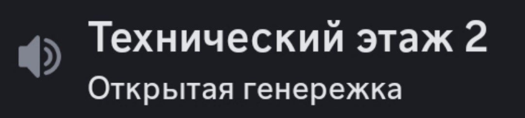
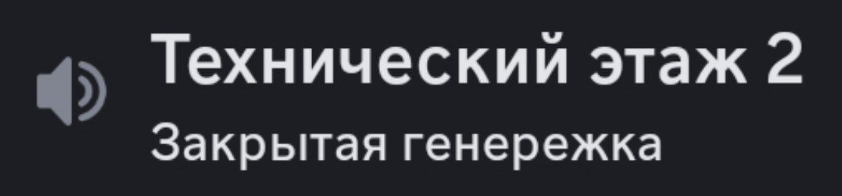

<link rel="stylesheet" href="style.css">

<nav class="navbar">
  <a href="index.html">Главная</a>
  <a href="SistemaVT.html">Основные правила</a>
  <a href="Homerules.html">Правила «Тишины»</a>
  <a href="Game-Master-Code-of-Conduct.html">Кодекс Мастеров</a>
  <a href="Project-Organization.html">Организация проекта</a>
</nav>

[Главная](index.md) → [Кодекс Мастеров](Game-Master-Code-of-Conduct.md) → [Создание персонажей игроков](Character-Creation-Guidelines.md) → Организационные правила

---

# Организационные правила

<h2>Ведущий Мастер и Мастер Поддержки</h2>  

По умолчанию для создания персонажа на генережке должны присутствовать двое мастеров: один в роли Ведущего мастера, другой - в роли Мастера Поддержки.

**Ведущий Мастер**

Роль Ведущего мастера заключается в том, чтобы направлять процесс создания персонажа. Именно он объясняет игроку, как происходит будет происходить генережка, он координирует действия всех участников. Ведущий мастер определяет, будет ли генережка открытой или закрытой, выбирает Мастера Поддержки и организует сам процесс. Он также отвечает за организационные моменты, такие как выбор времени и даты генережки, приглашение участников, предоставление им возможности высказаться.

Однако с этой ролью приходит и ответственность. Ведущий мастер следит за тем, чтобы процесс шел в соответствии с правилами и регламентом. Ниже, в регламенте генережки есть параграфы, которые относятся именно к Ведущему Мастеру. 

**Мастер Поддержки**

Теперь поговорим о Мастере Поддержки. Хотя он не ведёт генережку, его роль не менее важна. Мастер Поддержки помогает Ведущему мастеру и обеспечивает гладкое течение процесса.

  •  Его присутствие крайне необходимо в таких случаях:

  •  Если Ведущий мастер запутался в сеттинге или механике, Мастер Поддержки может деликатно указать на ошибку - лучше всего через личные сообщения, чтобы не сбить игрока с толку.
                 
  •  Если Ведущему мастеру по каким-то причинам нужно прерваться, Мастер Поддержки может его подменить, когда тот попросит.
             
  •  Мастер Поддержки также может участвовать в проработке персонажа, если Ведущий мастер обращается за помощью.
           
  •  Кроме того, он может помогать Ведущему мастеру с заполнением необходимых граф в Листе персонажа.
  
Так как Мастера Поддержки выбирает Ведущий мастер, они могут заранее обсудить формат взаимодействия. Важно договориться, будет ли Мастер Поддержки участвовать в обсуждениях с игроком в войс-чате или лучше вступать в диалог по просьбе Ведущего мастера.

---

<h2>Право на сомостоятельную генережку</h2>  

После того, как любой Мастер **пять раз** участвовал в совместной создании персонажей в роли Ведущего мастера или **десять раз** в роли Мастера Поддержки, он считается освоившим основные принципы этого процесса и понимающим общий тон создаваемых персонажей. С этого момента мастер получает право создавать персонажей самостоятельно. 

Если мастер решает действовать самостоятельно, то по окончанию генережки он должен отправить ссылку на чар-лист персонажа в Мастерскую, чтобы у Главмастера была возможность проверки корректности генережки. Присутствие второго мастера в процессе создания теперь становится рекомендацией, а не обязательным условием.

Тем не менее, с расширением прав возрастает и ответственность. Если мастер проявляет недобросовестное отношение к принципам создания персонажей, Главмастер проекта оставляет за собой право ограничить или отменить его возможность самостоятельной генережки.

---

<h2>Формат генережки</h2>  

Генережки могут проводиться в трех форматах. Ведущий мастер выбирает тот формат, который ему наиболее комфортен и соответствует ситуации.

**Открытая генережка** - в этом формате могут участвовать любое количество игроков и мастеров. Все участники имеют право предлагать свои идеи и концепции вслух, давать варианты трактовки бросков игрока. Это способствует созданию разнообразных и коллективных решений в процессе создания персонажа. Если вам подходит этот формат, обозначьте это в статусе канала, сделав это вот так: 

<table class="simple-table center-all-table">

    <tr>
        <td class="center">
            
        </td>
    </tr>

</table>

**Закрытая генережка** - в этом формате в процессе создания персонажа могут участвовать только участники, выбранные Ведущим мастером (чаще всего это сам игрок и Мастер Поддержки) Если вам подходит этот формат, обозначьте это в статусе канала, сделав это вот так: 

<table class="simple-table center-all-table">

    <tr>
        <td class="center">
            
        </td>
    </tr>

</table>

**Генережка в режиме тишины** - этот формат подразумевает, что на генережку могут прийти любое количество игроков и мастеров, однако их микрофоны должны оставаться выключенными, пока Ведущий мастер не предоставит слово. **По умолчанию все генережки проводятся в таком формате**, даже если статус не указан. 

---

<h2>Инструкция как организовать генерёжку</h2>  

Порядок действий при появлении нового игрока:

**Шаг 1. Выбрать тип генережки.**

Когда к нам приходит новый игрок, важно учитывать, что каждый человек индивидуален, и подход к созданию персонажа, который подходит одному, может не подойти другому. Поэтому после приветствия нового участника ему необходимо предложить ему выбрать тип создания персонажа.

    
Стандартное сообщение о типе генерёжки

    

        <table class="green-table">
        
            <tr>
                <td>
У нас есть разные типы создания персонажа, вы можете выбрать тот, который вам больше импонирует:
 
                
1. <strong>Соавторство вместе с Мастером.</strong> Стандартная форма генережки. Вы подаете идеи, а мастер думает каким образом интересно их обыграть, развить и дополнить. Таким образом, вы совместно создаёте вашего персонажа.
 
                
2. <strong>Интервью.</strong> В данном типе генержки персонажа по большей мере создает сам игрок, а Мастер лишь задает наводящие вопросы и подправляет возможные огрехи, отклонения от канона.
 
                
3. <strong>Доверие Мастеру.</strong> В данном типе генережки вы в начале раскрываете суть задуманного персонажа, а Мастер думает каким образом реализовать этот концепт в мире Столицы. Именно Мастер создаст предысторию вашего персонажа, сделав её нарративно-целостной. А вы выступаете в роли оценивающего - нравится вам подобная придумка или нет, хотите ли изменить или вас всё устраивает.
  
                
4. <strong>Домашнее задание.</strong> Крайне редкий тип генережек, но про него тоже расскажу. В данном типе генережек, мы с вами созваниваемся на 20-30 минут, чтобы совершить базовые прокидки кубов. Затем, вы самостоятельно письменно создаёте вашего персонажа, заполняя свои графы предыстории. Закончив, вы присылаете свой чарлист на проверку Мастеру. После внесения возможных коррективов, мы созвонимся с вами еще раз, чтобы заполнить лист ваших навыков. Закончив с этим, ваш персонаж считается принятым.
 
                
Разумеется, каждый тип имеет свои плюсы и минусы, но здесь нужно смотреть на то, какой тип у вас больше отзывается. Если у вас есть какие-то вопросы - пишите. Ждем вашего ответа)
</td>
            </tr>    
            
        </table>

    

**Шаг 2. Уведомление для игрока.**

После того как игрок выбрал удобный для него тип создания персонажа, сообщите ему, что в течение нескольких часов вы свяжетесь с ним для дальнейших шагов.

**Шаг 3. Публикация заявки в Мастерку.**

Ответ игрока пересылается в Мастерскую с вопросом: «Кто хочет взяться за генережку этого игрока?» Каждый мастер в Мастер-группе может поучавствовать в генережке игрока. Чтобы это сделать, необходимо поставить «плюс» в ответ на пересланное в мастерку сообщение игрока, как при заявке на игру. Переслать сообщение может любой мастер, но ответственность за этот процесс лежит на Главе Кураторов.

**Шаг 4. Выбор Ведущего мастера.** 

Спустя 6 часов после публикации сообщения в Мастерской, любой мастер может провести кубовку в этом чате для выбора Ведущего Мастера из тех, кто поставил «плюс». Провести кубовку может любой мастер, однако ответственность за это лежит на Основателе. Результат кубовки определяет кто будет Ведущим Мастером для генережка персонажа с этим игроком.

Почему это важно: многие из нас работают, часто заняты, или сталкиваются с отключениями света на несколько часов. Мы не должны руководствоваться принципом «кто первый встал, того и тапки». Нужно обеспечить справедливый доступ всем мастерам к возможности участвовать в создании персонажа, чтобы каждый имел шанс увидеть сообщение и высказать желание участвовать. 

Пожалуйста, не нарушайте это правило, так как это считается крайне неэтичным.

Исключение: во время активного набора новобранцев, когда заявок на генержку слишком много, время на ожидание отклика от других мастеров сокращается до двух часов.

**Шаг 5. Договор о времени генережки.**

После того как Ведущий Мастер выбран, он связывается с игроком в чате Новобранцев, чтобы договориться об удобном времени для создания персонажа. 

Если Ведущий Мастер ещё не имеет права на самостоятельную генережку, он также должен найти себе Мастера Поддержки.

**Шаг 6.** **Знание сеттинга игроком** - [Исключительно обязательно]

Помните, что для создания персонажа, необходимо чтобы человек был ознакомлен с сеттингом Теней. Спросите его об этом незадолго до генережки. Если игрок не знаком с сеттингом и еще не смотрел наше видео о игровом мире - предложите ему посмотреть, пожалуйста. Вот ссылки на видео: в <a href="https://www.youtube.com/watch?v=bmPXQZw0QBA">Ютубе</a> и во <a href="https://vk.com/video66330231_456240307">Вконтакте</a> .

---

<h2>Особые случаи создания персонажа</h2>
 
  •  Если Ведущий Мастер по каким-либо причинам не может провести генережку, он сообщает об этом в Мастерскую. В случае, если желающих по-прежнему несколько, проводится новая кубовка. Если же желающий провести генережку остался только один, он автоматически становится Ведущим Мастером.

  •  Если уже играющий участник хочет создать нового персонажа, он также может отправить запрос об этом в чат “Обращения в Мастерку”. Однако, если этот игрок хочет пройти генережку у конкретного Мастера (часто своего друга), этот Мастер автоматически становится Ведущим, и кубовка не требуется.
                       
  •  Два Мастера могут вместе создать персонажа для одного из них. В этом случае один Мастер выступает в роли игрока, создающего персонажа, а второй становится Ведущим Мастером генережки. 

  •  Создавать персонажа самому себе без участия другого Мастера - запрещено.

  •  Если мастер приводит в проект своего друга, он автоматически становится ведущим мастером генережки этого персонажа.
           
  •  Если нового участника проекта приводит игрок (не мастер), этот игрок получает право присутствовать на создании персонажа, даже если Генережка является закрытой.
              
  •  Помните, что у игрока может быть не более 3х активных персонажей.

---

<h2>Уникальные концепты</h2>

Если вы хотите создать совершенно уникальный концепт персонажа, который сильно отличается от всех остальных персонажей в проекте, вам необходимо согласовать подобное в Мастерке с другими мастерами. Введение подобных персонажей обсуждается всей группой. Такой концепт может быть создан только после публикации описания в Мастерскую, публичного мастерского обсуждения и, главное, одобрения Главмастера проекта. Персонаж сможет начать игру, если все мастера будут уведомлены об этом и большая часть из них будут готовы водить такого персонажа (для этого желательно создание голосования).

Важно: Уникальные концепты можно создавать только на совместных сессиях создания персонажа. Мастера с правом самостоятельной генерации не могут создавать такие концепты в одиночку, поскольку их понимание мира Столицы, нарратива агентства или игрового баланса может быть субъективным, что может привести к проблемам.

Примеры уникальных концептов: разумный трубач Ноктус, прототип будущих нованов Фитц, коллектор Свирель, автоматон Тео, персонаж Амати с раздвоением личности, за которого играют два игрока поочерёдно.

---

<a href="SistemaVT.html" class="button">← Назад к Игровой системе</a>
