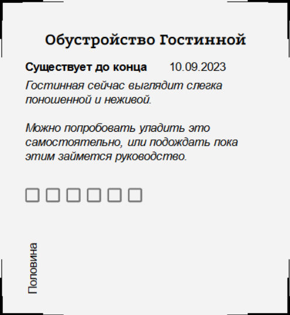
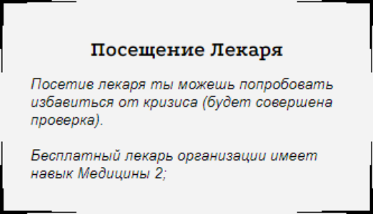
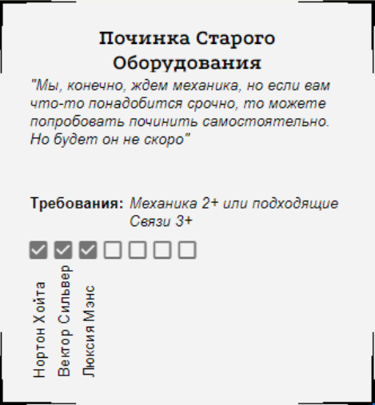
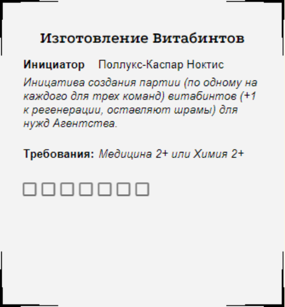
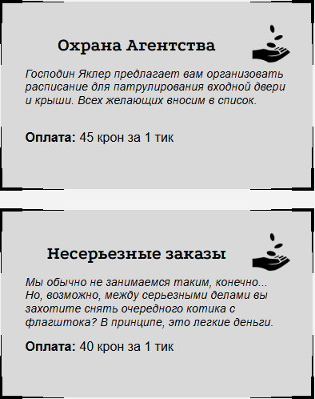

<link rel="stylesheet" href="style.css">

<nav class="navbar">
  <a href="index.html">Главная</a>
  <a href="SistemaVT.html">Игровая система</a>
  <a href="Homerules.html">Домашние правила</a>
</nav>
[Главная](index.md) → [Домашние правила](Homerules.md) → Инициативы, возможности и свободное время

<h2>Инициативы, возможности и свободное время</h2>

**Даунтайм** (англ. downtime - «время простоя») - это промежуток времени между игровыми сессиями, когда герой занимается тем, на что не хотелось бы тратить время непосредственно во время партии. Он может залечивать раны, работать над собственными и сторонними проектами, заниматься личными делами, поддерживать связи и решать другие вопросы, которые происходят за рамками основного повествования.

Эта дополнительная система позволяет вынести подобную активность за пределы игровых сессий, чтобы освободить время партии для сюжетных событий, важных решений и совместного взаимодействия персонажей.

---

<h2>Глоссарий</h2> 

  •  **Герой** - персонаж игрока.

  •  **Время простоя** - время, которое персонаж проводит между играми или заданиями.

  •  **Тик** - абстрактный отрезок времени, которым герой может распоряжаться во время простоя.

  •  **Возможность** - доступный герою способ потратить накопленные Тики во время простоя. Обычно Возможности предоставляются Мастерами и публикуются на Доске возможностей. В разговорной речи Возможности также могут называться инициативами.

  •  **Инициатива** - Возможность, которую самостоятельно создаёт герой. Одновременно у героя может быть не более одной собственной Инициативы.(Важно: Крафт не занимает слота инициативы)

  •  **Часовой** - игрок, ответственный за организацию и ведение механики Даунтайма. Актуальный список Часовых отображен на Доске Возможностей.

  •  **Доска возможностей** - электронная таблица, содержащая актуальный список доступных Возможностей.

---

<h2>Доска возможностей</h2>  

При любом расхождении между настоящим документом и Доской возможностей приоритет имеет Доска возможностей. Вот ссылка на эту  <a href="https://docs.google.com/spreadsheets/d/1FzE7Mc_nw7VJ3qG98MLgqbDsDKuBPSUc8jqBGhblzK0/edit?usp=sharing">Доску</a>

---

<h2>Тики</h2> 

Чтобы начать получать Тики, игроку необходимо принять участие хотя бы в одной игровой сессии.

После этого каждая игровая встреча у любого Мастера, независимо от того, принимал ли в ней участие конкретный герой, приносит этому игроку 1 Тик.

Раз в две недели количество неиспользованных Тиков проверяется. Если их становится больше 10, все Тики сверх этого количества превращаются в «Дела» - абстрактную нарративную деятельность героя, которая не имеет самостоятельного игромеханического значения.

---

<h2>Как потратить Тики?</h2>

Чтобы потратить накопленные Тики, герой должен находиться в безопасном месте, например в штаб-квартире Агентства. Игроку необходимо связаться с Часовыми - основной способ сделать это заключается в том, чтобы оставить заявку в канале <a href="https://t.me/+SHHh4Q65c-liNjQy">«Часовые отчёты»</a>, предварительно выбрав подходящую Возможность или предложив собственную Инициативу.

По взаимному желанию игрока и Мастера может быть проведён небольшой текстовый отыгрыш, посвящённый реализации выбранной Возможности. Такой отыгрыш организует Часовой или Мастер, создавший соответствующую Инициативу.

Если в распоряжении игрока находится два и более героя, начисление Тиков происходит на одного из них. При этом накопленные Тики можно потратить любым героем игрока.

---
<h2>Возможности и Инициативы</h2>

Часовые следят за актуальностью Доски возможностей и своевременно обновляют представленные на ней варианты.

Каждая Возможность оформлена в виде отдельной карточки. Карточка может содержать следующие сведения:

  •  **Название** - название Возможности.
  
  •  **Описание** - информация о том, чем занимается герой и какой результат получает.
  
  •  **Требования** - дополнительные условия, которым должен соответствовать герой для использования Возможности. Поле является необязательным.
  
  •  **Время существования** - срок, в течение которого Возможность остаётся доступной. Он может определяться количеством оставшихся игр или конкретной датой. После истечения срока Возможность исчезает, а в некоторых случаях может повлечь за собой дополнительный штраф или последствие. Некоторые Возможности доступны постоянно и не имеют ограничения по времени.

  •  **Необходимое количество Тиков** - количество Тиков, которое необходимо вложить для завершения Возможности. После вложения последнего необходимого Тика Возможность производит указанный эффект и, если это предусмотрено её описанием, удаляется с Доски возможностей.

<table class="simple-table center-all-table">

    <tr>
        <td class="center">
            
        </td>
    </tr>

</table>

Пример Возможности: она имеет срок действия и утратит силу в указанную дату, не предъявляет требований к герою и требует вложения 5 Тиков. Герои, вложившие свои Тики в эту Возможность, отмечены на карточке.

<table class="simple-table center-all-table">

    <tr>
        <td class="center">
            
        </td>
    </tr>

</table>

Пример возможности; она не утраивает силу, не имеет требований к герою,  и занимает всего 1 тик

<table class="simple-table center-all-table">

    <tr>
        <td class="center">
            
        </td>
    </tr>

</table>

Пример возможности; она не утратит силу,  но имеет требование к герою, и требует вложить 7 тиков; вложившие свои тики герои отмечены

<table class="simple-table center-all-table">

    <tr>
        <td class="center">
            
        </td>
    </tr>

</table>

Пример инициативы; она не утратит силу, имеет требования к герою,  и занимает всего 7 тиков; никто пока не вложил свои тики.

---

<h2>Получение Возможностей</h2>

Существует несколько способов получить Возможность во время Даунтайма:

  •  **Предложение Агентства**

По случаю календарных и других событий авторы проекта могут вводить новые Возможности. Обычно такие Возможности доступны всем персонажам, если в их описании не указано иное.

  •  **Итог приключения**

По итогам приключения Мастер может предоставить герою новую Возможность. Ею может стать что угодно: предмет, найденный шифр, деловое предложение, новый контакт или иное обстоятельство, возникшее в результате событий партии.

Обычно такая Возможность становится доступна всем персонажам. Однако игрок и Мастер могут договориться о том, что она будет считаться личной Инициативой героя. В таком случае действуют обычные правила для Инициатив.

  •  **Собственная Инициатива**

Герой может самостоятельно проявить инициативу и создать новую Возможность для себя и тех персонажей, которых он решит к ней допустить.

Одновременно у одного героя может быть не более одной собственной Инициативы. При необходимости Инициатива может быть временно скрыта с Доски возможностей.

Если другой игрок хочет принять участие в чужой Инициативе, ему необходимо связаться с её инициатором и договориться об участии.

  •  **Улучшение**

Отдельным видом Инициатив являются Улучшения - проекты, направленные на развитие Агентства, его инфраструктуры, Поставщиков или личных дел героя.

На текущий момент доступны следующие разновидности Улучшений:

  •  **Улучшение Агентства** - поиск и найм Поставщика;
  
  •  **Улучшение Агентства** - поиск и найм Специалиста;
  
  •  **Улучшение Агентства** - проектирование и наполнение комнаты;
  
  •  **Улучшение Поставщика** - расширение ассортимента Поставщика;
  
  •  **Улучшение Личного дела** - подробнее см. раздел «Личное дело».

---
  
<h2>Здоровье, Рассудок и расходники</h2>

Даунтайм позволяет восстанавливать некоторые ресурсы, потерянные во время игры.

После потери пунктов Здоровья или Рассудка герой может обратиться к штатным врачам Агентства. В этом случае восстановление одного пункта требует затратить 1 Тик и заплатить 50 крон (25 крон для Новобранецев)

Также герой может обратиться к штатному врачу для лечения кризиса. Каждая попытка лечения требует 1 Тик.

Другой вариант - попросить о лечении другого героя. В этом случае и лечащий, и получающий лечение персонаж тратят по 1 Тику.

Стоимость лечения может также включать денежные расходы, если это предусмотрено конкретной Возможностью или способом восстановления.

---

<h2>Лечение Травм</h2> 

  •  **Травма 1** может быть полностью вылечена, однако для этого требуется длительное лечение. Герою необходимо потратить 12 Тиков, использовать свою личную Инициативу, а также оплатить обустройство на дневном стационаре в одном из лечебных учреждений Столицы.

  •  **Травмы 2 и 3** уровня не подлежат полному исцелению. Их последствия могут быть скорректированы с помощью подходящих протезов и других средств, доступных в мире игры.

---

<h2>Большие проекты и изобретения</h2> 

Большая Инициатива, представляющая собой масштабный проект или изобретение, работает несколько иначе, чем обычная Возможность. Для получения конечного результата такой проект последовательно проходит через три этапа.

  •  Стадия 1. **Разработка**

На этом этапе формируется идея и создаётся проект будущего результата.

Требования: Творчество, трата Вдохновения, профильные навыки.

  •  Стадия 2. **Реализация**

Разработанный проект необходимо воплотить в жизнь.

Требования: профильные навыки, трата денег, наличие подходящего Поставщика.

На этапе реализации для продолжения работы может потребоваться набрать определённое количество Успехов на бросках. Необходимое количество определяется условиями конкретного проекта.

  •  Стадия 3. **Легализация**

Завершённый проект необходимо официально оформить и получить необходимые разрешения, если этого требует его характер.

Требования: подходящие Связи, например в сферах Деловых кругов, Власти и Закона или Академии.

Только после последовательного прохождения всех трёх этапов Большая Инициатива даёт свой конечный результат.

---

<h2>Комнаты: улучшения Агентства</h2> 

Создание новых комнат и помещений для Агентства происходит по правилам Большого проекта, однако имеет несколько особенностей.

Первым и обязательным этапом является наличие пустого помещения, которое необходимо приобрести или получить иным способом. Его стоимость может быть весьма значительной и в отдельных случаях достигать нескольких тысяч крон.

После получения помещения проект проходит ещё два этапа:

  •  **Планировка** - разработка функционального назначения помещения и его внутреннего устройства.

  •  **Обустройство** - закупка и установка необходимого оборудования, мебели, инструментов и другой оснастки.

После завершения всех этапов помещение становится полноценной частью инфраструктуры Агентства и начинает предоставлять предусмотренный им эффект.

Примеры комнат:

  •  **Мастерская:** На территории Агентства даёт +1 к значению навыка героям, если значение соответствующего навыка уже выше 0. Бонус действует также при выполнении действий, связанных с вложением Тиков.

  •  **Подвал:** Позволяет Агентству содержать больше пленных за счёт создания дополнительных камер.

  •  **Часовая:** Увеличивает максимальное количество накопленных Тиков на 2.

  •  **Защитные сооружения:** Включают ловушки, решётки, укрепления и другие средства, повышающие защищённость Агентства от внешнего вмешательства. Для создания защитных сооружений не требуется отдельное помещение, однако их обустройство обходится дороже.

---

<h2>Подработка: простые деньги</h2> 

Агентство может предоставлять героям простые возможности для заработка между играми. Такие подработки не требуют создания собственного Личного дела, не связаны с выполнением опасных заданий и практически не несут риска для персонажа.

Однако за простоту и безопасность приходится платить меньшим доходом: заработок от подработок значительно ниже, чем доход от развитого Личного дела или выполнения особых заданий во время игровых сессий.

Ниже приведены примеры подработок, которыми герой может заниматься во время Даунтайма.

<table class="simple-table center-all-table">

    <tr>
        <td class="center">
            
        </td>
    </tr>

</table>

---

<h2>Личное дело</h2> 

Личное дело - это личная инициатива персонажа, позволяющая ему самостоятельно развивать собственную деятельность и получать за неё деньги, знания, услуги или вдохновение.

  <a href="Personal-Endeavor.html">Личное дело</a>

---

<h2>Восстановление между играми</h2> 

Напомним, что Восстановление Здоровья и Рассудка между партиями тоже является частью системы Даунтайма. 

  <a href="Recovery-Between-Games.html">Восстановление между играми</a>

---

<a href="SistemaVT.html" class="button">← Назад к Игровой системе</a>

