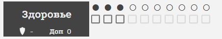
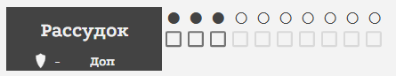
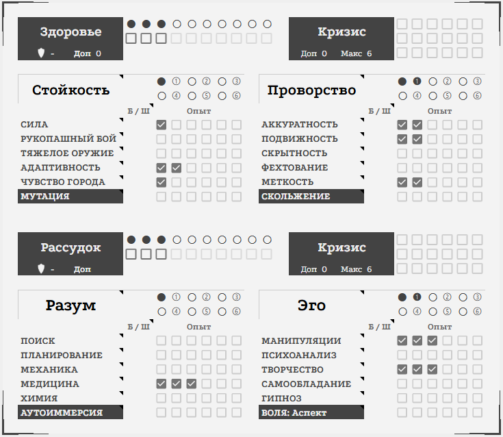
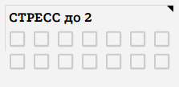
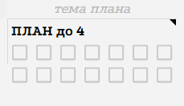

<link rel="stylesheet" href="style.css">

<nav class="navbar">
  <a href="start.html">Введение</a>
  <a href="SistemaVT.html">Основы игровой системы</a>
  <a href="Homerules.html">Правила «Тишины»</a>
  <a href="Game-Master-Code-of-Conduct.html">Кодекс Мастеров</a>
  <a href="Project-Organization.html">Организация проекта</a>
</nav>

[Основы игровой системы](SistemaVT.md) → [Базовая механика бросков](basics.md) → Предисловие

---

# Предисловие

Предполагается, что вы читаете эти правила уже после того, как создали своего первого персонажа. 

Прежде чем приступить к изучению игровой системы, мы хотим обратить ваше внимание на несколько важных элементов вашего Листа персонажа. 

Здесь мы **кратко** расскажем о тех элементах, которые важны в контексте бросков кубов, а подробнее вы сможете ознакомиться с ними в соответствующих разделах правил.

---

<h2>Основные показатели</h2>  

В Листе персонажа вы можете увидеть показатели Здоровья и Рассудка. Они отражают физическую и ментальную выносливость вашего персонажа.

<table class="simple-table image-text-table">

    <colgroup>
        <col style="width:40%;">
        <col style="width:60%;">
    </colgroup>

    <!-- Строка 1 -->
    <tr>
        <td class="image-cell">
            
        </td>

        <td class="text-cell">
         
<strong>Здоровье</strong> определяет его живучесть и способность переносить различные повреждения: от ранений, нанесённых огнестрельным и холодным оружием, до воздействия отравляющих веществ, прямого огня, холода и некоторых болезней.

        </td>
    </tr>

    <!-- Строка 1 -->
    <tr>
        <td class="image-cell">
            
        </td>

        <td class="text-cell">
         
<strong>Рассудок</strong> отражает ментальную стойкость персонажа, его собранность и способность заниматься интеллектуальной деятельностью.

        </td>
    </tr>
  
</table>

<h2>Навыки и их распределение</h2> 

<table class="simple-table image-text-table">

    <colgroup>
        <col style="width:40%;">
        <col style="width:60%;">
    </colgroup>

    <!-- Строка 1 -->
    <tr>
        <td class="image-cell">
            
        </td>

        <td class="text-cell">
         
При создании персонажа вы распределили <strong>навыки</strong> между четырьмя блоками: Стойкость, Проворство, Разум и Эго.  Это распределение не является окончательным: в течение первых нескольких игр вы можете свободно перераспределять свои навыки. По мере накопления опыта персонаж будет развиваться, а общее количество освоенных навыков - постепенно увеличиваться.

        </td>
    </tr>
  
</table>

---

<h2>Состояния персонажа</h2>

Ниже блока Тавыков и Травм расположен блок Состояний. Мы бы хотели обратить ваше внимание на некоторые из них:

<table class="simple-table image-text-table">

    <colgroup>
        <col style="width:40%;">
        <col style="width:60%;">
    </colgroup>

    <!-- Строка 1 -->
    <tr>
        <td class="image-cell">
            
        </td>

        <td class="text-cell">
         
<strong>Стресс</strong> - это ресурс, связанный с ментальной деятельностью. Пункты Стресса выступают своего рода ментальным инструментом, которым персонаж распоряжается в ходе игры.

        </td>
    </tr>

    <!-- Строка 1 -->
    <tr>
        <td class="image-cell">
            
        </td>

        <td class="text-cell">
         
<strong>План:</strong> Если при создании персонажа вы вложили пункты опыта в навык «План», обратите внимание, что вам также доступна возможность получать и реализовывать пункты Плана.

        </td>
    </tr>
    <!-- Строка 1 -->
    <tr>
        <td class="image-cell">
            
        </td>

        <td class="text-cell">
         
<strong>Проворство</strong>: В блоке Состояний вы также найдёте кубы Проворства, которые используются в бою и погонях. Количество кубов проворства зависит от того, какой показатель вашего блока навыков "Проворство"

        </td>
    </tr>
  
</table>

---

<h2>Знания и Связи</h2>

<table class="simple-table image-text-table">

    <colgroup>
        <col style="width:40%;">
        <col style="width:60%;">
    </colgroup>

    <!-- Строка 1 -->
    <tr>
        <td class="image-cell">
            
        </td>

        <td class="text-cell">
         
Обратите внимание, что в вашем Листе персонажа также заполнены Знания и Связи в тех Сферах, с которыми вы взаимодействовали при создании предыстории.  <strong>Знания</strong> отражают ваше понимание того, как устроена и работает соответствующая Сфера.   <strong>Связи</strong> представляют собой полезные знакомства, которые могут помочь персонажу в будущем.

        </td>
    </tr>
  
</table>

---

Теперь, когда вы получили общее представление об основных элементах Листа персонажа и познакомились с ключевыми терминами, можно приступать к изучению базовых правил игровых прокидок.

---

<a href="SistemaVT.html" class="button">← Назад к Игровой системе</a>

