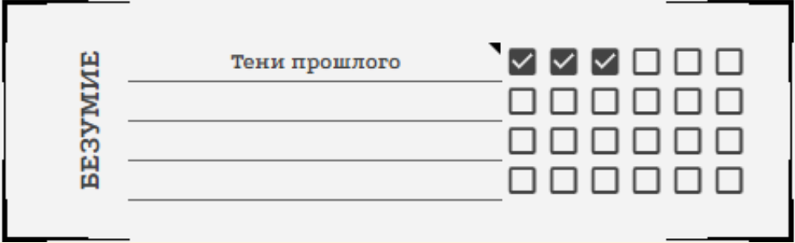
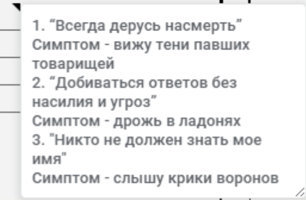

<link rel="stylesheet" href="style.css">

<nav class="navbar">
  <a href="index.html">Главная</a>
  <a href="SistemaVT.html">Игровая система</a>
  <a href="Homerules.html">Домашние правила</a>
</nav>
[Главная](index.md) → [Игровая система](SistemaVT.md) → [Безумие](madness.md) → Создание Императивных установок

# Создание Императивных установок.

<i>"Столица благоволит безумцам"</i>  
**Поговорка**

---
<h2>Как сделать хороший Императив?</h2>

Хорошая установка должна нарративно подходить вашему персонажу. 

_“Я не возьму в руки оружия”_ звучит как довольно плохая установка для стрелка, но вполне хорошая для шпиона. “Я не общаюсь с тем, кто мне врет” плохо подходит для интригана, но отлично сочетается с образом ревностного мстителя. 

Установка должна быть **конкретной и понятной**, ее трактовка должна, в основном, зависеть от внешних условий, а не внутреннего восприятия. 

Установка _“Я обманываю только тех, кто этого заслуживает”_ - плохая установка, так как только игрок определяет, кто “заслуживает” быть обманутым. Установка “Я не могу обмануть тех, кто честен со мной” - уже лучше, но все еще оставляет очень много трактовки для понятия “обман” и “честность”. А вот установка “Я никогда не сообщаю недостоверных данных” - понятная и четкая. 

Хорошая установка должна иметь не очень широкую, но и не очень узкую область применения. 

Установка _“Я не могу находится близко с другими людьми”_ - плохая установка, так как большую часть времени на играх персонаж будет находится в таких условиях. Но и установка _“Я не могу находится близко с коллекторами 5-го кольца”_ - тоже плохая, так как коллекторы 5-го кольца встречаются крайне редко. Хорошей установкой было бы _“Я не могу находится близко с мутантами”_, так как эта ситуация происходит не очень часто и не очень редко. 

Отдельно стоит отметить, что механика императивов создана не для игры в “джинна” или упражнении в софистике. Не стоит спорить про каждую мелочь - конфликты в стиле “близко - это сколько метров”, “люди в беде - это какие именно люди” и “а что такое ложь в целом” убивают динамику и игру. Если вы не настроены принимать предлагаемые мастером условия, возможно, вам лучше заменить императив на более четкий или отказаться от безумия вовсе.

Помните, что Безумие - **это ментальная болезнь, а потому ваша установка должна усложнять вам жизнь,** но также - создавать интересные ситуации. 

Установка _“Я всегда ожидаю подвоха”_ - плохая, так как она не создает потенциально интересных ситуаций и дает только плюсы: ваш персонаж всегда настороже и готов себя защитить. 

Установка _“Я никогда не верю степнякам”_ - хорошая, так как создает эмоциональный конфликт и интригующие ситуации.

---

<h2>Разбор Безумия на примере</h2>

**Точка** - бывший боец магистериума, и все ее безумие связано с тяжелыми воспоминаниями о ее прошлом, поэтому мы дадим ее безумию название “Тени прошлого”.

**Императивные установки ее безумия:**

Первый пункт безумия появляется в предыстории, когда во время боя один из недобитых врагов поднялся и расстрелял в спину ее товарищей. Из-за этого у Точки появилась установка “Всегда дерусь насмерть” - это означает, что она не пытается бить по коленям, использовать нелетальное оружие или брать пленных. Для красоты отыгрыша мы добавляем этой установке проявление “Тени павших товарищей”, которые Точка видит в любом бою.

Второй пункт безумия появляется, когда Точка получает обвинение в госизмене и переживает тяжелые пытки от своего же ведомства. Из-за этих ужасных событий она получает установку “Добиваться ответов без насилия и угроз” - это означает, что теперь она не станет выбивать информацию кулаками или запугивать людей. Для интереса добавим этому проявление “Дрожь в ладонях” 

Третий пункт безумия появляется уже на игре, когда в Мороке ее имя услышал Шепот и ввел ее в кризис рассудка. Ее новая императивная установка - “Никто не должен знать мое имя”. Теперь даже представиться исполнителям или довериться другу для нее - крайне сложная задача. И конечно, добавим проявление - “Крики ворон”, которые она слышит, стоит ей подумать о своем имени, которое знает Шепот. 

Как это записано в чарнике:

<table class="simple-table">

    <colgroup>
        <col style="width:50%;">
        <col style="width:50%;">
    </colgroup>

    <tr>

        <td class="center">
            
        </td>

    </tr>

</table>

<table class="simple-table">

    <colgroup>
        <col style="width:50%;">
        <col style="width:50%;">
    </colgroup>

    <tr>

        <td class="center">
            
        </td>

    </tr>

</table>

---

**Безумие в игровой ситуации:**

Во время очередного задания Точке очень нужно найти следы маньяка, а на броске поиска выпало 6, 5, 1. Нужно было набрать 3 успеха, а выпало только 2.  Точка тратит пункт безумия, чтобы перебросить кубик, на котором выпало “1”, и получает заветную 6. Три нужных успеха есть.

Точка настигает маньяка по найденным следам, однако мирный допрос не дает результатов: ублюдок молчит, а счет идет на минуты. Точке крайне важно узнать, где маньяк держит умирающую жертву. Точка хочет пойти против своей установки “Добиваться ответов без насилия и угроз”. Если бы у Точки хватило навыка самообладания, она бы могла попробовать преодолеть свое безумие, но теперь она вынуждена сделать сверхусилие: сжечь три пункта рассудка, по одному за каждый пункт безумия. У нее начинают дрожать пальцы (так описывается проявление этого безумия), но она начинает запугивать маньяка. 

Если бы у Точки не оказалось достаточно рассудка, ей бы пришлось получить штраф -3 на все навыки в этой сцене, что существенно усложнило бы допрос. 

---

<h2>Примеры императивных установок</h2>

  
• Я никогда не ношу броню
 
  
• Я не возьму в руки оружия
 
  
• Я не употребляю наркотики и препараты
 
  
• Я не веду дел с слугами закона
 
  
• Я всегда использую фальшивые имена 
 
  
• Я не нападаю первым
 
  
• Я не вторгаюсь в частную собственность 
 
  
• Я не беру чужое
 
  
• Я всегда помогаю слабым
 
  
• Я обязан узнать то, что от меня сейчас пытаются скрыть
 
  
• Я не спорю с Древними 
 
  
• Я всегда добиваю умирающих
 
  
• Я не раскрываю чужих секретов 
 
  
• Я не расстаюсь со своим оружием 
 
  
• Враги не должны меня видеть
 
  
• Я никогда не доверюсь мистическим силам
 
  
• Я не оставляю следов своего присутствия 
 
  
• Я не взаимодействую с тем, чьи мотивы мне неизвестны
 
  
• Я должен видеть лицо человека, с которым говорю
 
  
• Я принимаю любые предсказания как истину 
 
  
• Я не использую технологии, работу которых не понимаю
 
  
• Команда должна действовать только по моему плану 
 
  
• Я не могу обращаться вежливо с теми, кто ниже меня по статусу 

---

<a href="SistemaVT.html" class="button">← Назад к Игровой системе</a>

