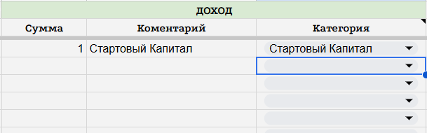
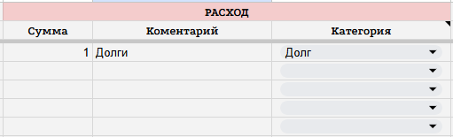
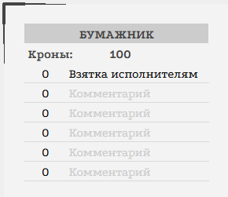
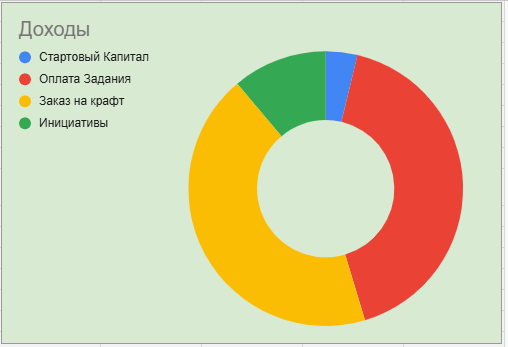
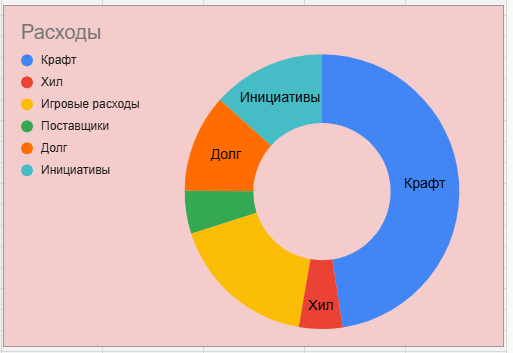

<link rel="stylesheet" href="style.css">

<nav class="navbar">
  <a href="index.html">Главная</a>
  <a href="SistemaVT.html">Игровая система</a>
  <a href="Homerules.html">Домашние правила</a>
</nav>
[Главная](index.md) → [Игровая система](SistemaVT.md) → [Инвентарь](inventory.md) →  [Финансы](Finance.md) → Вкладка "Деньги" в Листе Персонажа

# Вкладка "Деньги" в Листе Персонажа

Во вкладке «Деньги» вашего Листа Персонажа вы можете фиксировать все доходы и расходы своего персонажа.

Правила использования этой вкладки просты:

**Доходы**. Каждый раз, когда вы получаете деньги из любого источника, укажите полученную сумму в графе «Доходы», а также выберите соответствующий тип дохода. Вы можете использовать уже существующие типы или создать собственный, если подходящего варианта нет.

<table class="simple-table center-all-table">

    <tr>
        <td>
            
        </td>
    </tr>

</table>

**Расходы**. Точно так же фиксируются и траты. Каждый раз, когда вы расходуете деньги, укажите потраченную сумму и выберите тип расхода.

<table class="simple-table center-all-table">

    <tr>
        <td>
            
        </td>
    </tr>

</table>

---

**Денежные единицы**

Все расчёты в нашем проекте производятся в кронах.

Если вам по какой-либо причине требуется вести расчёты в либрах и грошах, напоминаем вам, что:

1 крона = 20 либр
1 либра = 10 грошей

---

**Бумажник**

Обратите особое внимание: вкладка «Деньги» связана с вашим бумажником, расположенным во вкладке «Дело».

Лист Персонажа автоматически учитывает все внесённые вами доходы и расходы и пересчитывает содержимое бумажника. Таким образом, в нём всегда отображается актуальная сумма средств вашего персонажа.

<table class="simple-table center-all-table">

    <tr>
        <td>
            
        </td>
    </tr>

</table>

---

**Круговые диараммы**

Справа от таблицы расположены графики, позволяющие увидеть основные источники ваших доходов и статьи расходов, а также их соотношение между собой.

Эти графики предназначены для того, чтобы вы могли наблюдать за экономикой своего персонажа и при желании анализировать, откуда приходят и куда уходят его деньги.

<table class="simple-table center-all-table">

    <colgroup>
        <col style="width:50%;">
        <col style="width:50%;">
    </colgroup>

    <tr>
        <td class="center">
            
        </td>

        <td class="center">
            
        </td>
    </tr>

</table>

---

<a href="SistemaVT.html" class="button">← Назад к Игровой системе</a>

