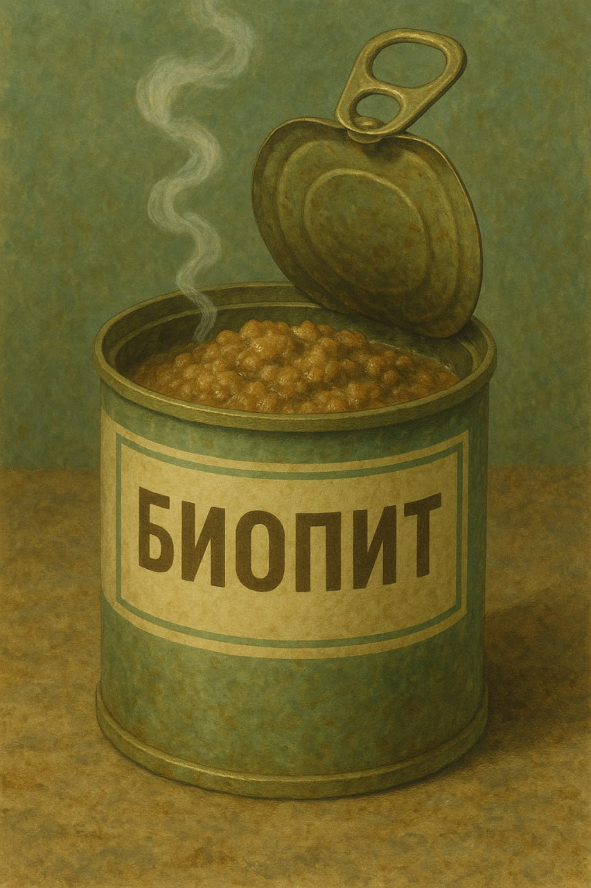
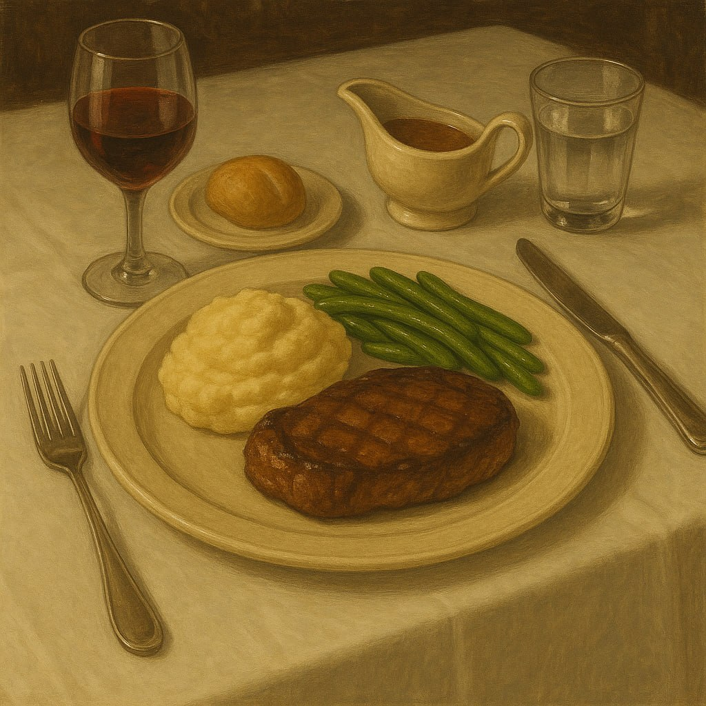

<link rel="stylesheet" href="style.css">

<nav class="navbar">
  <a href="index.html">Главная</a>
  <a href="SistemaVT.html">Игровая система</a>
  <a href="Homerules.html">Домашние правила</a>
</nav>
[Главная](index.md) → [Игровая система](SistemaVT.md) → [Инвентарь](inventory.md) → Общее виденье товаров и услуг

# Общее виденье товаров и услуг

Стоимость одной и той же вещи, как правило, сильно разнится, в зависимости от того, в каком Кольце происходит действие. То что в 3м Кольце будет стоить 20 крон, в 1м уже 200, а в дальних Кольцах вы сможете купить это за несколько либр. Разумеется, это относиться не ко всем категориям предметов. Например, самый распространенный револьвер от “Милосердной стали” в Первом Кольце вообще невозможно приобрести легально.

Для того чтобы помочь вам ориентироваться в этом многообразии цен и создать у игроков и мастров общее виденье игровой экономики, мы приводим таблицу ниже. В ней указана средняя цена для каждого из Колец. Качество предмета, его исполнение и дополнительные функции могут значительно изменить эту цену, но это уже мы предоставляем вам решить самостоятельно.

Нюанс: в таблицах не приведены цены для 9 Кольца, Застенок и территорий каторги, так как привычные законы и правила там действуют плохо или же не действуют вообще. За вещи там убивают чаще чем платят, поэтому мы предоставляем вам определить цены самостоятельно. Вы можете ориентироваться на последнюю колонку _(цена в 7-8 Кольцах)_, изменяя их по собственному усмотрению.

---

<table class="simple-table center-all-table">

    <colgroup>
      <col style="width:25%;">
      <col style="width:15%;">
      <col style="width:12%;">
      <col style="width:12%;">
      <col style="width:12%;">
      <col style="width:12%;">
      <col style="width:12%;">
   </colgroup>

   <!-- Оглавление -->
    <tr>
        <td colspan="7" class="title center">
            <h3>Стоимость питания и выпивки.</h3>
        </td>
    </tr>

     <!-- Новая верхняя строка -->
    <tr>
        <td>ㅤ</td>
        <td>Предмет или услуга</td>
        <td>В 1м кольце</td>
        <td>В 2м кольце</td>
        <td>В 3м-4м кольце</td>
        <td>В 5м-6м кольце</td>
        <td>В 7м-8м кольце</td>
    </tr>

    <!-- Строка 1 -->
    <tr>
    
       <td>
            
        </td>

        <td><strong>Банка биопита</strong></td>
        <td>Ячейка 3</td>
        <td>Ячейка 3</td>
        <td class="parchment-cell">1 крона</td>
        <td>Ячейка 5</td>
        <td>Ячейка 6</td>
    </tr>

    <!-- Строка 2 -->
    <tr>
        <td>
            
        </td>

        <td><strong>Обед в столовой</strong></td>
        <td>Ячейка 9</td>
        <td>Ячейка 3</td>
        <td class="parchment-cell">2-3 кроны</td>
        <td>Ячейка 11</td>
        <td>Ячейка 12</td>
    </tr>

    <!-- Строка 3 -->
    <tr>
        <td>
            
        </td>

        <td><strong>Ужин в приличном ресторане</strong></td>
        <td>Ячейка 15</td>
        <td>Ячейка 3</td>
        <td class="parchment-cell">5-10 крон</td>
        <td>Ячейка 17</td>
        <td>Ячейка 18</td>
    </tr>

    <!-- Строка 4 -->
    <tr>
        <td>
            
        </td>

        <td><strong>Ужин в элитном ресторане</strong></td>
        <td>Ячейка 15</td>
        <td>Ячейка 15</td>
        <td class="parchment-cell">100-250 крон</td>
        <td>Ячейка 17</td>
        <td>Ячейка 18</td>
    </tr>

</table>

---

<a href="SistemaVT.html" class="button">← Назад к Игровой системе</a>

