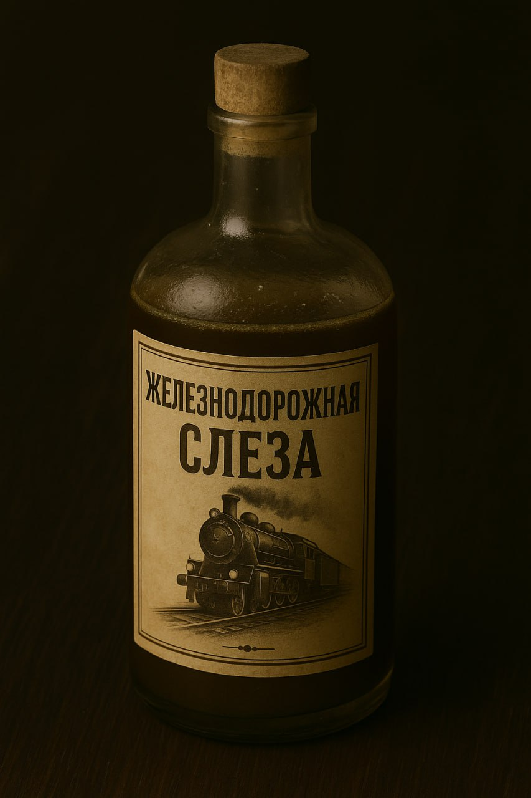
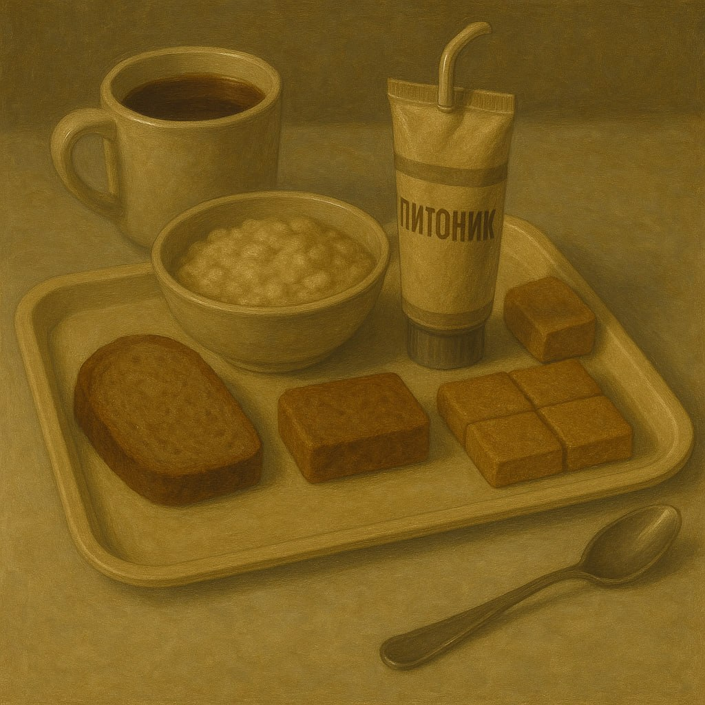
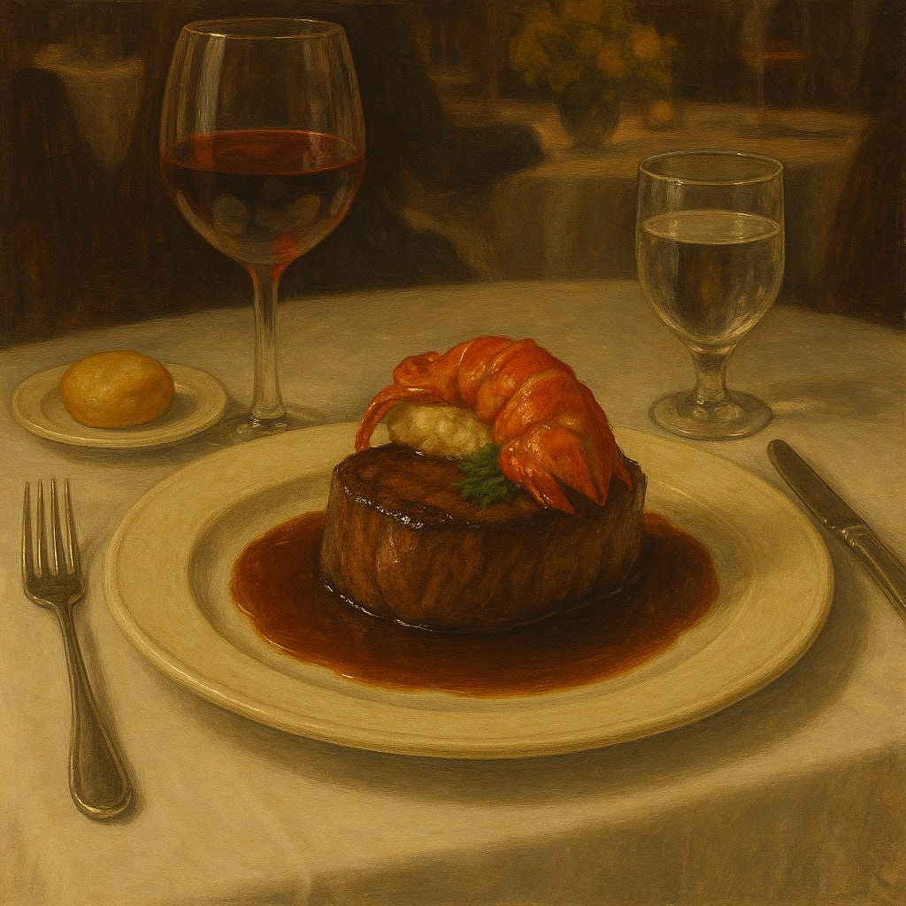
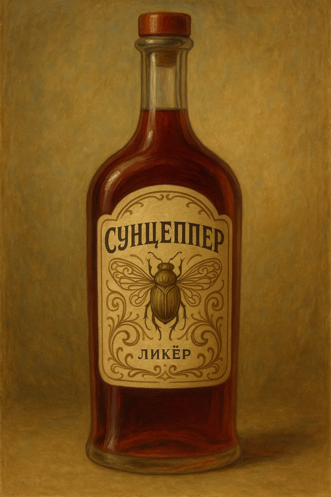
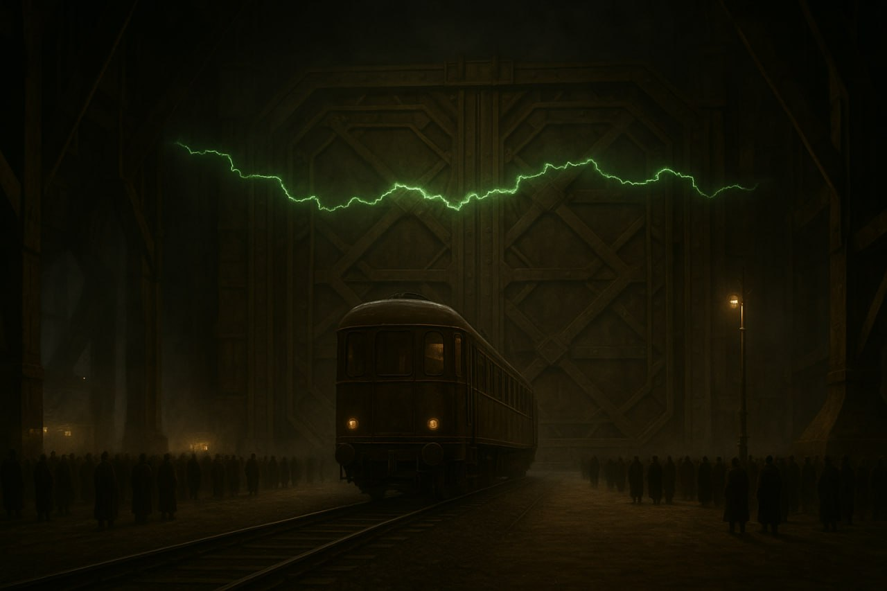
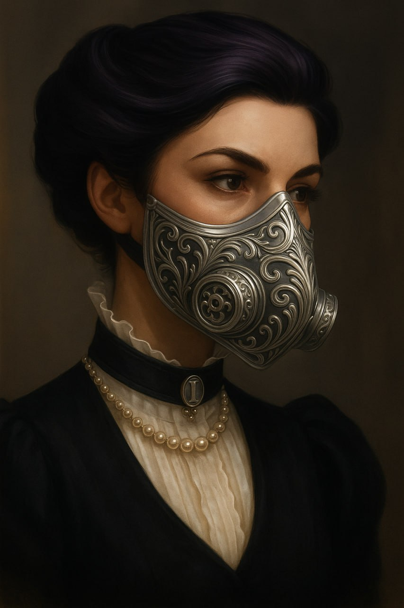
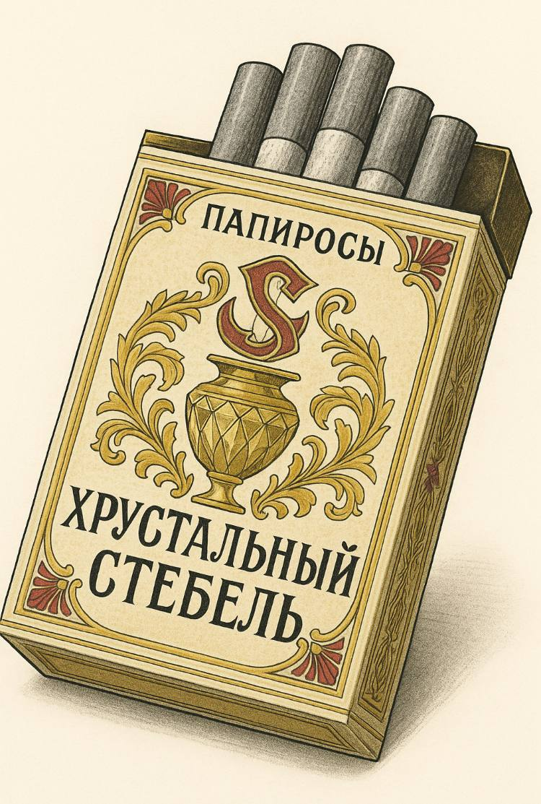
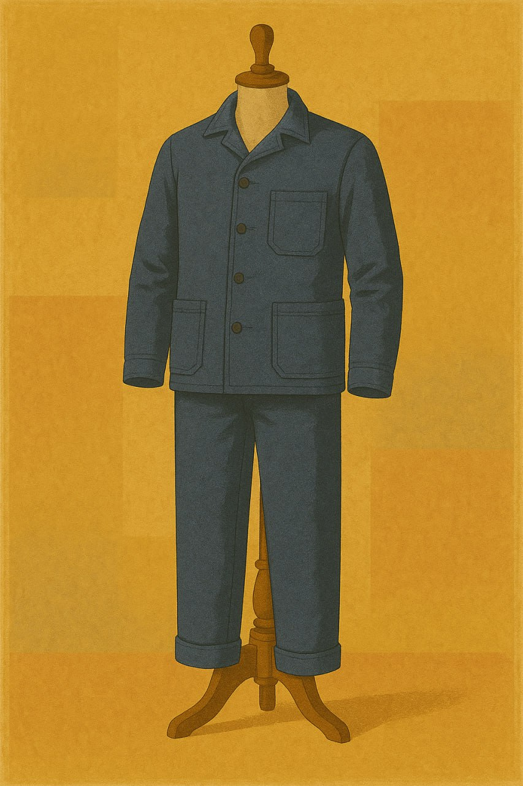
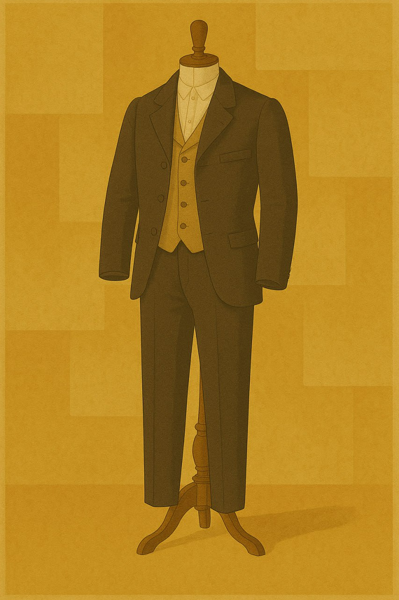
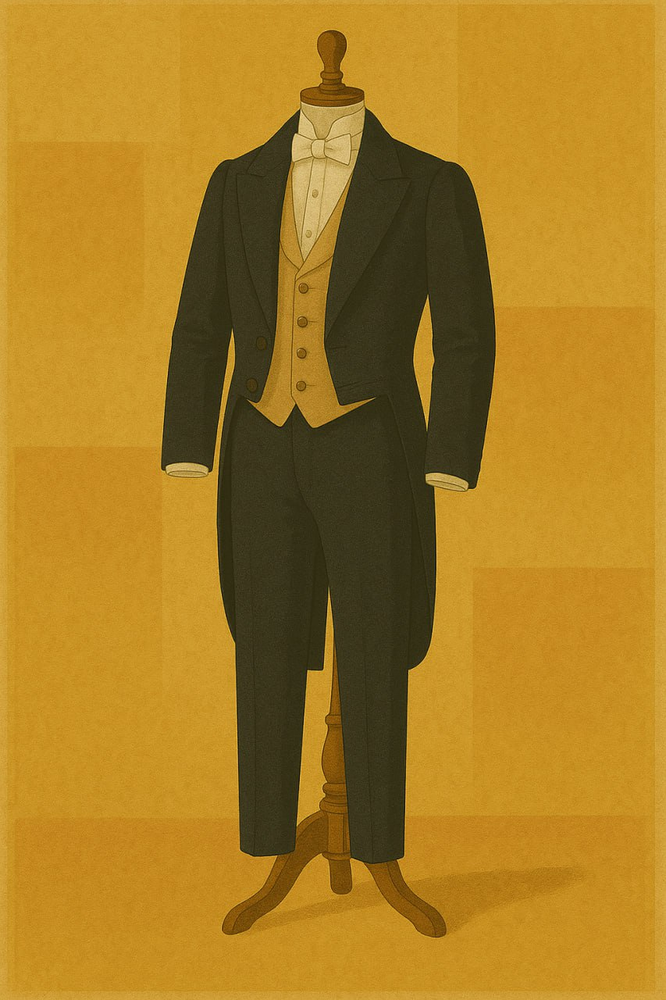

<link rel="stylesheet" href="style.css">

<nav class="navbar">
  <a href="index.html">Главная</a>
  <a href="SistemaVT.html">Игровая система</a>
  <a href="Homerules.html">Домашние правила</a>
</nav>
[Главная](index.md) → [Игровая система](SistemaVT.md) → [Инвентарь](inventory.md) →  [Финансы](Finance.md) → Общее виденье товаров и услуг

# Общее виденье товаров и услуг

Стоимость одной и той же вещи, как правило, сильно разнится, в зависимости от того, в каком Кольце происходит действие. То что в 3м Кольце будет стоить 20 крон, в 1м уже 200, а в дальних Кольцах вы сможете купить это за несколько либр. Разумеется, это относиться не ко всем категориям предметов. Например, самый распространенный револьвер от “Милосердной стали” в Первом Кольце вообще невозможно приобрести легально.

Для того чтобы помочь вам ориентироваться в этом многообразии цен и создать у игроков и мастров общее виденье игровой экономики, мы приводим таблицу ниже. В ней указана средняя цена для каждого из Колец. Качество предмета, его исполнение и дополнительные функции могут значительно изменить эту цену, но это уже мы предоставляем вам решить самостоятельно.

Нюанс: в таблицах не приведены цены для 9 Кольца, Застенок и территорий каторги, так как привычные законы и правила там действуют плохо или же не действуют вообще. За вещи там убивают чаще чем платят, поэтому мы предоставляем вам определить цены самостоятельно. Вы можете ориентироваться на последнюю колонку _(цена в 7-8 Кольцах)_, изменяя их по собственному усмотрению.

Обратите также внимание, что цены в 3-4 Кольцах выделены синим, так как именно в Четвертом Кольце находится агенство "Тишина" и проходит большая часть игровых партий. Первостепенно ориентируйтесь на этот столбик для понимания экономики нашего игрового мира.

---

<table class="simple-table center-all-table">

    <colgroup>
      <col style="width:25%;">
      <col style="width:20%;">
      <col style="width:11%;">
      <col style="width:11%;">
      <col style="width:11%;">
      <col style="width:11%;">
      <col style="width:11%;">
   </colgroup>

   <!-- Оглавление -->
    <tr>
        <td colspan="7" class="title center">
            <h3>Стоимость питания и выпивки</h3>
        </td>
    </tr>

     <!-- Новая верхняя строка -->
    <tr>
        <td class="center">ㅤ</td>
        <td class="center">Предмет или услуга</td>
        <td class="center">В 1м кольце</td>
        <td class="center">В 2м кольце</td>
        <td class="parchment-cell">В 3м-4м кольце</td>
        <td class="center">В 5м-6м кольце</td>
        <td class="center">В 7м-8м кольце</td>
    </tr>

    <!-- Строка 1 -->
    <tr>
    
       <td class="center">
            
        </td>

        <td class="center"><strong>Банка биопита</strong></td>
        <td class="center">5 крон</td>
        <td class="center">2 кроны</td>
        <td class="parchment-cell">1 крона</td>
        <td class="center">10 либр</td>
        <td class="center">5 лир</td>
    </tr>

    <!-- Строка 2 -->
    <tr>
    
       <td class="center">
            
        </td>

        <td class="center"><strong>Дешевый алкоголь</strong></td>
        <td class="center">5 крон</td>
        <td class="center">2 кроны</td>
        <td class="parchment-cell">1 крона</td>
        <td class="center">10 либр</td>
        <td class="center">5 лир</td>
    </tr>

    <!-- Строка 3 -->
    <tr>
        <td class="center">
            
        </td>

        <td class="center"><strong>Обед в столовой</strong></td>
        <td class="center">10-15 крон</td>
        <td class="center">5-10 крон</td>
        <td class="parchment-cell">2-3 кроны</td>
        <td class="center">1-2 кроны 11</td>
        <td class="center">10-20 либр</td>
    </tr>

    <!-- Строка 4 -->
    <tr>
        <td class="center">
            
        </td>

        <td class="center"><strong>Ужин в приличном ресторане</strong></td>
        <td class="center">20-50 крон</td>
        <td class="center">10-20 крон</td>
        <td class="parchment-cell">5-10 крон</td>
        <td class="center">2-5 крон</td>
        <td class="center">1-2 кроны</td>
    </tr>

    <!-- Строка 6 -->
    <tr>
        <td class="center">
            
        </td>

        <td class="center"><strong>Ужин в элитном ресторане</strong></td>
        <td class="center">400-1000 крон</td>
        <td class="center">200-500 крон</td>
        <td class="parchment-cell">100-250 крон</td>
        <td class="center">50-100 крон</td>
        <td class="center">25-50 крон</td>
    </tr>
    
    <!-- Строка 5 -->
    <tr>
        <td class="center">
            
        </td>

        <td class="center"><strong>Дорогой алкоголь</strong></td>
        <td class="center">300-400 крон</td>
        <td class="center">150–200 крон</td>
        <td class="parchment-cell">70-100 крон</td>
        <td class="center">35–50 крон</td>
        <td class="center">20 крон</td>
    </tr>

</table>

---

<table class="simple-table center-all-table">

    <colgroup>
      <col style="width:25%;">
      <col style="width:20%;">
      <col style="width:11%;">
      <col style="width:11%;">
      <col style="width:11%;">
      <col style="width:11%;">
      <col style="width:11%;">
   </colgroup>

   <!-- Оглавление -->
    <tr>
        <td colspan="7" class="title center">
            <h3>Стоимость услуг и ночлега</h3>
        </td>
    </tr>

     <!-- Новая верхняя строка -->
    <tr>
        <td class="center">ㅤ</td>
        <td class="center">Предмет или услуга</td>
        <td class="center">В 1м кольце</td>
        <td class="center">В 2м кольце</td>
        <td class="parchment-cell">В 3м-4м кольце</td>
        <td class="center">В 5м-6м кольце</td>
        <td class="center">В 7м-8м кольце</td>
    </tr>

    <!-- Строка 1 -->
    <tr>
    
       <td class="center">
            
        </td>

        <td class="center"><strong>Обычная стрижка</strong></td>
        <td class="center">10–15 крон</td>
        <td class="center">4–6 крон</td>
        <td class="parchment-cell">2-3 кроны</td>
        <td class="center">1–2 кроны</td>
        <td class="center">10 либр</td>
    </tr>

    <!-- Строка 2 -->
    <tr>
    
       <td class="center">
            
        </td>

        <td class="center"><strong>Модная стрижка</strong></td>
        <td class="center">60–80 крон</td>
        <td class="center">30–40 крон</td>
        <td class="parchment-cell">15-20 крон</td>
        <td class="center">7–10 крон</td>
        <td class="center">3–5 крон</td>
    </tr>

    <!-- Строка 3 -->
    <tr>
    
       <td class="center">
            
        </td>

        <td class="center"><strong>Культурное мероприятие</strong></td>
        <td class="center">150–200 крон</td>
        <td class="center">80–100 крон</td>
        <td class="parchment-cell">40-50 крон</td>
        <td class="center">20–25 крон</td>
        <td class="center">10–12 крон</td>
    </tr>

    <!-- Строка 4 -->
    <tr>
    
       <td class="center">
            
        </td>

        <td class="center"><strong>Средняя взятка Исполнителю</strong></td>
        <td class="center">100-150 крон</td>
        <td class="center">40–60 крон</td>
        <td class="parchment-cell">20-30 крон</td>
        <td class="center">10–15 крон</td>
        <td class="center">5-7 крон</td>
    </tr>

    <!-- Строка 5 -->
    <tr>
    
       <td class="center">
            
        </td>

        <td class="center"><strong>Ночь в хорошем отеле</strong></td>
        <td class="center">200–300 крон</td>
        <td class="center">100–150 крон</td>
        <td class="parchment-cell">50-70 крон</td>
        <td class="center">25–35 крон</td>
        <td class="center">12–17 крон</td>
    </tr>

    

</table>

---

<table class="simple-table center-all-table">

    <colgroup>
      <col style="width:25%;">
      <col style="width:20%;">
      <col style="width:11%;">
      <col style="width:11%;">
      <col style="width:11%;">
      <col style="width:11%;">
      <col style="width:11%;">
   </colgroup>

   <!-- Оглавление -->
    <tr>
        <td colspan="7" class="title center">
            <h3>Стоимость перемещения</h3>
        </td>
    </tr>

     <!-- Новая верхняя строка -->
    <tr>
        <td class="center">ㅤ</td>
        <td class="center">Предмет или услуга</td>
        <td class="center">В 1м кольце</td>
        <td class="center">В 2м кольце</td>
        <td class="parchment-cell">В 3м-4м кольце</td>
        <td class="center">В 5м-6м кольце</td>
        <td class="center">В 7м-8м кольце</td>
    </tr>

    <!-- Строка 1 -->
    <tr>
    
       <td class="center">
            
        </td>

        <td class="center"><strong>Проезд на антароходе</strong></td>
        <td class="center">-</td>
        <td class="center">4 кроны</td>
        <td class="parchment-cell">3 кроны</td>
        <td class="center">2 кроны</td>
        <td class="center">1 крона</td>
    </tr>

    <!-- Строка 2 -->
    <tr>
    
       <td class="center">
            
        </td>

        <td class="center"><strong>Проезд в соседнее Кольцо</strong></td>
        <td class="center">150–250 крон</td>
        <td class="center">70–120 крон</td>
        <td class="parchment-cell">35-60 крон</td>
        <td class="center">15–30 крон</td>
        <td class="center">8–15 крон</td>
    </tr>

</table>

---

<table class="simple-table center-all-table">

    <colgroup>
      <col style="width:25%;">
      <col style="width:20%;">
      <col style="width:11%;">
      <col style="width:11%;">
      <col style="width:11%;">
      <col style="width:11%;">
      <col style="width:11%;">
   </colgroup>

   <!-- Оглавление -->
    <tr>
        <td colspan="7" class="title center">
            <h3>Стоимость товаров постоянного спроса</h3>
        </td>
    </tr>

     <!-- Новая верхняя строка -->
    <tr>
        <td class="center">ㅤ</td>
        <td class="center">Предмет или услуга</td>
        <td class="center">В 1м кольце</td>
        <td class="center">В 2м кольце</td>
        <td class="parchment-cell">В 3м-4м кольце</td>
        <td class="center">В 5м-6м кольце</td>
        <td class="center">В 7м-8м кольце</td>
    </tr>

    <!-- Строка 1 -->
    <tr>
    
       <td class="center">
            
        </td>

        <td class="center"><strong>Фильтр низкого качества</strong></td>
        <td class="center">10–15 крон</td>
        <td class="center">4–6 крон</td>
        <td class="parchment-cell">2-3 кроны</td>
        <td class="center">1–2 кроны</td>
        <td class="center">10 либр</td>
    </tr>
    <!-- Строка 2 -->
    <tr>
    
       <td class="center">
            
        </td>

        <td class="center"><strong>Качественный фильтр среднего качества</strong></td>
        <td class="center">60–80 крон</td>
        <td class="center">30–40 крон</td>
        <td class="parchment-cell">15-20 крон</td>
        <td class="center">7–10 крон</td>
        <td class="center">3–5 крон</td>
    </tr>
    <!-- Строка 3 -->
    <tr>
    
       <td class="center">
            
        </td>

        <td class="center"><strong>Высококлассный и филигранный фильтр</strong></td>
        <td class="center">1-2 тысячи крон</td>
        <td class="center">500-800 крон</td>
        <td class="parchment-cell">300-400 крон</td>
        <td class="center">150-200 крон</td>
        <td class="center">75-100 крон</td>
    </tr>
    <!-- Строка 4 -->
    <tr>
    
       <td class="center">
            
        </td>

        <td class="center"><strong>Молоток</strong></td>
        <td class="center">10–20 крон</td>
        <td class="center">5–10 крон</td>
        <td class="parchment-cell">2-5 крон</td>
        <td class="center">1–2 кроны</td>
        <td class="center">10 либр</td>
    </tr>

    <!-- Строка 5 -->
    <tr>
    
       <td class="center">
            
        </td>

        <td class="center"><strong>Художественная книга</strong></td>
        <td class="center">50–70 крон</td>
        <td class="center">20–30 крон</td>
        <td class="parchment-cell">10-15 крон</td>
        <td class="center">5–8 крон</td>
        <td class="center">2-3 кроны</td>
    </tr>

    <!-- Строка 6 -->
    <tr>
    
       <td class="center">
            
        </td>

        <td class="center">Одна доза <strong>наркотика</strong> среднего качества</td>
        <td class="center">120–160 крон</td>
        <td class="center">60–80 крон</td>
        <td class="parchment-cell">30-40 крон</td>
        <td class="center">15–20 крон</td>
        <td class="center">7–10 крон</td>
    </tr>

    <!-- Строка 7 -->
    <tr>
    
       <td class="center">
            
        </td>

        <td class="center"><strong><i>"Хрустальный Стебель"</i></strong></td>
        <td class="center">250–400 крон</td>
        <td class="center">150–200 крон</td>
        <td class="parchment-cell">70-100 крон</td>
        <td class="center">35–50 крон</td>
        <td class="center">17–25 крон</td>
    </tr>

    <!-- Строка 8 -->
    <tr>
    
       <td class="center">
            
        </td>

        <td class="center"><strong>Обычная роба рабочего</strong></td>
        <td class="center">50–70 крон</td>
        <td class="center">20–30 крон</td>
        <td class="parchment-cell">10-15 крон</td>
        <td class="center">5–8 крон</td>
        <td class="center">2-3 кроны</td>
    </tr>

    <!-- Строка 9 -->
    <tr>
    
       <td class="center">
            
        </td>

        <td class="center"><strong>Стандартный деловой костюм клерка</strong></td>
        <td class="center">150–200 крон</td>
        <td class="center">80–100 крон</td>
        <td class="parchment-cell">40-50 крон</td>
        <td class="center">20–25 крон</td>
        <td class="center">10–15 крон</td>
    </tr>

    <!-- Строка 10 -->
    <tr>
    
       <td class="center">
            
        </td>

        <td class="center"><strong>Костюм модного франта</strong></td>
        <td class="center">2-3 тысячи крон</td>
        <td class="center">1-2 тысячи крон</td>
        <td class="parchment-cell">700 крон</td>
        <td class="center">350 крон</td>
        <td class="center">175 крон</td>
    </tr>

    <!-- Строка 11 -->
    <tr>
    
       <td class="center">
            
        </td>

        <td class="center"><strong>Золотое кольцо</strong></td>
        <td class="center">1-2 тысячи крон</td>
        <td class="center">600-1000 крон</td>
        <td class="parchment-cell">300-500 крон</td>
        <td class="center">150-250 крон</td>
        <td class="center">75-100 крон</td>
    </tr>

</table>

<a href="SistemaVT.html" class="button">← Назад к Игровой системе</a>

