<link rel="stylesheet" href="style.css">

<nav class="navbar">
  <a href="start.html">Введение</a>
  <a href="SistemaVT.html">Основы игровой системы</a>
  <a href="Homerules.html">Правила «Тишины»</a>
  <a href="Game-Master-Code-of-Conduct.html">Кодекс Мастеров</a>
  <a href="Project-Organization.html">Организация проекта</a>
</nav>

[Основы игровой системы](SistemaVT.md) → [Общее виденье игры](gamevision.md) → Общее виденье товаров и услуг

---

# Общее виденье товаров и услуг

Стоимость одной и той же вещи, как правило, сильно разнится, в зависимости от того, в каком Кольце происходит действие. То что в 3м Кольце будет стоить 20 крон, в 1м уже 200, а в дальних Кольцах вы сможете купить это за несколько либр. Разумеется, это относиться не ко всем категориям предметов. Например, самый распространенный револьвер от “Милосердной стали” в Первом Кольце вообще невозможно приобрести легально.

Для того чтобы помочь вам ориентироваться в этом многообразии цен и создать у игроков и мастров общее виденье игровой экономики, мы приводим таблицу ниже. В ней указана средняя цена для каждого из Колец. Качество предмета, его исполнение и дополнительные функции могут значительно изменить эту цену, но это уже мы предоставляем вам решить самостоятельно.

Нюанс: в таблицах не приведены цены для 9 Кольца, Застенок и территорий каторги, так как привычные законы и правила там действуют плохо или же не действуют вообще. За вещи там убивают чаще чем платят, поэтому мы предоставляем вам определить цены самостоятельно. Вы можете ориентироваться на последнюю колонку _(цена в 7-8 Кольцах)_, изменяя их по собственному усмотрению.

Обратите также внимание, что цены в 3-4 Кольцах выделены синим, так как именно в Четвертом Кольце находится агенство "Тишина" и проходит большая часть игровых партий. Первостепенно ориентируйтесь на этот столбик для понимания экономики нашего игрового мира.

---

<table class="simple-table center-all-table">

    <colgroup>
      <col style="width:25%;">
      <col style="width:20%;">
      <col style="width:11%;">
      <col style="width:11%;">
      <col style="width:11%;">
      <col style="width:11%;">
      <col style="width:11%;">
   </colgroup>

   <!-- Оглавление -->
    <tr>
        <td colspan="7" class="title center">
            <h3>Стоимость питания и выпивки</h3>
        </td>
    </tr>

     <!-- Новая верхняя строка -->
    <tr>
        <td class="center">
            
ㅤ

        </td>
        <td class="center">
            
Предмет или услуга

        </td>
        <td class="center">
            
В 1м кольце

        </td>
        <td class="center">
            
В 2м кольце

        </td>
        <td class="parchment-cell">
            
В 3м-4м кольце

        </td>
        <td class="center">
            
В 5м-6м кольце

        </td>
        <td class="center">
            
В 7м-8м кольце

        </td>
    </tr>

    <!-- Строка 1 -->
    <tr>
    
       <td class="center">
            
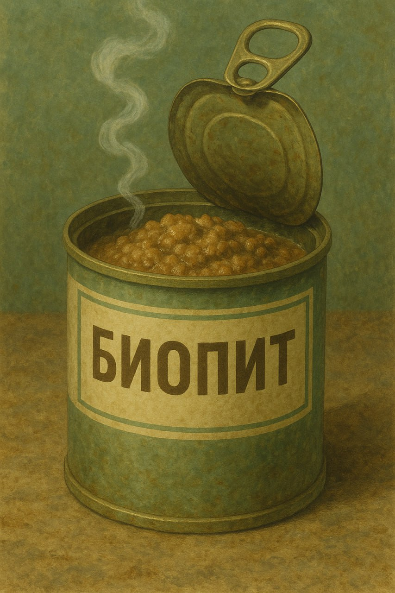

        </td>

        <td class="center">
            
<strong>Банка биопита</strong>

        </td>
        <td class="center">
            
5 крон

        </td>
        <td class="center">
            
2 кроны

        </td>
        <td class="parchment-cell">
            
1 крона

        </td>
        <td class="center">
            
10 либр

        </td>
        <td class="center">
            
5 лир

        </td>
    </tr>

    <!-- Строка 2 -->
    <tr>
    
       <td class="center">
            
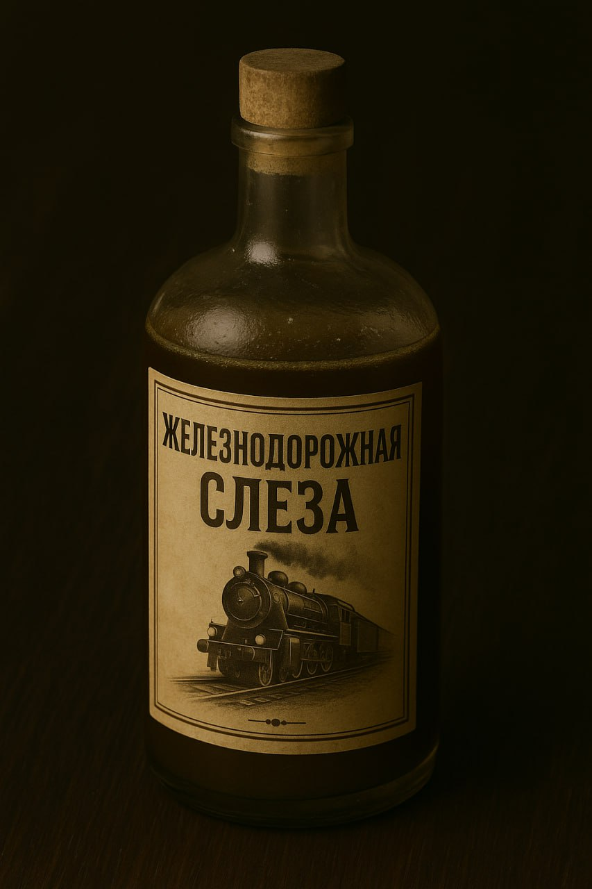

        </td>

        <td class="center">
            
<strong>Дешевый алкоголь</strong>

        </td>
        <td class="center">
            
5 крон

        </td>
        <td class="center">
            
2 кроны

        </td>
        <td class="parchment-cell">
            
1 крона

        </td>
        <td class="center">
            
10 либр

        </td>
        <td class="center">
            
5 лир

        </td>
    </tr>

    <!-- Строка 3 -->
    <tr>
        <td class="center">
            
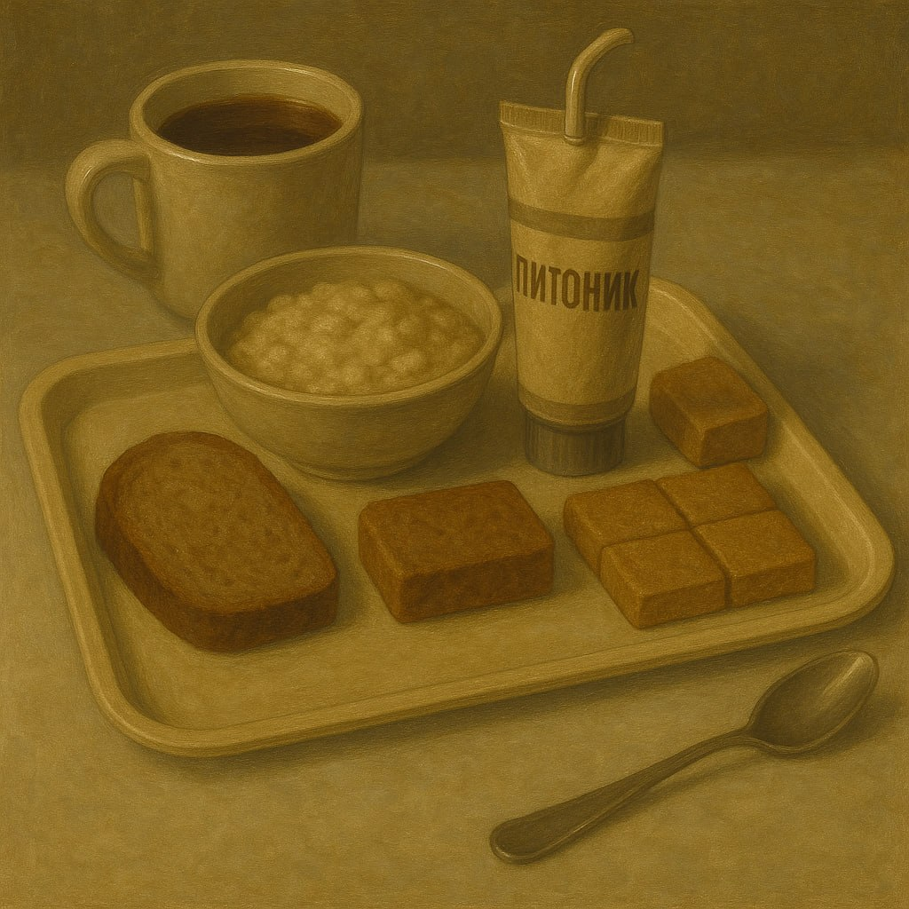

        </td>

        <td class="center">
            
<strong>Обед в столовой</strong>

        </td>
        <td class="center">
            
10-15 крон

        </td>
        <td class="center">
            
5-10 крон

        </td>
        <td class="parchment-cell">
            
2-3 кроны

        </td>
        <td class="center">
            
1-2 кроны 11

        </td>
        <td class="center">
            
10-20 либр

        </td>
    </tr>

    <!-- Строка 4 -->
    <tr>
        <td class="center">
            
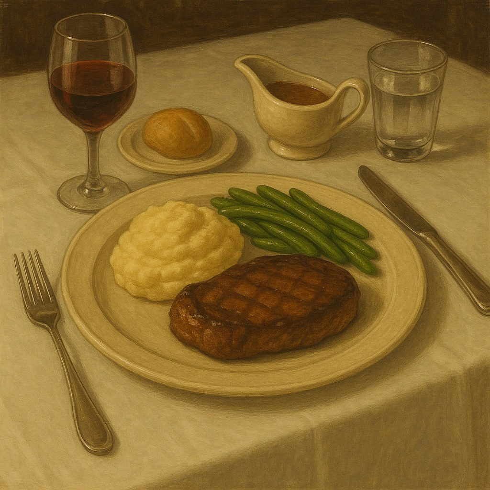

        </td>

        <td class="center">
            
<strong>Ужин в приличном ресторане</strong>

        </td>
        <td class="center">
            
20-50 крон

        </td>
        <td class="center">
            
10-20 крон

        </td>
        <td class="parchment-cell">
            
5-10 крон

        </td>
        <td class="center">
            
2-5 крон

        </td>
        <td class="center">
            
1-2 кроны

        </td>
    </tr>

    <!-- Строка 6 -->
    <tr>
        <td class="center">
            
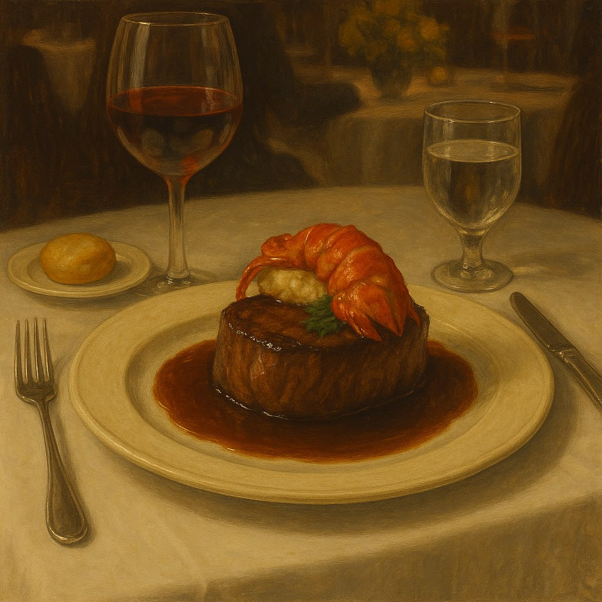

        </td>

        <td class="center">
            
<strong>Ужин в элитном ресторане</strong>

        </td>
        <td class="center">
            
400-1000 крон

        </td>
        <td class="center">
            
200-500 крон

        </td>
        <td class="parchment-cell">
            
100-250 крон

        </td>
        <td class="center">
            
50-100 крон

        </td>
        <td class="center">
            
25-50 крон

        </td>
    </tr>
    
    <!-- Строка 5 -->
    <tr>
        <td class="center">
            
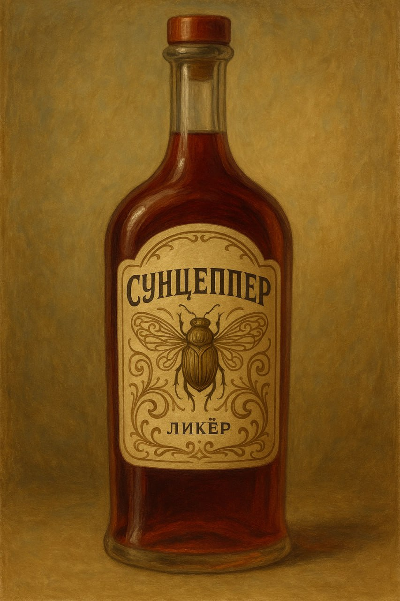

        </td>

        <td class="center">
            
<strong>Дорогой алкоголь</strong>

        </td>
        <td class="center">
            
300-400 крон

        </td>
        <td class="center">
            
150–200 крон

        </td>
        <td class="parchment-cell">
            
70-100 крон

        </td>
        <td class="center">
            
35–50 крон

        </td>
        <td class="center">
            
20 крон

        </td>
    </tr>

</table>

---

<table class="simple-table center-all-table">

    <colgroup>
      <col style="width:25%;">
      <col style="width:20%;">
      <col style="width:11%;">
      <col style="width:11%;">
      <col style="width:11%;">
      <col style="width:11%;">
      <col style="width:11%;">
   </colgroup>

   <!-- Оглавление -->
    <tr>
        <td colspan="7" class="title center">
            <h3>Стоимость услуг и ночлега</h3>
        </td>
    </tr>

     <!-- Новая верхняя строка -->
    <tr>
        <td class="center">
            
ㅤ

        </td>
        <td class="center">
            
Предмет или услуга

        </td>
        <td class="center">
            
В 1м кольце

        </td>
        <td class="center">
            
В 2м кольце

        </td>
        <td class="parchment-cell">
            
В 3м-4м кольце

        </td>
        <td class="center">
            
В 5м-6м кольце

        </td>
        <td class="center">
            
В 7м-8м кольце

        </td>
    </tr>

    <!-- Строка 1 -->
    <tr>
       <td class="center">
            

        </td>

        <td class="center">
            
<strong>Обычная стрижка</strong>

        </td>
        <td class="center">
            
10–15 крон

        </td>
        <td class="center">
            
4–6 крон

        </td>
        <td class="parchment-cell">
            
2-3 кроны

        </td>
        <td class="center">
            
1–2 кроны

        </td>
        <td class="center">
            
10 либр

        </td>
    </tr>

    <!-- Строка 2 -->
    <tr>
       <td class="center">
            

        </td>

        <td class="center">
            
<strong>Модная стрижка</strong>

        </td>
        <td class="center">
            
60–80 крон

        </td>
        <td class="center">
            
30–40 крон

        </td>
        <td class="parchment-cell">
            
15-20 крон

        </td>
        <td class="center">
            
7–10 крон

        </td>
        <td class="center">
            
3–5 крон

        </td>
    </tr>

    <!-- Строка 3 -->
    <tr>
       <td class="center">
            

        </td>

        <td class="center">
            
<strong>Культурное мероприятие</strong>

        </td>
        <td class="center">
            
150–200 крон

        </td>
        <td class="center">
            
80–100 крон

        </td>
        <td class="parchment-cell">
            
40-50 крон

        </td>
        <td class="center">
            
20–25 крон

        </td>
        <td class="center">
            
10–12 крон

        </td>
    </tr>

    <!-- Строка 4 -->
    <tr>
       <td class="center">
            

        </td>

        <td class="center">
            
<strong>Средняя взятка Исполнителю</strong>

        </td>
        <td class="center">
            
100-150 крон

        </td>
        <td class="center">
            
40–60 крон

        </td>
        <td class="parchment-cell">
            
20-30 крон

        </td>
        <td class="center">
            
10–15 крон

        </td>
        <td class="center">
            
5-7 крон

        </td>
    </tr>

    <!-- Строка 5 -->
    <tr>
       <td class="center">
            

        </td>

        <td class="center">
            
<strong>Ночь в хорошем отеле</strong>

        </td>
        <td class="center">
            
200–300 крон

        </td>
        <td class="center">
            
100–150 крон

        </td>
        <td class="parchment-cell">
            
50-70 крон

        </td>
        <td class="center">
            
25–35 крон

        </td>
        <td class="center">
            
12–17 крон

        </td>
    </tr>

</table>

---

<table class="simple-table center-all-table">

    <colgroup>
      <col style="width:25%;">
      <col style="width:20%;">
      <col style="width:11%;">
      <col style="width:11%;">
      <col style="width:11%;">
      <col style="width:11%;">
      <col style="width:11%;">
   </colgroup>

   <!-- Оглавление -->
    <tr>
        <td colspan="7" class="title center">
            <h3>Стоимость перемещения</h3>
        </td>
    </tr>

     <!-- Новая верхняя строка -->
    <tr>
        <td class="center">
            
ㅤ

        </td>
        <td class="center">
            
Предмет или услуга

        </td>
        <td class="center">
            
В 1м кольце

        </td>
        <td class="center">
            
В 2м кольце

        </td>
        <td class="parchment-cell">
            
В 3м-4м кольце

        </td>
        <td class="center">
            
В 5м-6м кольце

        </td>
        <td class="center">
            
В 7м-8м кольце

        </td>
    </tr>

    <!-- Строка 1 -->
    <tr>
       <td class="center">
            

        </td>

        <td class="center">
            
<strong>Проезд на антароходе</strong>

        </td>
        <td class="center">
            
-

        </td>
        <td class="center">
            
4 кроны

        </td>
        <td class="parchment-cell">
            
3 кроны

        </td>
        <td class="center">
            
2 кроны

        </td>
        <td class="center">
            
1 крона

        </td>
    </tr>

    <!-- Строка 2 -->
    <tr>
       <td class="center">
            
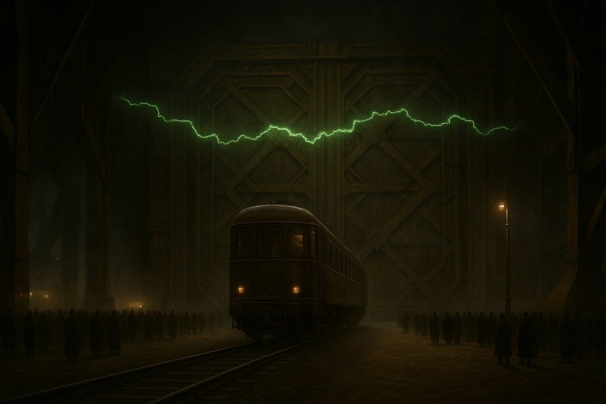

        </td>

        <td class="center">
            
<strong>Проезд в соседнее Кольцо</strong>

        </td>
        <td class="center">
            
150–250 крон

        </td>
        <td class="center">
            
70–120 крон

        </td>
        <td class="parchment-cell">
            
35-60 крон

        </td>
        <td class="center">
            
15–30 крон

        </td>
        <td class="center">
            
8–15 крон

        </td>
    </tr>

</table>
---

<table class="simple-table center-all-table">

    <colgroup>
      <col style="width:25%;">
      <col style="width:20%;">
      <col style="width:11%;">
      <col style="width:11%;">
      <col style="width:11%;">
      <col style="width:11%;">
      <col style="width:11%;">
   </colgroup>

   <!-- Оглавление -->
    <tr>
        <td colspan="7" class="title center">
            <h3>Стоимость товаров постоянного спроса</h3>
        </td>
    </tr>

    <!-- Новая верхняя строка -->
    <tr>
        <td class="center">ㅤ</td>
        <td class="center">Предмет или услуга</td>
        <td class="center">В 1м кольце</td>
        <td class="center">В 2м кольце</td>
        <td class="parchment-cell">В 3м-4м кольце</td>
        <td class="center">В 5м-6м кольце</td>
        <td class="center">В 7м-8м кольце</td>
    </tr>

    <!-- Строка 1 -->
    <tr>
       <td class="center">
            
        </td>

        <td class="center"><strong>
Фильтр низкого качества
</strong></td>
        <td class="center">
10–15 крон
</td>
        <td class="center">
4–6 крон
</td>
        <td class="parchment-cell">
2-3 кроны
</td>
        <td class="center">
1–2 кроны
</td>
        <td class="center">
10 либр
</td>
    </tr>

    <!-- Строка 2 -->
    <tr>
       <td class="center">
            
        </td>

        <td class="center"><strong>
Качественный фильтр среднего качества
</strong></td>
        <td class="center">
60–80 крон
</td>
        <td class="center">
30–40 крон
</td>
        <td class="parchment-cell">
15-20 крон
</td>
        <td class="center">
7–10 крон
</td>
        <td class="center">
3–5 крон
</td>
    </tr>

    <!-- Строка 3 -->
    <tr>
       <td class="center">
            
        </td>

        <td class="center"><strong>
Высококлассный и филигранный фильтр
</strong></td>
        <td class="center">
1-2 тысячи крон
</td>
        <td class="center">
500-800 крон
</td>
        <td class="parchment-cell">
300-400 крон
</td>
        <td class="center">
150-200 крон
</td>
        <td class="center">
75-100 крон
</td>
    </tr>

    <!-- Строка 4 -->
    <tr>
       <td class="center">
            
        </td>

        <td class="center"><strong>
Молоток
</strong></td>
        <td class="center">
10–20 крон
</td>
        <td class="center">
5–10 крон
</td>
        <td class="parchment-cell">
2-5 крон
</td>
        <td class="center">
1–2 кроны
</td>
        <td class="center">
10 либр
</td>
    </tr>

    <!-- Строка 5 -->
    <tr>
       <td class="center">
            
        </td>

        <td class="center"><strong>
Художественная книга
</strong></td>
        <td class="center">
50–70 крон
</td>
        <td class="center">
20–30 крон
</td>
        <td class="parchment-cell">
10-15 крон
</td>
        <td class="center">
5–8 крон
</td>
        <td class="center">
2-3 кроны
</td>
    </tr>

    <!-- Строка 6 -->
    <tr>
       <td class="center">
            
        </td>

        <td class="center">
Одна доза <strong>наркотика</strong> среднего качества
</td>
        <td class="center">
120–160 крон
</td>
        <td class="center">
60–80 крон
</td>
        <td class="parchment-cell">
30-40 крон
</td>
        <td class="center">
15–20 крон
</td>
        <td class="center">
7–10 крон
</td>
    </tr>

    <!-- Строка 7 -->
    <tr>
       <td class="center">
            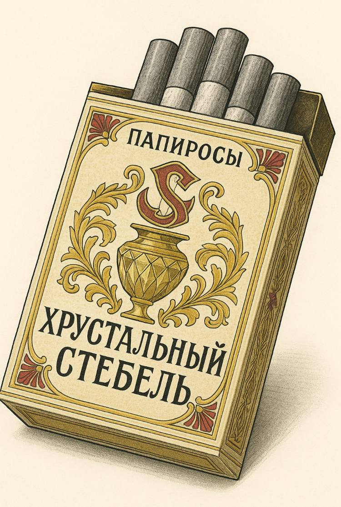
        </td>

        <td class="center"><strong>
<i>"Хрустальный Стебель"</i>
</strong></td>
        <td class="center">
250–400 крон
</td>
        <td class="center">
150–200 крон
</td>
        <td class="parchment-cell">
70-100 крон
</td>
        <td class="center">
35–50 крон
</td>
        <td class="center">
17–25 крон
</td>
    </tr>

    <!-- Строка 8 -->
    <tr>
       <td class="center">
            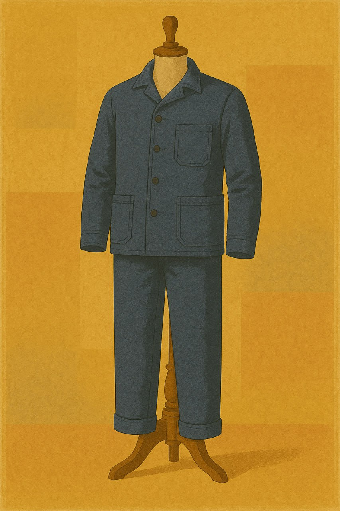
        </td>

        <td class="center"><strong>
Обычная роба рабочего
</strong></td>
        <td class="center">
50–70 крон
</td>
        <td class="center">
20–30 крон
</td>
        <td class="parchment-cell">
10-15 крон
</td>
        <td class="center">
5–8 крон
</td>
        <td class="center">
2-3 кроны
</td>
    </tr>

    <!-- Строка 9 -->
    <tr>
       <td class="center">
            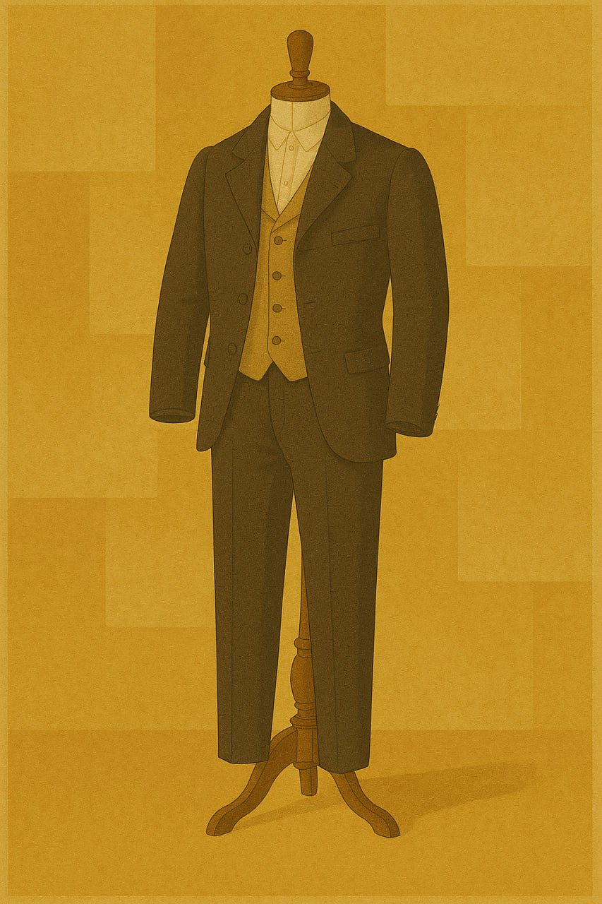
        </td>

        <td class="center"><strong>
Стандартный деловой костюм клерка
</strong></td>
        <td class="center">
150–200 крон
</td>
        <td class="center">
80–100 крон
</td>
        <td class="parchment-cell">
40-50 крон
</td>
        <td class="center">
20–25 крон
</td>
        <td class="center">
10–15 крон
</td>
    </tr>

    <!-- Строка 10 -->
    <tr>
       <td class="center">
            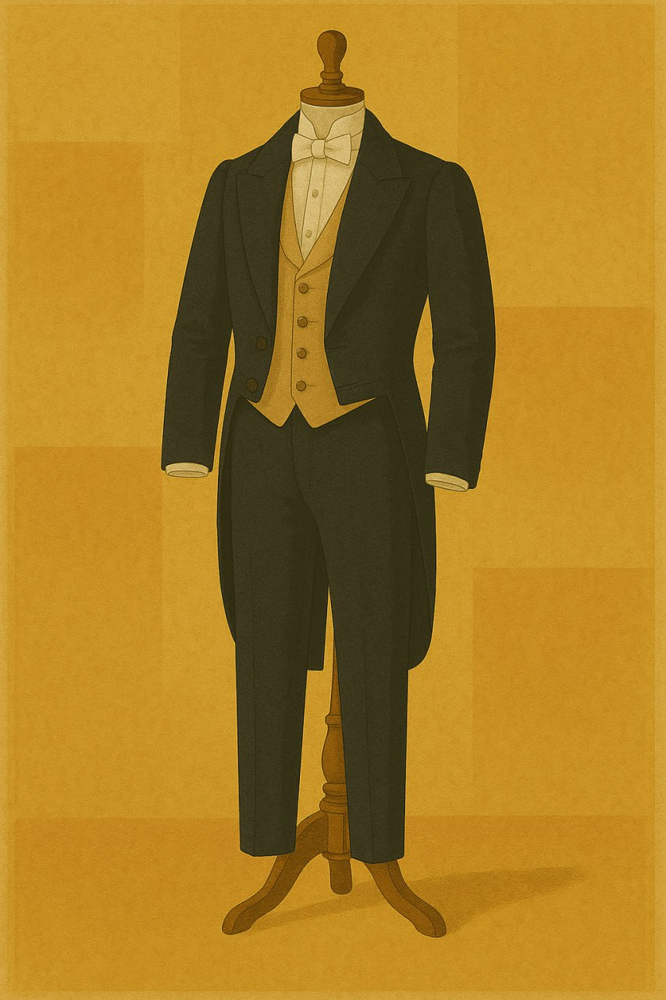
        </td>

        <td class="center"><strong>
Костюм модного франта
</strong></td>
        <td class="center">
2-3 тысячи крон
</td>
        <td class="center">
1-2 тысячи крон
</td>
        <td class="parchment-cell">
700 крон
</td>
        <td class="center">
350 крон
</td>
        <td class="center">
175 крон
</td>
    </tr>

    <!-- Строка 11 -->
    <tr>
       <td class="center">
            
        </td>

        <td class="center"><strong>
Золотое кольцо
</strong></td>
        <td class="center">
1-2 тысячи крон
</td>
        <td class="center">
600-1000 крон
</td>
        <td class="parchment-cell">
300-500 крон
</td>
        <td class="center">
150-250 крон
</td>
        <td class="center">
75-100 крон
</td>
    </tr>

</table>

---

  

    
  

  

    
Агентство 
    «Тишина»

  

