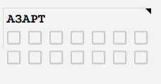

<link rel="stylesheet" href="style.css">

<nav class="navbar">
  <a href="start.html">Введение</a>
  <a href="SistemaVT.html">Основы игровой системы</a>
  <a href="Homerules.html">Правила «Тишины»</a>
  <a href="Game-Master-Code-of-Conduct.html">Кодекс Мастеров</a>
  <a href="Project-Organization.html">Организация проекта</a>
</nav>

[Основы игровой системы](SistemaVT.md) → [Базовая механика бросков](basics.md) → Виды действий

---

# Виды действий

Любые ситуации, в которых успех персонажу не гарантирован, или же если Мастер хочет, чтобы участники действия оставались в неведении относительно имеющихся у них шансов, могут описываться следующим образом:

<h2>Обычное действие</h2> 

В ситуациях, когда персонажу требуется сделать что-либо здесь и сейчас, персонаж совершает бросок всех кубиков, которые он может взять для проверки **навыка**. Результат броска сразу определит, удалось задуманное или нет. 

  
<strong>Пример:</strong>
 
  
Взлом замка, определение состава жидкости, лечение ранений, общение.

---

<h2>Совместное действие</h2> 

Если персонажи действуют вместе, то все полученные Успехи суммируются, но не могут быть больше самого высокого навыка. При этом все **Провалы** применяются индивидуально (_то есть результат общей проверки может быть успешен, но каждый персонаж по отдельности может пострадать_).

Мастер может не разрешить использовать одновременную проверку, если обстоятельства этого не позволяют.

  
<strong>Пример:</strong>
 
  
Три персонажа взламывают замок, и у двух из них Механика 2, а у третьего – 5.   Все они делают проверки навыков, но по результату не получится набрать больше 5 Успехов.   Один из персонажей получает Провал, и только он сталкивается с его последствиями, хотя взлом замка по итогу успешен.

---

<h2>Процесс</h2> 

Некоторые задачи требуют определённого времени, их нельзя выполнить на ходу. Такие задачи, как сборка прибора, синтез сложного препарата, планирование или гипноз могут потребовать продолжительных действий. 

В таких задачах с течением времени совершаются броски, в которых все успехи выше сложности записываются или отмечаются иным способом, накапливаясь в качестве прогресса. 

Действие считается завершенным при накоплении должного количества успехов.

  
<strong>Примеры:</strong>
 
  
Лечение Кризисов, создание новых предметов, гипноз, работа со сложными устройствами.

---

<h2>Проверка против проверки</h2>

Если действие подразумевает противостояние нескольких сторон (атака и защита, поиск и скрытность, попытка обмана), то для определения результата потребуется оппозитная проверка.

Все стороны конфликта совершают бросок навыка и после сравнивают количество набранных успехов.  Ключевым правилом здесь будет желание изменить ситуацию – то есть атакующий должен быть более успешным, чем защищающийся, ищущий – выбросить больше успехов, чем спрятавшийся. Логика проста – когда кто-то хочет что-то изменить, он должен бросить больше, чем тот, кто не желает изменений.

Если проверка подразумевает однозначный результат, то своей цели достигает сторона с наибольшим количеством успехов. Если проверка может иметь градацию достижения цели, то в зависимости от набранных сторонами успехов Мастер описывает произошедшее, учитывая полученные успехи всех сторон.

  
<strong>Примеры:</strong>
 
  
• Атака против защиты. Атакующий хочет изменить ситуацию, то есть нанести урон. Защищающийся хочет сохранить себя в текущем статусе. Если атакующий и защищающий имеют равное число Успехов, атака была неудачной.
 
  
• Поиск против попытки скрыться: если персонаж был замечен врагом, и пытается спрятаться – ему нужно бросить больше Успехов, чем тому, кто его обнаружил.
 
  
• Попытка найти против броска спрятавшегося: в обратной ситуации, когда ищущий не знает о спрятавшемся, чтобы изменить ситуацию, ему нужно бросить больше Успехов, чем спрятавшийся.
 
  
• Использование ресурсов.

Часто персонажи могут использовать что-то для успешного совершения действий _(превращение одного пункта состояния в дополнительные кубики или даже получение автоматического успеха_).

Персонаж может расходовать **Рассудок**, **Азарт**, **План**, получать **Стресс** или использовать иные показатели, чтобы получать дополнительные кубики или полностью успешные проверки. 

<table class="simple-table image-text-table">

    <colgroup>
        <col style="width:40%;">
        <col style="width:60%;">
    </colgroup>

    <!-- Строка 1 -->
    <tr>
        <td class="image-cell">
            
        </td>

        <td class="text-cell">
         
<strong>Азарт</strong> - это временный ресурс, который персонаж получает за успехи, превзошедший необходимые условия задачи, и может использовать для усиления последующих действий. Подробнее об Азарте вы сможете узнать в соответствующей главе.

        </td>
    </tr>
  
</table>

---

<a href="SistemaVT.html" class="button">← Назад к Игровой системе</a>

