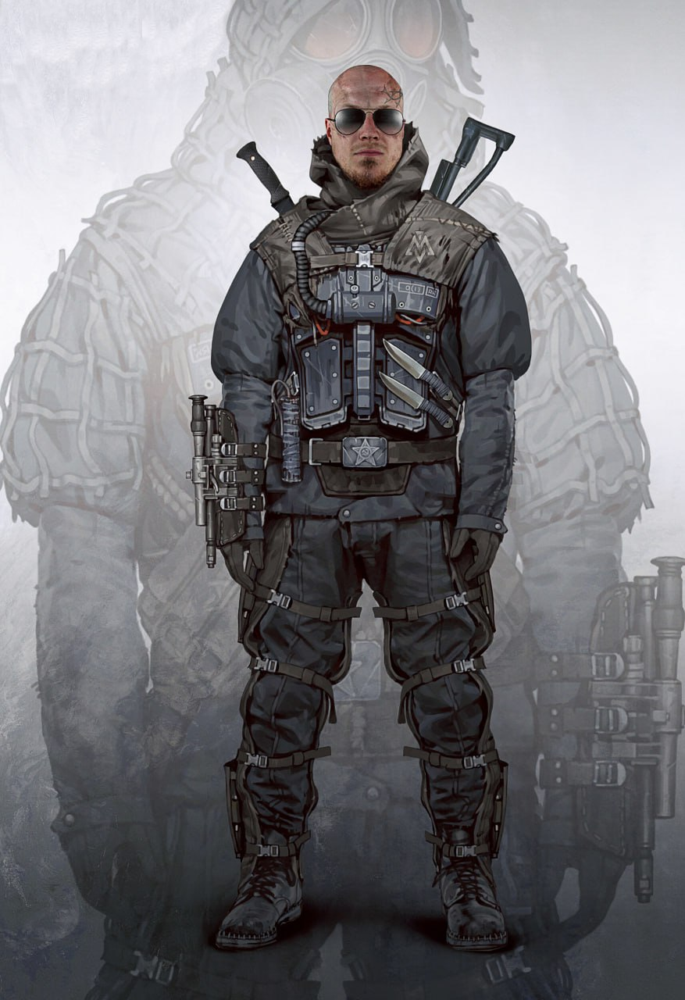
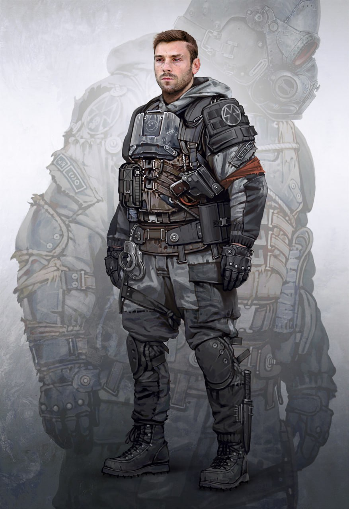

<link rel="stylesheet" href="style.css">

<nav class="navbar">
  <a href="start.html">Введение</a>
  <a href="SistemaVT.html">Основы игровой системы</a>
  <a href="Homerules.html">Правила «Тишины»</a>
  <a href="Game-Master-Code-of-Conduct.html">Кодекс Мастеров</a>
  <a href="Project-Organization.html">Организация проекта</a>
</nav>

[Главная](index.md) → [Игровая система](SistemaVT.md) → [Инвентарь](inventory.md) → Броня и протезы

# Броня и протезы

<h2>Броня</h2>

Бронежилеты, одежда, пропитанная спецсоставом и сложные серво-доспехи могут защитить носителя от смертельных повреждений. Чем сложнее броня, тем реже ее можно достать и более высокую категорию нужно иметь для ее использования, но тем больше она даст преимуществ своему обладателю.

Помните, что броня, даже самая слабая – серьезное преимущество.

<table class="simple-table">

    <colgroup>
        <col style="width:20%;">
        <col style="width:60%;">
        <col style="width:20%;">
    </colgroup>

    <tr>
        <td colspan="3" class="title center">
            <h3>Броня, доступная агентам "Тишины"</h3> 
        </td>
    </tr>
    
    <tr>
        <td class="center">
            
<strong>Уровень брони</strong>

        </td>
        <td class="center">
            
<strong>Тип брони</strong>

        </td>
        <td class="center">
            
<strong>Технологическая категория</strong>

        </td>
    </tr>

    <tr>
        <td class="center">
            
<strong>1</strong> уровень брони

        </td>
        <td>
            
Прочный, укрепленный жилет; специально простеганная куртка; самодельная защита из подручных средств; одежда трубачей

        </td>
        <td class="center">
            
Пятая

        </td>
    </tr>
    
    <tr>
        <td class="center">
            
<strong>2</strong> уровень брони

        </td>
        <td>
            
Штатный бронежилет специальных подразделений исполнителей, всадников, арбитров и офицеров антаротрядов; особенно прочная гражданская бронированная одежда или бронежилет; костюмы “светлячков”

        </td>
        <td class="center">
            
Четвертая

        </td>
    </tr>

</table>

<table class="simple-table image-text-table">

    <colgroup>
        <col style="width:50%;">
        <col style="width:50%;">
    </colgroup>

    <!-- Строка 1 -->
    <tr>
        <td class="image-cell">
            
<strong>Броня первого уровня</strong>

        </td>

        <td class="image-cell">
            
<strong>Броня второго уровня</strong>
 
        </td>
    </tr>

    <!-- Строка 2 -->
    <tr>
        <td class="image-cell">
            
        </td>
        <td class="image-cell">
            
        </td>

    </tr>

</table>

<table class="simple-table">

    <colgroup>
        <col style="width:20%;">
        <col style="width:60%;">
        <col style="width:20%;">
    </colgroup>

    <tr>
        <td colspan="3" class="title center">
            <h3>Броня, доступная только игровым npc</h3> 
        </td>
    </tr>

    <tr>
        <td class="center">
            
<strong>Уровень брони</strong>

        </td>
        <td class="center">
            
<strong>Тип брони</strong>

        </td>
        <td class="center">
            
<strong>Технологическая категория</strong>

        </td>
    </tr>

    <tr>
        <td class="center">
            
<strong>3</strong> уровень брони

        </td>
        <td>
            
Костюм бойцов СЭС и СБ ГИЗа, а также спецподразделений Академий; латы “спящей стражи”; корпус артифита; наличие химической гелевой бронемассы в одежде

        </td>
        <td class="center">
            
Третья

        </td>
    </tr>

    <tr>
        <td class="center">
            
<strong>4</strong> уровень брони

        </td>
        <td>
            
Сервокостюм штурмовиков ГИЗа и СЭС, а также штурмовых подразделений Кинжальной Гвардии; “Личные крепости” Древних. Такие бронекостюмы дают своему владельцу дополнительные преимущества вроде увеличения навыков благодаря сервосистемам, обладают встроенными санитонами и прочим оборудованием

        </td>
        <td class="center">
            
Вторая

        </td>
    </tr>

    <tr>
        <td class="center">
            
<strong>Высшие</strong> уровни брони

        </td>
        <td>
            
Что-то, неизвестное широкой общественности и выходящее за рамки привычных вещей

        </td>
        <td class="center">
            
Выше

        </td>
    </tr>

</table>

---

<h2>Создание и покупка брони</h2>

О создании брони вы сможете в будущем прочесть здесь: <a href="https://theagencyofsilence.github.io/knowledge-archive/property-tables.html">Таблица пассивных свойств</a>, открыв подраздел "Броня и Одежда"

О покупке брони вы сможете в будущем прочесть здесь: <a href="https://docs.google.com/spreadsheets/d/1B4rr57XzjiJw0hHbf_MhxWP1f2WpPCJMT12u1tLmVFg/edit?gid=849957562#gid=849957562">Лист Агентства</a> во вкладке "Поставщики: Товары"

---

<h2>Протезы</h2>

В первую очередь протезы созданы для того, чтобы заменять собою потерянные конечности. Однако науки Столицы шагнули столь далеко, что современные протезы способны полностью заменять ту или иную часть тела с очевидными преимуществами. Впрочем, наиболее распространенным недостатком любого протеза является отсутствие чувствительности или ее заметное редуцирование.

Преимущества протеза в первую очередь заключаются в том, что он позволяет эффективно использовать травмированную или отсутствующую конечность – в зависимости от своего качества. Таким образом, если у персонажа есть Травма: Глаз 2, то протез в виде окуляра может как сокращать травму на 1, если это недорогой, монохромный визор, или на 2, если это качественный академический прибор с натуральной цветопередачей. Протезы, которые просто компенсируют утраченную конечность или орган, называют “компенс-системами”, или монофункциональными протезами.

В том случае, если протезы не только заменяют конечность, но и несут большие выгоды, они считаются улучшениями, ради которых человек не пожалел пожертвовать частью своего тела, специально или случайно. или просто добавил в него что-то постороннее. Такие протезы называются мультифункциональными протезами, “виртосистемами”, “потентехникой” или попросту “усилителями”. Если бы глазной окуляр из примера выше был бы очень качественным, то он мог бы даже давать своему пользователю +1 к различным проверкам, связанным со зрением, таким как Поиск, Медицина, возможность видеть в темноте, обнаруживать тепло или распознавать ложь.

Мультфункциональные протезы заменяют утерянные конечности и органы их более совершенными версиями, в том числе нередко слабо напоминающими оригинальные части тела.

Протезы нередко становятся своеобразным элементом шантажа, если с их помощью лояльность и деятельность пациента желают контролировать некие силы. Механические сердца требуют завода особым ключом, в окулярах время от времени возникает напоминающая о чем-то надпись, руки или ноги требуют подзарядки особой “антаро-моторной лимфой”… В протезы могут вшивать взрывчатку, таймер, ограничивающий его работу без подзарядки, завода ключом или введении кода, маячки для слежки и прочее. Чаще всего так поступают академии или крупные банды технологического толка.

---

<h2>Как устанавливают протезы?</h2>

Подбробнее об этом вы сможете в будущем прочесть в соответствующей главе правил: <a href="https://theagencyofsilence.github.io/knowledge-archive/prosthetic-installation.html">«Установка протезов»</a>

---

<a href="SistemaVT.html" class="button">← Назад к Игровой системе</a>

