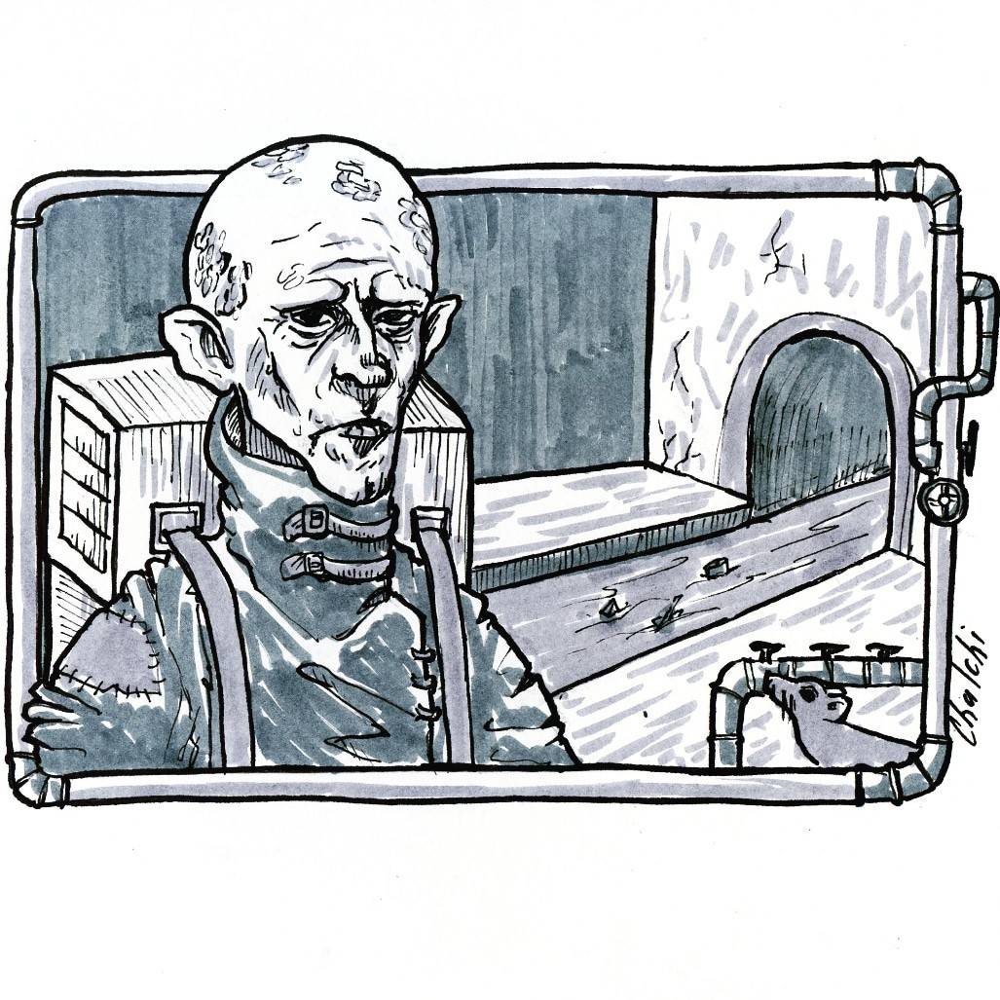

<link rel="stylesheet" href="style.css">

<nav class="navbar">
  <a href="start.html">Введение</a>
  <a href="SistemaVT.html">Основы игровой системы</a>
  <a href="Homerules.html">Правила «Тишины»</a>
  <a href="Game-Master-Code-of-Conduct.html">Кодекс Мастеров</a>
  <a href="Project-Organization.html">Организация проекта</a>
</nav>

[Основы игровой системы](SistemaVT.md) → [Создание персонажей](characters-creation.md) → [Шаг первый: Фенотип](1-phenotype.md) → Коллекторы

---

<h1 class="center">Коллекторы</h1> 

В прошлом – множество нищих и неимущих людей, оставшихся на Потерянных улицах и пытающихся там выжить, в подавляющем своем большинстве <u>столичники</u>. В настоящее время – те, кто добровольно выбрал практически пещерное существование в мире, где токсичные и ядовитые отходы чаще всего стекаются в самый низ города.

<table class="simple-table center-all-table">

    <tr>
        <td class="center">
            
        </td>
    </tr>

</table>

Коллекторы – это неотъемлемая часть быта Потерянных улиц и тех мест, которые так или иначе с ними соприкасаются. Технически коллекторов нельзя назвать мутантами, хотя отдельные случаи и странные эволюционные ветки были неоднократно замечены. 

По большому счету коллекторы – это люди, живущие по своим законам, с разрушенным социальным восприятием: многие из них не умеют читать, писать и даже говорить, с трудом способны понять мир над ними.

Обычный коллектор – это худой и жилистый, лысый и очень бледный человек в рваных и залатанных одеждах, с неизменным рюкзаком или коробом на спине, обладающий отличительными знаками своеобразного “племени”, к которому он принадлежит – “схрона”. 

Коллекторы очень болезненно выглядят, и, чаще всего, обладают целым набором недугов, однако от обычных столичных болезней иммунитет их прекрасно защищает.

Коллекторы обитают в схронах, представляющих собой обжитые места наподобие складов или сети подвалов, а самые старые схроны, лежащие глубоко внизу Потерянных улиц, и вовсе похожи на ульи. У коллекторов нет частной собственности – все вещи схрона принадлежат всем, и каждый волен брать то, что ему нужно. 

Если же какой-то коллектор внезапно начинает злоупотреблять правилом, его судьба решается быстро и жестоко. Среди жителей схрона всегда есть несколько обитателей, которые умеют разговаривать и читать, а иногда встречаются и те, что способны даже вполне правдоподобно прикидываться обычными жителями.

Основная деятельность коллекторов – сбор хлама, улучшение своего схрона, накопление богатств и продуктов. Поодиночке и даже небольшими группами коллекторы пугливы и не опасны, однако, в отличие от трубачей, которые в случае угрозы стараются увести опасность подальше от сородичей и предупредить их, коллекторы, наоборот, зовут на подмогу всех, кого могут. Большие толпы коллекторов способны справиться с любой угрозой – при условии, что бой идет на Потерянных улицах. 

Сами коллекторы, со слов одного из них, в целом делятся на “рыщеек”, которые занимаются сбором, кражей и исследованием разных мест, “болтачей”, которые общаются с более цивилизованными людьми, “каюков”, выполняющих роль бойцов и стражей, а также “знарей” – тех, кто лучше остальных разбирается в технике, химии, медицине и прочем.

Государству нет особого дела до коллекторов, которых они считают просто нищими, а живущие возле них обычные люди знают, что у соседей всегда можно найти что-то на обмен, и, если быть с ними вежливыми и не пытаться обмануть, то вполне реально заиметь и неплохих друзей. К тому же никто, кроме разве что сотрудников ГИЗа, не знает системы коммуникаций города лучше.

---

<h2>Фенотипические особенности</h2>

Для коллекторов с момента создания персонажа доступен навык **Мутация**.

---

  

    
  

  

    
Агентство 
    «Тишина»

  

