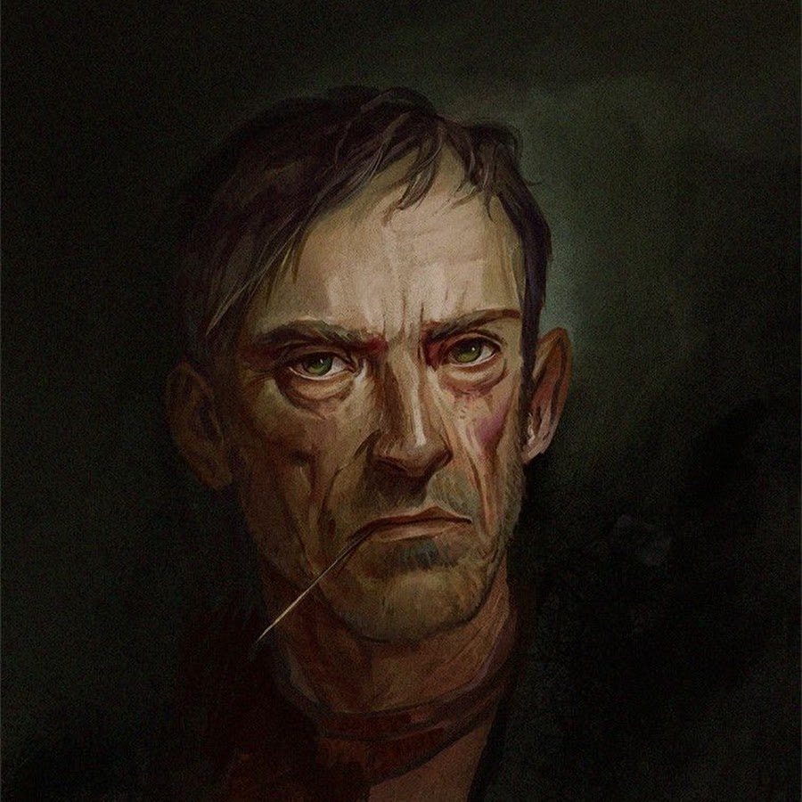

<link rel="stylesheet" href="style.css">

<nav class="navbar">
  <a href="index.html">Главная</a>
  <a href="SistemaVT.html">Игровая система</a>
  <a href="Homerules.html">Домашние правила</a>
</nav>
[Главная](index.md) → [Игровая система](SistemaVT.md) → Общее виденье игры

# Общее виденье игры

В этом разделе зафиксировано общее видение нашей игры - единая точка сборки для всех мастеров и игроков. Здесь мы договариваемся о том, как устроен игровой мир, какие масштабы характеристик и возможностей считаются в нём нормальными, где проходят границы человеческих возможностей и как мы оцениваем силу, опыт и компетентность персонажей.

Это социальное соглашение, на которое мы опираемся при создании персонажей, описании NPC, разрешении игровых ситуаций и принятии решений мастером. Оно необходимо для того, чтобы все участники представляли себе игровой мир примерно одинаково: понимали, что означает определённое значение навыка, сколько опыта считается обычным, насколько выдающимся является персонаж и какого уровня мастерства можно достичь в различных областях.

Приведённые здесь значения задают масштаб и ориентиры игровой системы. Если в произведении или игровой ситуации возникает вопрос о том, насколько хорошо персонаж умеет что-либо делать, насколько он опытен или насколько велик разрыв между специалистом и мастером, мы сверяемся с этими договорённостями.

Таким образом, данный раздел отвечает не только на вопрос «как работает механика?», но и на вопрос «что означают её значения внутри нашего мира?». Все примеры и установленные ориентиры ниже следует воспринимать как общую шкалу, относительно которой мастера и игроки оценивают персонажей, их возможности и результаты их действий.

---

<h2>Навыки</h2> 

<table class="simple-table three-column-image-table">

    <colgroup>
        <col style="width:20%;">
        <col style="width:42%;">
        <col style="width:38%;">
    </colgroup>

    <!-- Первая / заглавная строка -->
    <tr>
        <td class="first-col"> <strong>Значение навыка </strong></td>
        <td class="second-col header-center"> <strong>Уровень компетентности </strong></td>

        <!-- Изображение занимает весь третий столбец -->
        <td class="image-column" rowspan="8">
            
        </td>
    </tr>

    <tr>
        <td class="first-col"><strong>0</strong></td>
        <td class="second-col">Ужасный уровень</td>
    </tr>

    <tr>
        <td class="first-col"><strong>1</strong></td>
        <td class="second-col">Плохой уровень</td>
    </tr>

    <tr>
        <td class="first-col"><strong>2</strong></td>
        <td class="second-col">Уровень ниже среднего</td>
    </tr>

    <tr>
        <td class="first-col"><strong>3</strong></td>
        <td class="second-col">Средний уровень</td>
    </tr>

    <tr>
        <td class="first-col"><strong>4</strong></td>
        <td class="second-col">Хороший уровень</td>
    </tr>

    <tr>
        <td class="first-col"><strong>5</strong></td>
        <td class="second-col">Отличный уровень</td>
    </tr>

    <tr>
        <td class="first-col"><strong>6</strong></td>
        <td class="second-col">Неподражаемый уровень</td>
    </tr>

</table>

---

<h2>Примеры из произведения</h2> 

<table class="simple-table image-text-table">

    <colgroup>
        <col style="width:40%;">
        <col style="width:60%;">
    </colgroup>

    <!-- Строка 1 -->
    <tr>
        <td class="image-cell">
            
        </td>

        <td class="text-cell">
            Мы считаем, что с учетом всех навыков и талантов Алан Хеймс выбросит на броске химии примерно 10-11 кубов.
        </td>
    </tr>

    <!-- Строка 2 -->
    <tr>
        <td class="image-cell">
            
        </td>

        <td class="text-cell">
            Мы считаем, что у Красного примерно 10 пунктов в навыке планирования.
        </td>
    </tr>

    <!-- Строка 3 -->
    <tr>
        <td class="image-cell">
            
        </td>

        <td class="text-cell">
            Мы сошлись на том, что у Эвелины Ван Кейн – ректора самой влиятельной академии в Столице – 12 пунктов Знаний и Связей в сфере «Академии». Потому мы считаем 12 – максимальным значением  Знания и Связей в принципе.   Такими ЗиС обладают самые влиятельные и легендарные люди в Столице.
        </td>
    </tr>

    <!-- Строка 4 -->
    <tr>
        <td class="image-cell">
            
        </td>

        <td class="text-cell">
            Мы считаем, что уровень меткости бандита с Продольной равен примерно 3 пунктам навыка. 
        </td>
    </tr>

</table>

  <a href="q-and-a.html">Очень краткий список ЧаВо</a>

---

<a href="SistemaVT.html" class="button">← Очень краткий список ЧаВо</a>

