<link rel="stylesheet" href="style.css">

<nav class="navbar">
  <a href="index.html">Главная</a>
  <a href="SistemaVT.html">Игровая система</a>
  <a href="Homerules.html">Домашние правила</a>
</nav>
[Главная](index.md) → [Игровая система](SistemaVT.md) → Общее виденье игры

# Общее виденье игры

В этом разделе зафиксировано общее видение нашей игры - единая точка сборки для всех мастеров и игроков. Здесь мы договариваемся о том, как устроен игровой мир, какие масштабы характеристик и возможностей считаются в нём нормальными, где проходят границы человеческих возможностей и как мы оцениваем силу, опыт и компетентность персонажей.

Это социальное соглашение, на которое мы опираемся при создании персонажей, описании NPC, разрешении игровых ситуаций и принятии решений мастером. Оно необходимо для того, чтобы все участники представляли себе игровой мир примерно одинаково: понимали, что означает определённое значение навыка, сколько опыта считается обычным, насколько выдающимся является персонаж и какого уровня мастерства можно достичь в различных областях.

Приведённые здесь значения задают масштаб и ориентиры игровой системы. Если в произведении или игровой ситуации возникает вопрос о том, насколько хорошо персонаж умеет что-либо делать, насколько он опытен или насколько велик разрыв между специалистом и мастером, мы сверяемся с этими договорённостями.

Таким образом, данный раздел отвечает не только на вопрос «как работает механика?», но и на вопрос «что означают её значения внутри нашего мира?». Все примеры и установленные ориентиры ниже следует воспринимать как общую шкалу, относительно которой мастера и игроки оценивают персонажей, их возможности и результаты их действий.

---

<h2>Навыки</h2> 

<table class="simple-table three-column-image-table">

    <colgroup>
        <col style="width:20%;">
        <col style="width:42%;">
        <col style="width:38%;">
    </colgroup>

    <!-- Первая / заглавная строка -->
    <tr>
        <td class="first-col"> <strong>Значение навыка </strong></td>
        <td class="second-col header-center"> <strong>Уровень компетентности </strong></td>

        <!-- Изображение занимает весь третий столбец -->
        <td class="image-column" rowspan="8">
            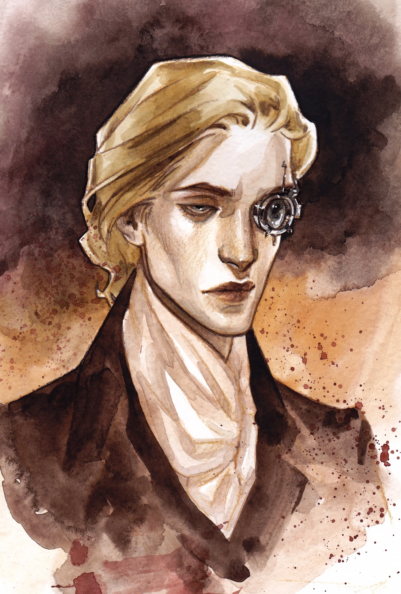
        </td>
    </tr>

    <tr>
        <td class="first-col"><strong>0</strong></td>
        <td class="second-col">Ужасный уровень</td>
    </tr>

    <tr>
        <td class="first-col"><strong>1</strong></td>
        <td class="second-col">Плохой уровень</td>
    </tr>

    <tr>
        <td class="first-col"><strong>2</strong></td>
        <td class="second-col">Уровень ниже среднего</td>
    </tr>

    <tr>
        <td class="first-col"><strong>3</strong></td>
        <td class="second-col">Средний уровень</td>
    </tr>

    <tr>
        <td class="first-col"><strong>4</strong></td>
        <td class="second-col">Хороший уровень</td>
    </tr>

    <tr>
        <td class="first-col"><strong>5</strong></td>
        <td class="second-col">Отличный уровень</td>
    </tr>

    <tr>
        <td class="first-col"><strong>6</strong></td>
        <td class="second-col">Неподражаемый уровень</td>
    </tr>

</table>

---

<h2>Примеры из произведения</h2> 

<table class="simple-table image-text-table">

    <colgroup>
        <col style="width:40%;">
        <col style="width:60%;">
    </colgroup>

    <!-- Строка 1 -->
    <tr>
        <td class="image-cell">
            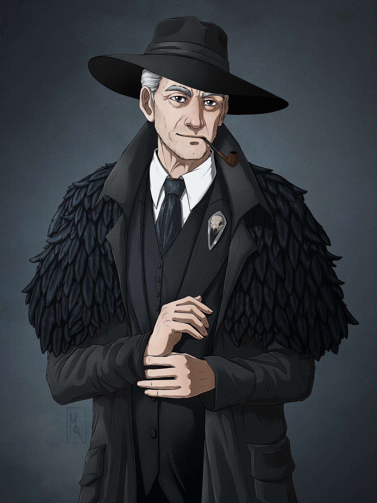
        </td>

        <td class="text-cell">
            Мы считаем, что с учётом всех его навыков, талантов и накопленного опыта Алан Хеймс при броске на химию будет собирать примерно 10–11 кубов. Это значение следует рассматривать как ориентир для специалиста высочайшего уровня: человека, который посвятил своему делу значительную часть жизни, обладает глубокими теоретическими знаниями, большим практическим опытом и уверенно решает сложные профессиональные задачи.  Таким образом, показатель в 10–11 кубов соответствует  мастеру своего дела. 
        </td>
    </tr>

    <!-- Строка 2 -->
    <tr>
        <td class="image-cell">
            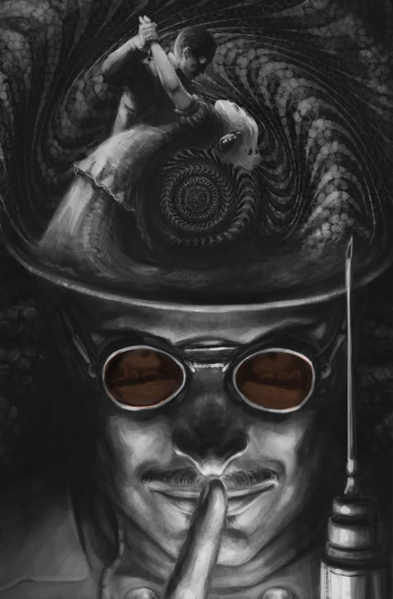
        </td>

        <td class="text-cell">
            Мы считаем, что у Красного примерно <strong>10 пунктов</strong> в навыке планирования.  Это запредельно высокий показатель, которым обладают лишь единицы во всей многомиллионной Столице. Такой уровень предполагает исключительную компетентность в своей области.   <strong>10 пунктов</strong> - это легендарный уровень, заметно превосходящий обычного профессионала и находящийся у самой границы человеческих возможностей в данном навыке.
        </td>
    </tr>

    <!-- Строка 3 -->
    <tr>
        <td class="image-cell">
            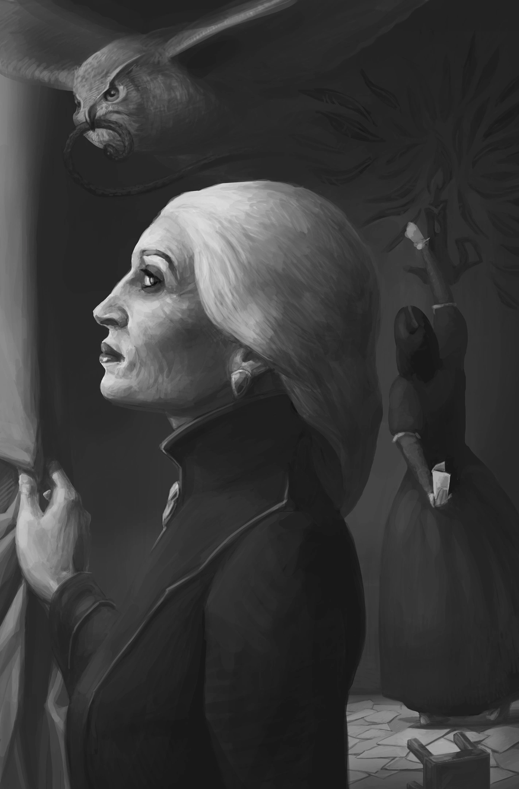
        </td>

        <td class="text-cell">
            Мы сошлись на том, что у Эвелины Ван Кейн — ректора самой влиятельной академии в Столице - <strong>12 пунктов</strong> Знаний и Связей в сфере «Академии». Поэтому мы считаем 12 максимальным значением Знаний и Связей в принципе.   Такой уровень означает исключительную осведомлённость, авторитет и влияние: подобными ЗиС обладают лишь самые влиятельные и легендарные люди Столицы.  При этом важно учитывать разницу между максимумом системы и возможностями персонажей Агентства. Персонаж игрока может достичь не более <strong>8 пунктов ЗиС</strong> - это уже исключительно высокий показатель, соответствующий человеку с огромным объёмом знаний, обширными связями и серьёзным авторитетом в своей области.    Значения <strong>9-12</strong> находятся за пределами обычного потолка персонажей Агентства и обозначают уровень наиболее выдающихся фигур игрового мира.
        </td>
    </tr>

    <!-- Строка 4 -->
    <tr>
        <td class="image-cell">
            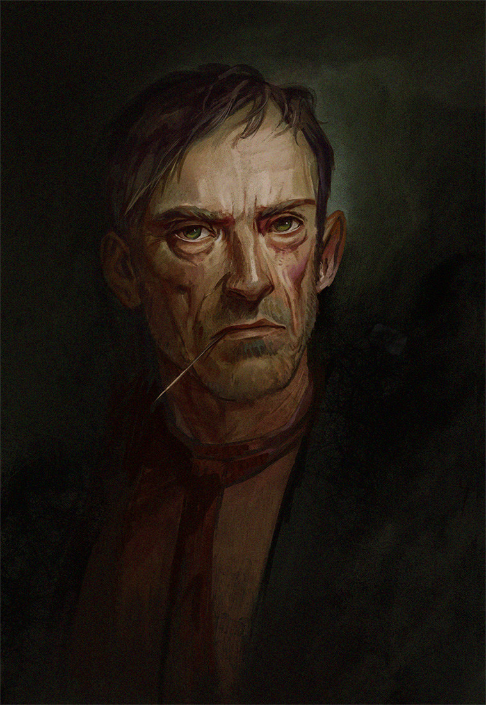
        </td>

        <td class="text-cell">
            Мы считаем, что уровень меткости бандита с Продольной равен примерно 3 пунктам навыка. Это средний уровень компетентности для человека, который регулярно пользуется оружием и имеет достаточный практический опыт. Для бандитов обращение с оружием - часть повседневной жизни, поэтому такой показатель не является выдающимся и отражает скорее обычный, привычный для них уровень владения навыком.
        </td>
    </tr>

</table>

---

<h2>Общее видение опыта</h2> 

<table class="simple-table image-text-table">

    <colgroup>
        <col style="width:40%;">
        <col style="width:60%;">
    </colgroup>

    <!-- Строка 1 -->
    <tr>
        <td class="image-cell">
            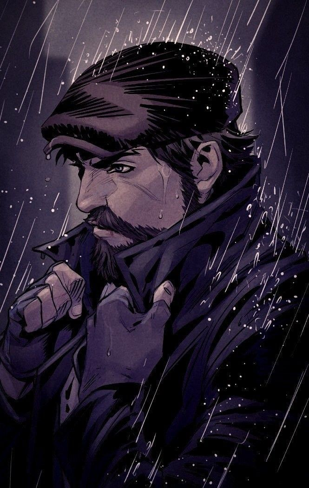
        </td>

        <td class="text-cell">
            Мы сошлись на том, что у обычного человека в Четвёртом Кольце примерно <strong>10–15 опыта</strong>. Это небольшой объём жизненного и профессионального опыта, соответствующий человеку, который прожил обычную жизнь, освоил необходимые для неё навыки и успел получить некоторую практику в своей области. Значения в этом диапазоне следует воспринимать как нормальный, повседневный уровень опыта для большинства жителей Четвёртого Кольца, а существенно более высокие показатели - как признак человека, который успел накопить исключительный жизненный или профессиональный опыт.
        </td>
    </tr>

    <!-- Строка 2 -->
    <tr>
        <td class="image-cell">
            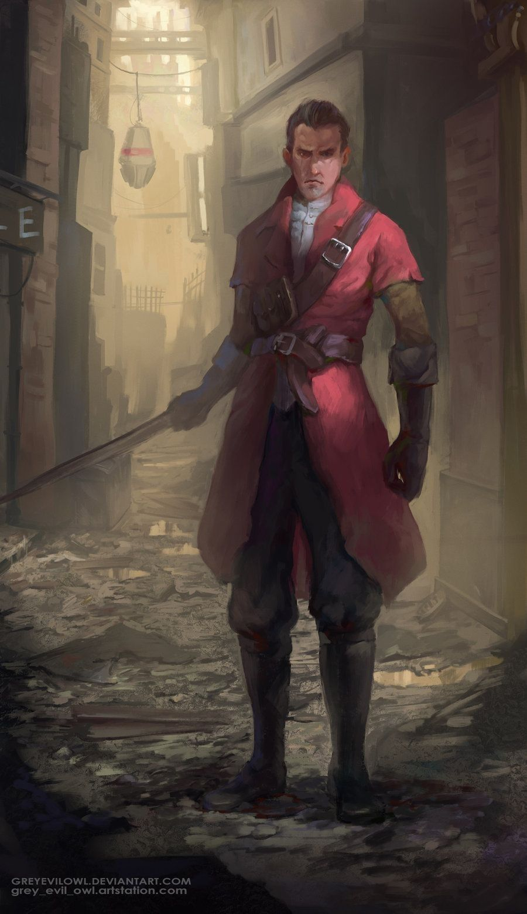
        </td>

        <td class="text-cell">
            Мы сошлись на том, что у обычного Исполнителя Четвёрки примерно 15–20 опыта. Это несколько выше, чем у среднего жителя Кольца, и отражает специальную подготовку, служебный опыт и практические навыки, необходимые для поддержания порядка и исполнения закона. При этом такой показатель остаётся вполне обычным для рядового Исполнителя и не свидетельствует о выдающейся компетентности или большом профессиональном опыте.
        </td>
    </tr>

    <!-- Строка 3 -->
    <tr>
        <td class="image-cell">
            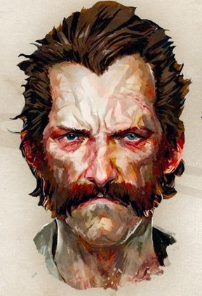
        </td>

        <td class="text-cell">
            Общий пул опыта обычного бандита мы расцениваем примерно как 15–20 опыта. Это отражает человека, который уже успел получить определённый практический опыт, регулярно сталкивается с опасными ситуациями и привык решать проблемы силой, хитростью или угрозами. При этом обычный бандит остаётся достаточно заурядной фигурой и не обладает опытом профессионалов или действительно опасных криминальных элементов.
        </td>
    </tr>

    <!-- Строка 4 -->
    <tr>
        <td class="image-cell">
            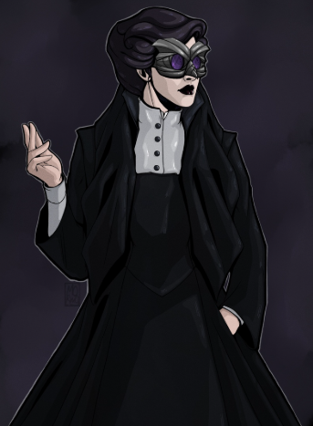
        </td>

        <td class="text-cell">
            Мы сошлись на том, что максимальным значением навыка, который человек может достичь человек в Столице – это <strong>10</strong>.   Шесть пунктов навыка – это серьезнейший профессионал, мастер своего дела,  но еще четыре пункта - это уникальные персононы, которые выходит за всякую грань человеческого развития.  Напомним, что персонажи агенства могут достигнуть максимум <strong>6 пунктов</strong> в определенном навыке.
        </td>
    </tr>

</table>

---

<h2>Экономика. Примеры</h2> 

<table class="simple-table image-text-table">

    <colgroup>
        <col style="width:40%;">
        <col style="width:60%;">
    </colgroup>

    <!-- Строка 1 -->
    <tr>
        <td class="image-cell">
            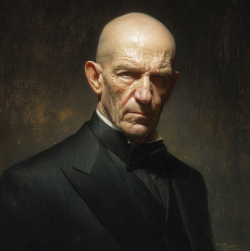
        </td>

        <td class="text-cell">
            Мы считаем, что у Лорда-Секретаря водятся <strong>сотни тысяч крон</strong>. Это огромная сумма даже по меркам состоятельных жителей Столицы, недоступная подавляющему большинству людей и позволяющая вести образ жизни, совершенно недосягаемый для обычного гражданина. Такое состояние следует воспринимать как ориентир для крупнейших личных состояний: это фигура, обладающая значительными финансовыми ресурсами и возможностями.
        </td>
    </tr>

    <!-- Строка 1 -->
    <tr>
        <td class="image-cell">
            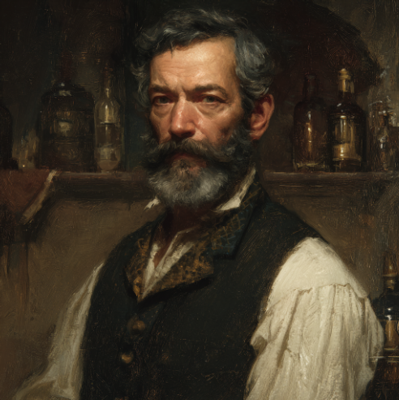
        </td>

        <td class="text-cell">
            Мы считаем, что у кабатчика при себе примерно <strong>600–900</strong> крон. Это хорошие деньги для обычного жителя Столицы — сумма, которая говорит о некотором достатке и финансовой устойчивости, но при этом не делает человека по-настоящему состоятельным. Такой запас денег следует воспринимать как вполне ощутимое, но не выдающееся состояние для представителя среднего достатка.
        </td>
    </tr>

    <!-- Строка 1 -->
    <tr>
        <td class="image-cell">
            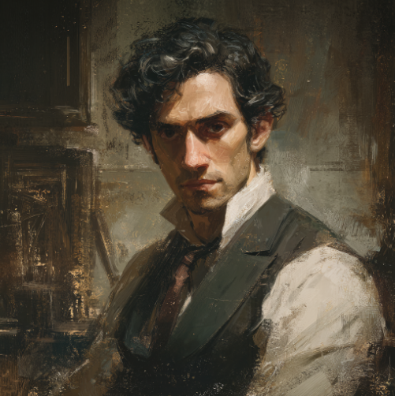
        </td>

        <td class="text-cell">
            Мы считаем, что у среднего жителя Четвёртого Кольца при себе может быть примерно <strong>100–300</strong> крон. Это вполне обычная сумма для человека, живущего в этом Кольце, и отражает привычный уровень повседневного достатка. Такой запас денег позволяет покрывать текущие расходы и небольшие непредвиденные траты, но не даёт значительных финансовых возможностей.
        </td>
    </tr>

    <!-- Строка 1 -->
    <tr>
        <td class="image-cell">
            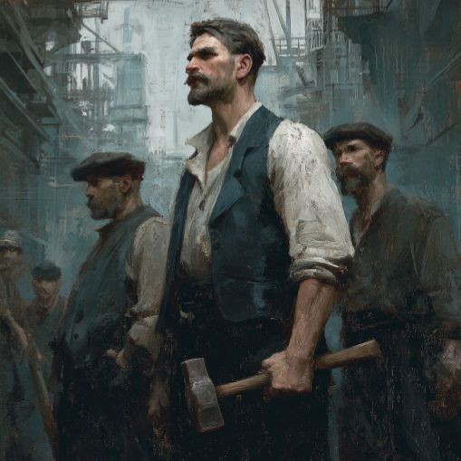
        </td>

        <td class="text-cell">
            Мы считаем, что заработная плата заводчанина Четвёртого Кольца составляет примерно <strong>100–150 крон в месяц</strong>. Это небольшой доход по меркам Столицы, особенно если учитывать колоссальный разрыв между различными социальными классами. Такая зарплата отражает положение обычного рабочего в нижних слоях общества: её достаточно для поддержания повседневной жизни, но накопление значительного состояния или доступ к дорогим товарам и услугам остаются для такого человека практически недостижимыми.
        </td>
    </tr>

</table>

---

<h2>Технопакт</h2> 

<table class="simple-table image-text-table">

    <colgroup>
        <col style="width:40%;">
        <col style="width:60%;">
    </colgroup>

    <!-- Строка 1 -->
    <tr>
        <td class="image-cell">
            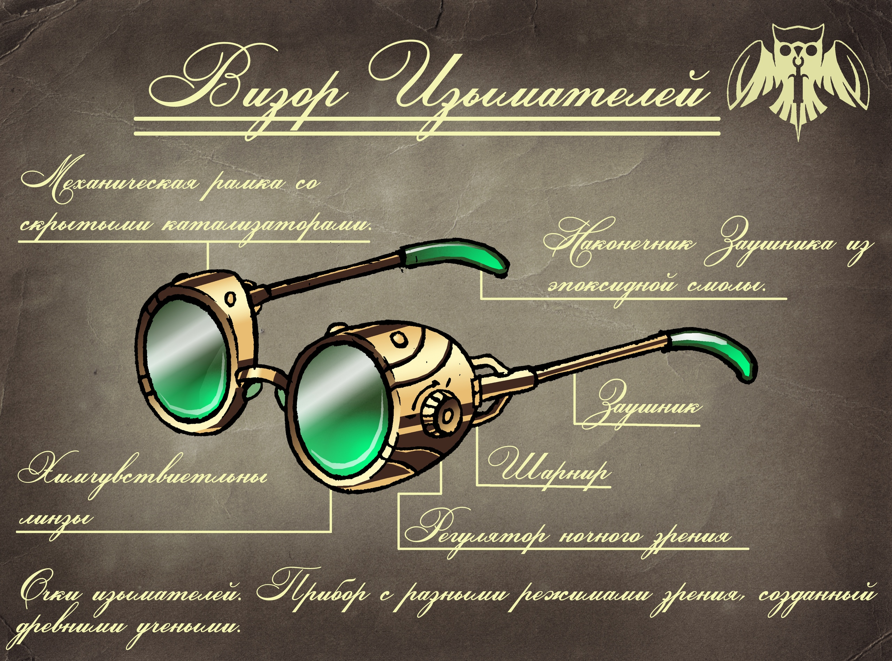
        </td>

        <td class="text-cell">
            Мы сошлись на том, что <strong>Третья Категория</strong> считается практически высшим научным достижением, доступным жителям Четвёртого Кольца. Технологии этого уровня могут быть сложными и впечатляющими по местным меркам, однако всё ещё заметно уступают передовым разработкам высших категорий.   <strong>Вторая Категория</strong> встречается в Четвёртом Кольце крайне редко. Такие технологии воспринимаются скорее как исключительные артефакты из «высшего, академического мира» - вещи, которые значительно превосходят привычный уровень местной науки и техники. Их появление здесь само по себе является примечательным событием.
        </td>
    </tr>
    
    <!-- Строка 1 -->
    <tr>
        <td class="image-cell">
            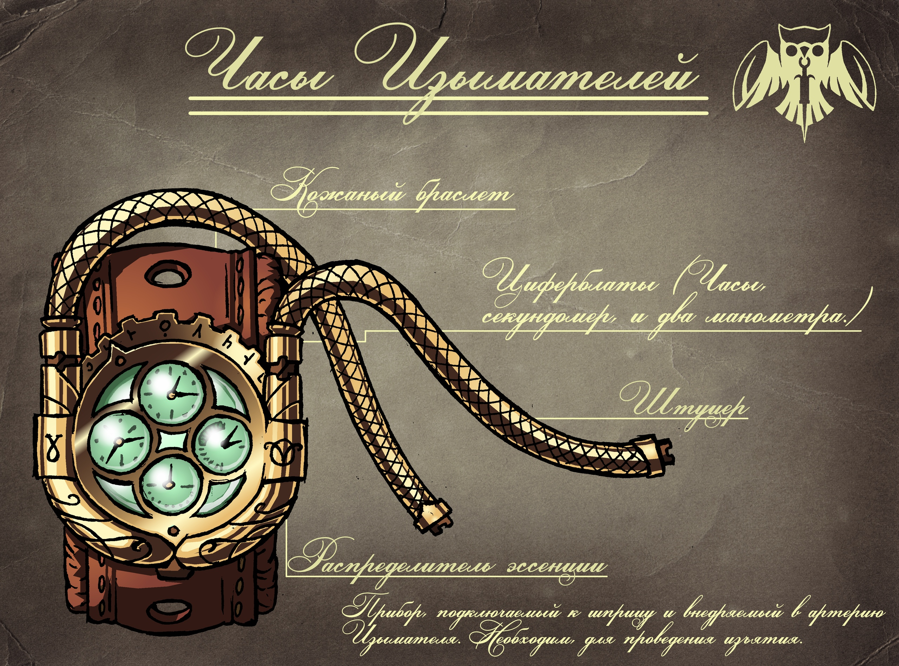
        </td>

        <td class="text-cell">
           Вещи <strong>Первой Категории</strong> — легендарные и практически недоступные технологии, само существование которых выходит далеко за пределы привычного мира Четвёртого Кольца. Появление такой вещи в игре должно быть обосновано сюжетом, рассматриваться на мастерской и проходить голосование на допустимость.  Такие технологии должны оставаться действительно исключительными: <u>Вещи Первой Категории не должны появляться в проекте чаще, чем один раз в три месяца</u>.

        </td>
    </tr>
    
    <!-- Строка 1 -->
    <tr>
        <td class="image-cell">
            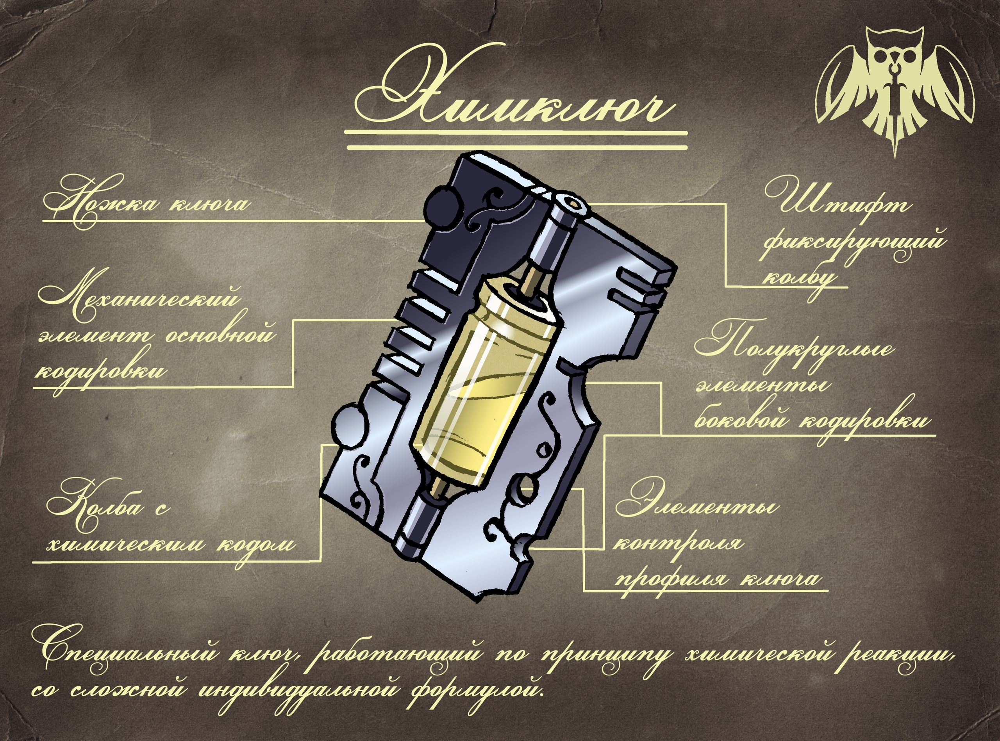
        </td>

        <td class="text-cell">
            Мы сошлись на том, что в личном инвентаре наших агентов могут находиться вещи Третьей Категории Технопакта - это максимальный допустимый уровень. Более высокие категории не считаются обычной частью личного снаряжения и должны рассматриваться как исключительные сюжетные обстоятельства, требующие отдельного обоснования и согласования с Мастер-группой.
        </td>
    </tr>
  

</table>

---

<h2>Технопакт. Примеры</h2> 

<table class="simple-table image-text-table">

    <colgroup>
        <col style="width:40%;">
        <col style="width:60%;">
    </colgroup>

    <!-- Строка 1 -->
    <tr>
        <td class="image-cell">
            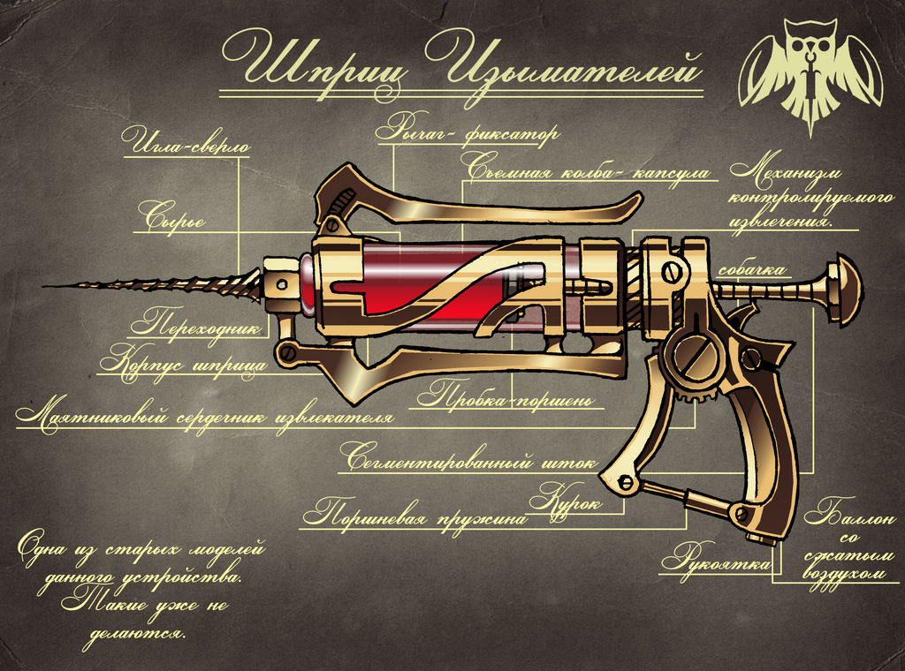
        </td>

        <td class="text-cell">
            Мы считаем, что Шприц Изымателей — это инструмент  <strong>Первой Категории Технопакта </strong> (КТ1). Это уникальное и практически легендарное устройство, способное извлекать талант непосредственно из  человеческого мозга и впоследствии передавать его другому носителю. Подобная технология значительно превосходит привычный уровень науки и техники и относится к числу наиболее выдающихся изобретений Столицы. Само существование Шприца известно лишь узкому кругу лиц.
        </td>
    </tr>

    <!-- Строка 1 -->
    <tr>
        <td class="image-cell">
            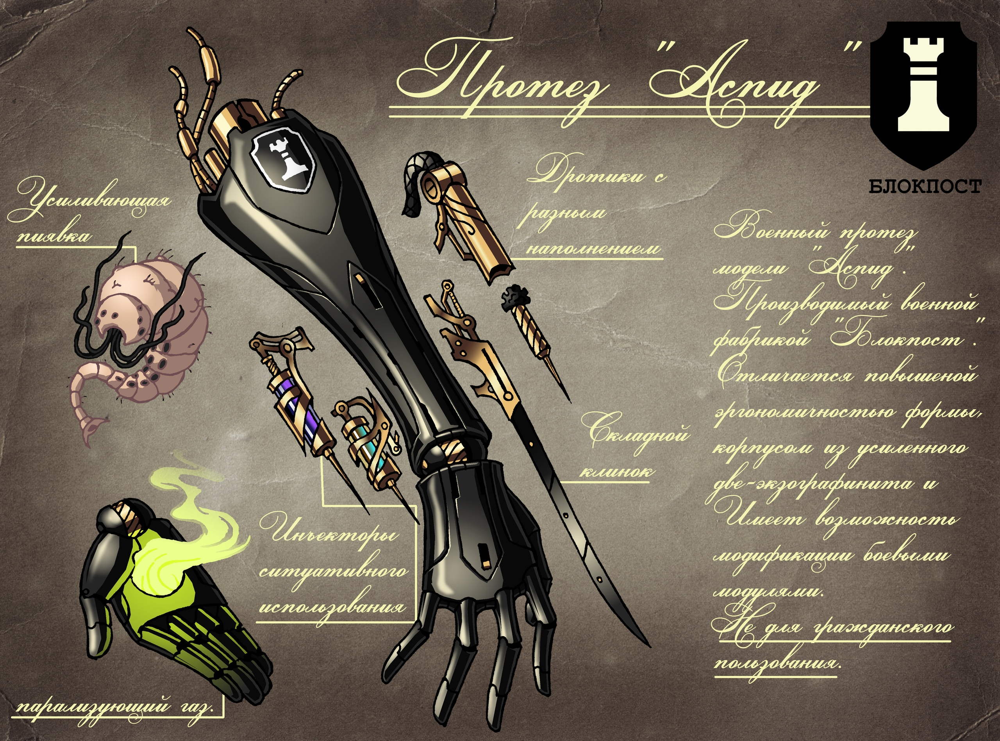
        </td>

        <td class="text-cell">
            Мы считаем, что Протез Фитца — это  <strong>Третья Категория Технопакта (КТ3)</strong>. Это высокотехнологичный и дорогостоящий протез, оснащённый симбионтом, который взаимодействует с организмом носителя на химико-биологическом уровне. Несмотря на свою сложность и высокое качество, Протез Фитца не является передовым образцом технологий Столицы: визуально он всё еще воспринимается лишь как протез, не обеспечивает полного ощущения естественной конечности и не превосходит человеческую руку по своим возможностям. Его главное достоинство - не создание сверхчеловеческих преимуществ, а компенсация физических недостатков носителя.
        </td>
    </tr>
  

</table>

---

<h2>Опасность</h2> 

<table class="simple-table image-text-table">

    <colgroup>
        <col style="width:40%;">
        <col style="width:60%;">
    </colgroup>

    <!-- Строка 1 -->
    <tr>
        <td class="image-cell">
            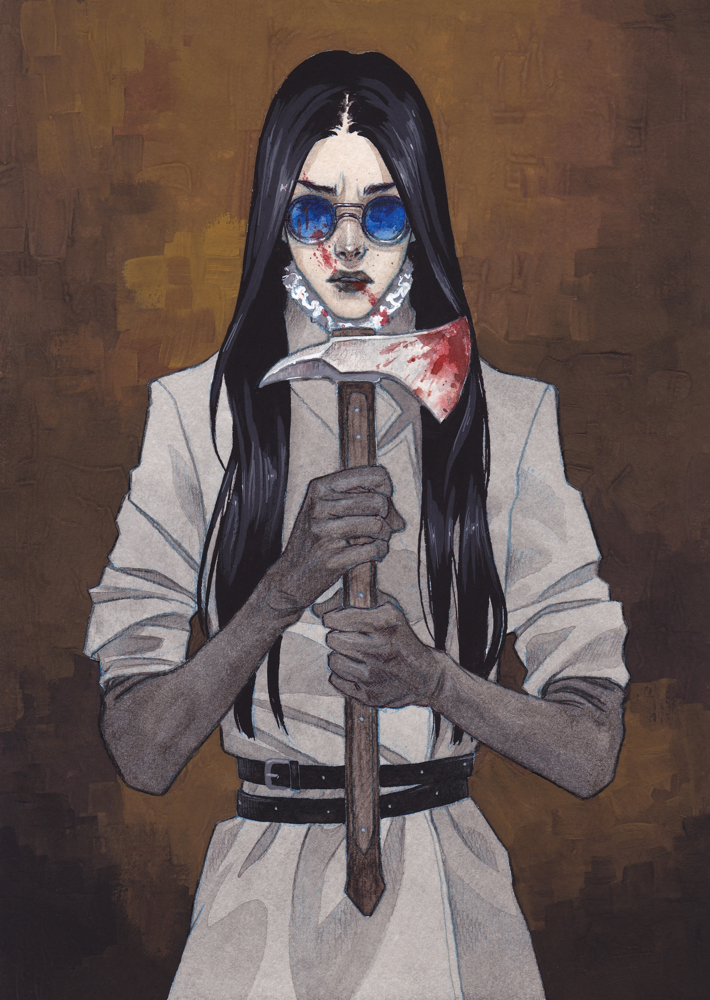
        </td>

        <td class="text-cell">
            Мы оцениваем опасность работы в «Тишине» на 7 из 10. Это следует воспринимать как <strong>весьма опасную профессию</strong>, в которой риск для жизни и здоровья является не исключением, а неотъемлемой частью работы. Каждый, кто становится сотрудником Агентства, должен понимать, что выполнение заданий может привести к тяжёлым последствиям, а привычка к опасности не делает её менее реальной.  Работа в «Тишине» - это постоянная конфронтация с жестоким миром Столицы, где ошибки, неудачные обстоятельства или встреча с противником могут стоить человеку жизни. И каждому агенту следует быть готовым к тому, что пенсия может и не наступить.
        </td>
    </tr>

  

</table>

---

<h2>Морок</h2> 

<table class="simple-table image-text-table">

    <colgroup>
        <col style="width:40%;">
        <col style="width:60%;">
    </colgroup>

    <!-- Строка 1 -->
    <tr>
        <td class="image-cell">
            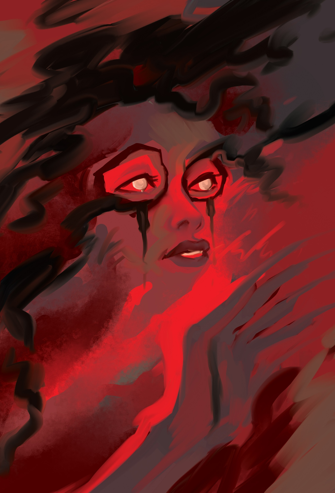
        </td>

        <td class="text-cell">
            Мы сошлись на том, что редкость попадания в Морок для сотрудников Агентства составляет примерно 3 из 10. Это означает, что Морок по-прежнему остаётся <strong>таинственным и практически неизведанным пространством</strong>, встреча с которым не должна восприниматься как обычная часть жизни или рядовая прогулка. Для большинства жителей Столицы Морок так и остаётся легендой: подавляющее большинство людей никогда не сталкивается с ним напрямую, а случаи осознанного попадания туда и вовсе крайне редки.  При этом работа в «Тишине» закономерно повышает вероятность такой встречи. Агенты сталкиваются с необычными, опасными и малоизученными явлениями значительно чаще обычных жителей Столицы, поэтому для них Морок - не только городская легенда. Тем не менее, даже для сотрудников Агентства попадание в Морок должно оставаться достаточно редким и значимым событием, а не привычным элементом каждой второй игры.
        </td>
    </tr>

    <!-- Строка 1 -->
    <tr>
        <td class="image-cell">
            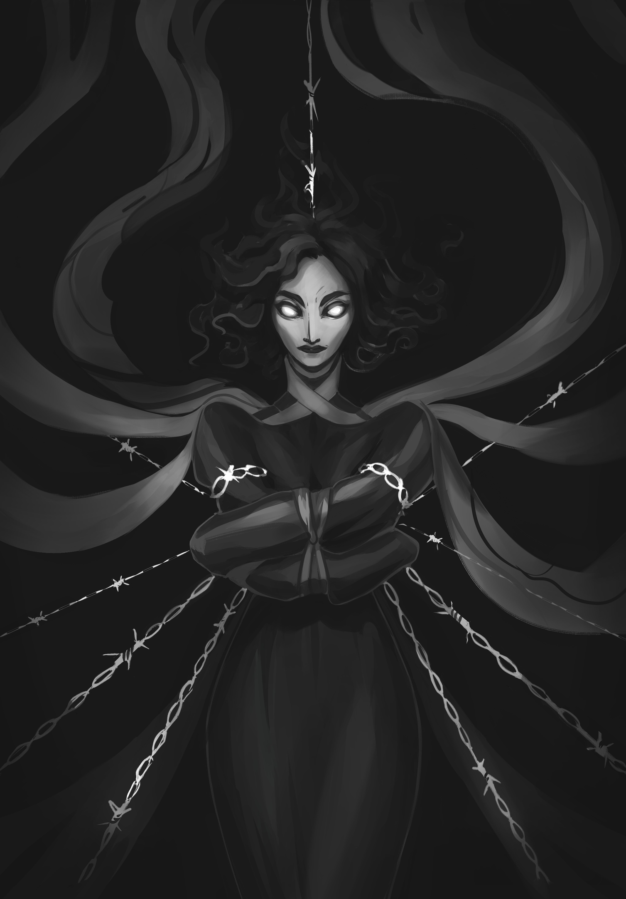
        </td>

        <td class="text-cell">
            Мы сошлись на том, что опасность Морока составляет примерно 7 из 10. Морок - действительно опасное место, где ошибки и необдуманные действия могут иметь куда более серьёзные последствия, чем в реальном мире. Его правила неочевидны, а природа малоизучена, поэтому человек, не подготовленный к Мороку и не понимающий его закономерностей, рискует очень быстро оказаться в ситуации, из которой будет трудно выйти невредимым.
  Незнание правил Морока может быть фатальным. Даже если человеку удастся вернуться обратно, встреча с ним может оставить ощутимый след - физический, психический или иной, который продолжит влиять на его жизнь после возвращения. Чем меньше человек понимает Морок и его правила, тем выше цена ошибки.
        </td>
    </tr>

    <!-- Строка 1 -->
    <tr>
        <td class="image-cell">
            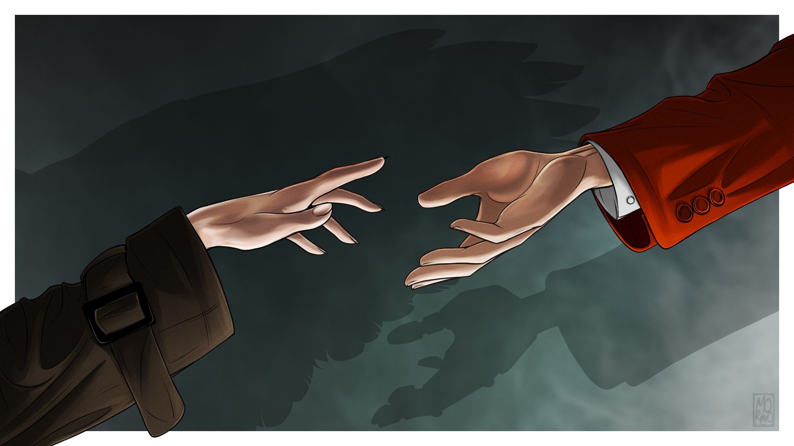
        </td>

        <td class="text-cell">
            Мы сошлись на том, что Оккультисты и Волевики не должны затягивать всю партию в Морок, если сама игра и сюжет не предполагают взаимодействия с ним. Подобные ситуации в принципе возможны, однако должны оставаться исключительными событиями, а не стандартным инструментом.   Принудительное перемещение всей партии в Морок допустимо лишь в случае крайней необходимости - например, когда этого требует важный сюжетный поворот или исключительно сильное внутриигровое обстоятельство.
        </td>
    </tr>

  

</table>

---

<h2>Смерть</h2> 

<table class="simple-table image-text-table">

    <colgroup>
        <col style="width:40%;">
        <col style="width:60%;">
    </colgroup>

    <!-- Строка 1 -->
    <tr>
        <td class="image-cell">
            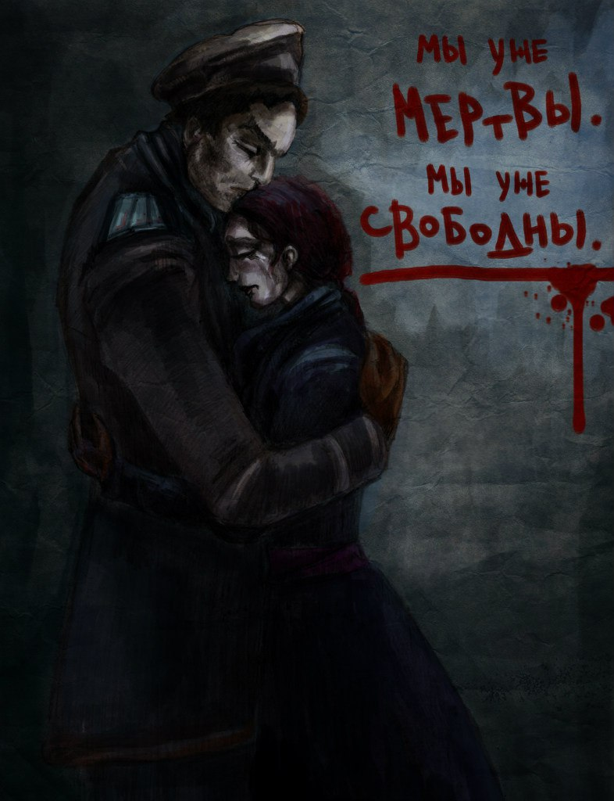
        </td>

        <td class="text-cell">
            Отношение Мастер-группы к смерти персонажей игроков в целом лояльное. Подавляющее большинство мастеров не видит проблемы в том, чтобы персонаж погиб на их партии, если для этого есть игромеханическая или нарративная причина. Смерть персонажа не рассматривается как ошибка мастера или исключительное событие, которое необходимо во что бы то ни стало предотвращать.   При этом отношение к смерти может различаться от мастера к мастеру. Каждый мастер самостоятельно определяет, насколько смертельной будет его игра, и игроку стоит учитывать это перед началом партии.  Помните: отправляясь на задание, ваш персонаж действительно может не вернуться. Риск смерти - одна из неотъемлемых частей жизни в Столице и работы в «Тишине».  <strong>Memento mori</strong>.
        </td>
    </tr>

</table>

---

<h2>Ценообразование</h2> 

Для понимания цен в нашем игровом мире, ниже представлены товары и услуги и примерная их стоимость в Четвертом Кольце. Для мастеров: исходя из этих примеров, вы можете сориентироваться какие примерно устанавливать цены у себя на партиях.

  <a href="Overall-Vision-of-Goods-and-Services.html">Общее виденье товаров и услуг</a>

---

  <a href="q-and-a.html">Очень краткий список ЧаВо</a>

---

<a href="SistemaVT.html" class="button">← Очень краткий список ЧаВо</a>

