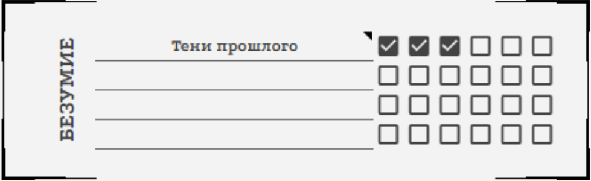
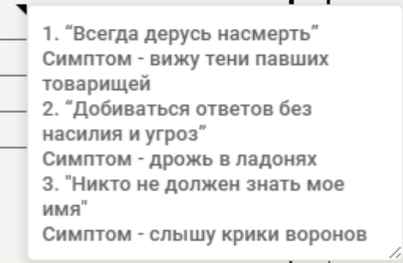

<link rel="stylesheet" href="style.css">

<nav class="navbar">
  <a href="start.html">Введение</a>
  <a href="SistemaVT.html">Основы игровой системы</a>
  <a href="Homerules.html">Правила «Тишины»</a>
  <a href="Game-Master-Code-of-Conduct.html">Кодекс Мастеров</a>
  <a href="Project-Organization.html">Организация проекта</a>
</nav>

[Основы игровой системы](SistemaVT.md) → [Безумие](madness.md) → Разбор Безумия на примере

---

# Разбор Безумия на примере

**Точка** - бывший боец магистериума, и все ее безумие связано с тяжелыми воспоминаниями о ее прошлом, поэтому мы дадим ее безумию название “Тени прошлого”.

**Императивные установки ее безумия:**

Первый пункт безумия появляется в предыстории, когда во время боя один из недобитых врагов поднялся и расстрелял в спину ее товарищей. Из-за этого у Точки появилась установка “Всегда дерусь насмерть” - это означает, что она не пытается бить по коленям, использовать нелетальное оружие или брать пленных. Для красоты отыгрыша мы добавляем этой установке проявление “Тени павших товарищей”, которые Точка видит в любом бою.

Второй пункт безумия появляется, когда Точка получает обвинение в госизмене и переживает тяжелые пытки от своего же ведомства. Из-за этих ужасных событий она получает установку “Добиваться ответов без насилия и угроз” - это означает, что теперь она не станет выбивать информацию кулаками или запугивать людей. Для интереса добавим этому проявление “Дрожь в ладонях” 

Третий пункт безумия появляется уже на игре, когда в Мороке ее имя услышал Шепот и ввел ее в кризис рассудка. Ее новая императивная установка - “Никто не должен знать мое имя”. Теперь даже представиться исполнителям или довериться другу для нее - крайне сложная задача. И конечно, добавим проявление - “Крики ворон”, которые она слышит, стоит ей подумать о своем имени, которое знает Шепот. 

Как это записано в чарнике:

<table class="simple-table center-all-table">

    <tr>
        <td class="center">
            
        </td>
    </tr>

</table>

<table class="simple-table center-all-table">

    <tr>
        <td class="center">
            
        </td>
    </tr>

</table>

---

**Безумие в игровой ситуации:**

Во время очередного задания Точке очень нужно найти следы маньяка, а на броске поиска выпало 6, 5, 1. Нужно было набрать 3 успеха, а выпало только 2.  Точка тратит пункт безумия, чтобы перебросить кубик, на котором выпало “1”, и получает заветную 6. Три нужных успеха есть.

Точка настигает маньяка по найденным следам, однако мирный допрос не дает результатов: ублюдок молчит, а счет идет на минуты. Точке крайне важно узнать, где маньяк держит умирающую жертву. Точка хочет пойти против своей установки “Добиваться ответов без насилия и угроз”. 

Если бы у Точки хватило навыка самообладания, она бы могла попробовать преодолеть свое безумие, но теперь она вынуждена сделать сверхусилие: сжечь три пункта рассудка, по одному за каждый пункт безумия. У нее начинают дрожать пальцы _(так описывается проявление этого безумия)_, но она начинает запугивать маньяка. 

Если бы у Точки не оказалось достаточно рассудка, ей бы пришлось получить штраф -3 на все навыки в этой сцене, что существенно усложнило бы допрос. 

---

<a href="SistemaVT.html" class="button">← Назад к Игровой системе</a>

