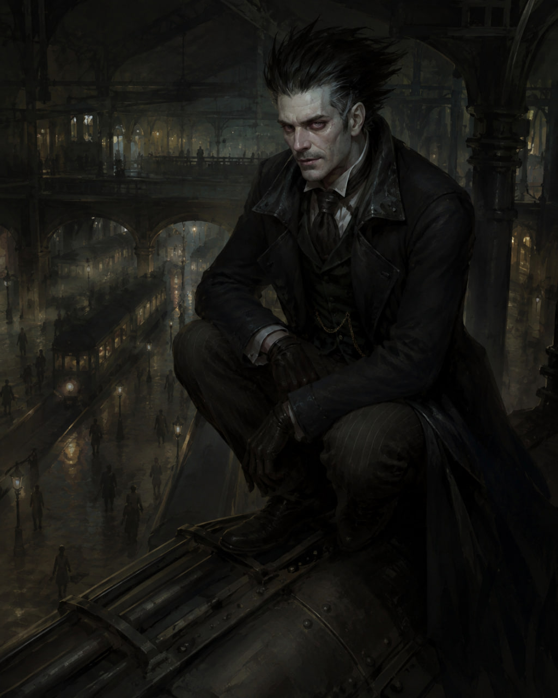

<link rel="stylesheet" href="style.css">

<nav class="navbar">
  <a href="index.html">Главная</a>
  <a href="SistemaVT.html">Игровая система</a>
  <a href="Homerules.html">Домашние правила</a>
</nav>
[Главная](index.md) → [Игровая система](SistemaVT.md) → [Создание персонажей](characters-creation.md) → [Шаг первый: Фенотип](1-phenotype.md) → Трубачи

# Трубачи

Мутанты, потомки рабов-**степняков**, что трудились в Застенках, на растущих вверх крышах и узких тоннелях.

Постепенно изменившиеся благодаря воздействию химикатов _(кое-кто, впрочем, утверждает, что мутации были специальными, а не случайными)_, трубачи стали больше напоминать животных, нежели людей. Обладающие большой силой и выносливостью, а также до предела развитыми органами чувств, трубачи проживают на крышах и в других свободных пространствах Столицы. Многие из них до сих пор трудятся на благо города, очищая засоры, трубы вентиляции и прочее, получая за это регулярные поставки пайка от специальных служб.

Обычно трубачи весьма нелюдимы, стараются избегать контакта с людьми, чтобы не провоцировать собственного отстрела и облав на своих сородичей. Впрочем, стычка с трубачом для большинства людей заканчивается плачевно – лишь самые рослые и сильные горняки способны на равных биться с ними без использования серьезного оружия. Трубачей отличают торчащие из головы назад иглы, делающие их похожими на дикобразов, а также самодельные или улучшенные маски, которые являются барьером между их до крайности обостренными чувствами и миром Столицы.

О наличии трубачей в городе знает большая часть населения, хоть и не придает этому факту особого значения, а их численность, по разным оценкам, может достигать полумиллиона.

---
<h2>Фенотипические особенности</h2>  

Мы рекомендуем авторам воздержаться от введения трубачей как игровых персонажей, так как большинство из них живет обособленно и не участвует в интригах города. Потому мы оставляем особенности трубачей на откуп вашей фантазии.

Действуйте на свой страх и риск.

---

<h2>Исключение из правила</h2>  

<table class="simple-table image-text-table">

    <colgroup>
        <col style="width:40%;">
        <col style="width:60%;">
    </colgroup>

    <!-- Строка 1 -->
    <tr>
        <td class="image-cell">
            
        </td>

        <td class="text-cell">
            <strong>Ноктус Либер </strong> - разумный и социализированный, в силу своей истории, трубач, созданный ещё  <strong>до того </strong>, как в проекте появилось правило о недоступности данного фенотипа для игроков. Поскольку мы придерживаемся принципа, согласно которому недопустимо лишать игрока его персонажа, Ноктусу позволено быть игровым персонажем в дальнейшем, несмотря на действующий запрет на создание новых персонажей-трубачей.  Ноктус является  <strong>историческим исключением </strong> и не создаёт прецедента для создания новых персонажей данного фенотипа.  В силу необычности концепции Ноктуса его участие требует предварительного согласования с Мастером. При записи на каждую игру игрок должен заранее сообщить Мастеру о намерении участвовать Ноктусом, обязательно уточняя, что на партию идёт трубач и получить согласие. Мастер вправе отказаться от включения Ноктуса в конкретную игру, если считает, что особенности персонажа не подходят для предполагаемой партии. Такой отказ относится только к конкретной игре и не отменяет право игрока продолжать использовать Ноктуса в дальнейшем.  Таким образом, Ноктус сохраняет право быть игровым персонажем, но его участие в каждой конкретной партии определяется отдельной договорённостью между игроком и Мастером. 
        </td>
    </tr>

</table>

---

<a href="SistemaVT.html" class="button">← Назад к Игровой системе</a>

