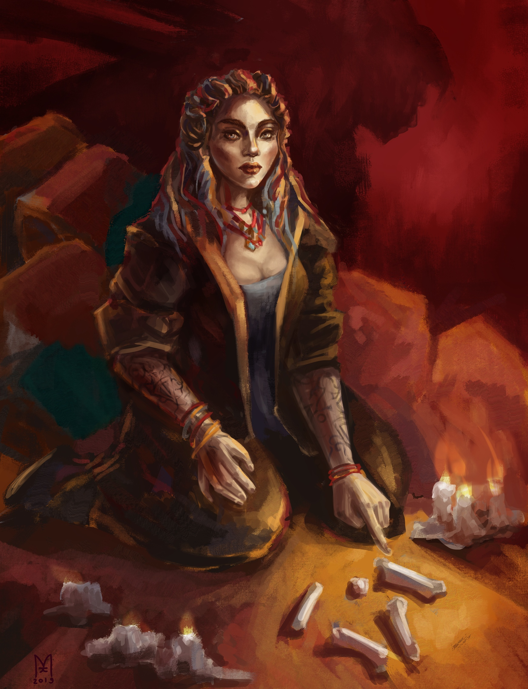

<link rel="stylesheet" href="style.css">

<nav class="navbar">
  <a href="start.html">Введение</a>
  <a href="SistemaVT.html">Основы игровой системы</a>
  <a href="Homerules.html">Правила «Тишины»</a>
  <a href="Game-Master-Code-of-Conduct.html">Кодекс Мастеров</a>
  <a href="Project-Organization.html">Организация проекта</a>
</nav>

[Основы игровой системы](SistemaVT.md) → [Создание персонажей](characters-creation.md) → [Шаг первый: Фенотип](1-phenotype.md) → Степняки

---

<h1 class="center">Степняки</h1> 

Делятся на чистых степняков _(т.н. внеживущих)_ и адаптантов.

Разница заключается в том, где родился человек — в бескрайней Степи или уже в Зоне адаптации. Обычные степняки весьма суеверны, предпочитают жить сообща даже в Столице, у многих из них может со временем развиться легкая клаустрофобия. Адаптанты больше похожи на <u> столичников</u>  в плане поведения, а их суеверность чаще касается криминальной сферы, в связи со спецификой адаптационной Зоны. Многие адаптанты так же картавят.

<table class="simple-table center-all-table">

    <tr>
        <td class="center">
            
        </td>
    </tr>

</table>

Внешние степняки с одинаковой вероятностью могут оказаться левшами и правшами, среди адаптантов леворукость – более распространенное явление. Редкие адаптанты обладают врожденной амбидекстрией. Так как адаптанты чаще всего не являются полноценной частью общин внешних степняков, но все же считаются степняками в глазах столичников, им обычно еще сложнее устроить свою жизнь по приезде в Столицу.

---

<h2>Фенотипические особенности</h2>

**Степняк-адаптант**

Персонажи степняков-адаптантов, когда совершают некомпетентный бросок любого навыка, считают Успехами значения на кубике 4-5-6, и в случае выпадения 1 результат броска не считается проваленным.

**Степняк внешнеживущий**

Персонажи степняков, по какой-то причине попавших в Столицу минуя зону адаптации, всегда игнорируют одну 1, выпавшую на кубиках. И, как и собратья из Столицы, могут совершать некомпетентные броски, считая 4-5-6 диапазоном успеха. Кроме того, без “городского” воспитания, фенотипические особенности <u> Древних</u> на “внешних” степняков не работают.

Однако со временем у персонажа появляется состояние Болезнь. Это может привести как к смерти, так и превратить его в разносчика доселе неизвестных штаммов инфекции, которая способна уничтожить целые районы города.

Сопротивляться этому персонаж может либо при помощи мощнейших медикаментов, либо отъездом обратно в Степь, либо, если очень постараться, адаптироваться к Столице, и стать степняком-адаптантом.

---

  

    
  

  

    
Агентство 
    «Тишина»

  

