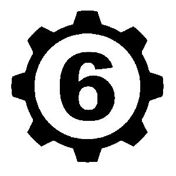

<link rel="stylesheet" href="style.css">

<nav class="navbar">
  <a href="index.html">Главная</a>
  <a href="SistemaVT.html">Игровая система</a>
  <a href="Homerules.html">Домашние правила</a>
</nav>
[Главная](index.md) → [Игровая система](SistemaVT.md) → [Процесс создания предметов](items-creation.md) → Таблица для покупки компонентов

# Таблица для покупки компонентов

    
Технические компоненты

    

        <!-- Таблица 1 -->
        <table class="blue-gray-table-1">

            <colgroup>
                <col style="width:20%;">
                <col style="width:20%;">
                <col style="width:60%;">
            </colgroup>

            <tr>
                <td colspan="3" class="title">
                    <h3>Технические компоненты Шестой категории Технопакта</h3>
                </td>
            </tr>

            <tr>
                <td>Цена:</td>
                <td>50 крон</td>
                <td class="center">Необходимые связи для покупки:</td>
            </tr>

            <tr>

                <td colspan="2" class="big-table-cell">
                    
                </td>

                <td class="inner-table-cell">

                    <table class="inner-table">

                        <colgroup>
                            <col style="width:38%;">
                            <col style="width:12%;">
                            <col style="width:38%;">
                            <col style="width:12%;">
                        </colgroup>

                        <tr>
                            <td>Академии</td>
                            <td>2</td>
                            <td>Армия</td>
                            <td>2</td>
                        </tr>

                        <tr>
                            <td>Власть и Закон</td>
                            <td>2</td>
                            <td>Криминал</td>
                            <td>2</td>
                        </tr>

                        <tr>
                            <td>Аристократия</td>
                            <td>2</td>
                            <td>Оккультизм</td>
                            <td>2</td>
                        </tr>

                        <tr>
                            <td>Деловые круги</td>
                            <td>1</td>
                            <td>Инфраструктуры</td>
                            <td>1</td>
                        </tr>

                        <tr>
                            <td>Искусство</td>
                            <td>2</td>
                            <td>Степь</td>
                            <td>2</td>
                        </tr>

                    </table>

                </td>

            </tr>

            <tr>
                <td colspan="3">
                    Описание: обыкновенные болты, гайки, пружины и инструменты.
                </td>
            </tr>

        </table>
        <table class="blue-gray-table-1">

            <colgroup>
                <col style="width:20%;">
                <col style="width:20%;">
                <col style="width:60%;">
            </colgroup>

            <tr>
                <td colspan="3" class="title">
                    <h3>Технические компоненты Пятой категории Технопакта</h3>
                </td>
            </tr>

            <tr>
                <td>Цена:</td>
                <td>200 крон</td>
                <td class="center">Необходимые связи для покупки:</td>
            </tr>

            <tr>

                <td colspan="2" class="big-table-cell">
                    <strong>Ячейка 4</strong>
                      
                    Текст посередине ячейки
                </td>

                <td class="inner-table-cell">

                    <table class="inner-table">

                        <colgroup>
                            <col style="width:38%;">
                            <col style="width:12%;">
                            <col style="width:38%;">
                            <col style="width:12%;">
                        </colgroup>

                        <tr>
                            <td>Академии</td>
                            <td>3</td>
                            <td>Армия</td>
                            <td>3</td>
                        </tr>

                        <tr>
                            <td>Власть и Закон</td>
                            <td>4</td>
                            <td>Криминал</td>
                            <td>4</td>
                        </tr>

                        <tr>
                            <td>Аристократия</td>
                            <td>4</td>
                            <td>Оккультизм</td>
                            <td>-</td>
                        </tr>

                        <tr>
                            <td>Деловые круги</td>
                            <td>3</td>
                            <td>Инфраструктуры</td>
                            <td>2</td>
                        </tr>

                        <tr>
                            <td>Искусство</td>
                            <td>4</td>
                            <td>Степь</td>
                            <td>3</td>
                        </tr>

                    </table>

                </td>

            </tr>

            <tr>
                <td colspan="3">
                    Описание: сложные пружинные системы, доводчики, клапаны, надежные инструменты.
                </td>
            </tr>

        </table>

        <!-- Таблица 2 -->
        <table class="blue-gray-table-1">

            <tr>
                <td colspan="3" class="title">
                    <h3>Технические компоненты Четвертой категории Технопакта</h3>
                </td>
            </tr>

            <tr>
                <td colspan="3" class="cell-center" style="height:180px;">
                    Текст посередине ячейки
                </td>
            </tr>

            <tr>
                <td colspan="3">
                    Описание: редкие материалы, дорогие фабричные запчасти и элементы, мелкие детали высокого качества.
                </td>
            </tr>

        </table>

        <!-- Таблица 3 -->
        <table class="blue-gray-table-1">

            <tr>
                <td colspan="3" class="title">
                    <h3>Технические компоненты Третьей категории Технопакта</h3>
                </td>
            </tr>

            <tr>
                <td colspan="3" class="cell-center" style="height:180px;">
                    Текст посередине ячейки
                </td>
            </tr>

            <tr>
                <td colspan="3">
                    Описание: крайне редкие материалы, сложные механические системы, надежные инструменты для тонкой работы.
                </td>
            </tr>

        </table>

        <!-- Таблица 4 -->
        <table class="blue-gray-table-1">

            <tr>
                <td colspan="2" class="title">
                    <h3>Технические компоненты Второй и Первой  категории Технопакта</h3>
                </td>
            </tr>

            <tr>
                <td class="half-cell-center">
                    Текст посередине 
                    ячейки
                </td>

                <td class="half-cell-center">
                    Текст посередине 
                    ячейки
                </td>
            </tr>

            <tr>
                <td colspan="2">
                    Описание: технологические аппараты и запчасти к ним, высокоточные приборы, микроскопические элементы, доступные только в Академиях или высших гос.службах.
                </td>
            </tr>

        </table>

    

---

    
Творческие компоненты

    

        <!-- Таблица 1 -->
        <table class="sand-table-1">

            <colgroup>
                <col style="width:20%;">
                <col style="width:20%;">
                <col style="width:60%;">
            </colgroup>

            <tr>
                <td colspan="3" class="title">
                    <h3>Творческие компоненты Шестой категории Технопакта</h3>
                </td>
            </tr>

            <tr>
                <td>Цена:</td>
                <td>50 крон</td>
                <td class="center">Необходимые связи для покупки:</td>
            </tr>

            <tr>

                <td colspan="2" class="big-table-cell">
                    <strong>Ячейка 4</strong>
                      
                    Текст посередине ячейки
                </td>

                <td class="inner-table-cell">

                    <table class="inner-table">

                        <colgroup>
                            <col style="width:38%;">
                            <col style="width:12%;">
                            <col style="width:38%;">
                            <col style="width:12%;">
                        </colgroup>

                        <tr>
                            <td>Академии</td>
                            <td>2</td>
                            <td>Армия</td>
                            <td>2</td>
                        </tr>

                        <tr>
                            <td>Власть и Закон</td>
                            <td>2</td>
                            <td>Криминал</td>
                            <td>2</td>
                        </tr>

                        <tr>
                            <td>Аристократия</td>
                            <td>2</td>
                            <td>Оккультизм</td>
                            <td>2</td>
                        </tr>

                        <tr>
                            <td>Деловые круги</td>
                            <td>1</td>
                            <td>Инфраструктуры</td>
                            <td>-</td>
                        </tr>

                        <tr>
                            <td>Искусство</td>
                            <td>1</td>
                            <td>Степь</td>
                            <td>2</td>
                        </tr>

                    </table>

                </td>

            </tr>

            <tr>
                <td colspan="3">
                    Описание: каменная бумага, дешевые чернила и краски, простой набор книг.
                </td>
            </tr>

        </table>
        <table class="sand-table-1">

            <colgroup>
                <col style="width:20%;">
                <col style="width:20%;">
                <col style="width:60%;">
            </colgroup>

            <tr>
                <td colspan="3" class="title">
                    <h3>Творческие компоненты Пятой категории Технопакта</h3>
                </td>
            </tr>

            <tr>
                <td>Цена:</td>
                <td>200 крон</td>
                <td class="center">Необходимые связи для покупки:</td>
            </tr>

            <tr>

                <td colspan="2" class="big-table-cell">
                    <strong>Ячейка 4</strong>
                      
                    Текст посередине ячейки
                </td>

                <td class="inner-table-cell">

                    <table class="inner-table">

                        <colgroup>
                            <col style="width:38%;">
                            <col style="width:12%;">
                            <col style="width:38%;">
                            <col style="width:12%;">
                        </colgroup>

                        <tr>
                            <td>Академии</td>
                            <td>4</td>
                            <td>Армия</td>
                            <td>-</td>
                        </tr>

                        <tr>
                            <td>Власть и Закон</td>
                            <td>4</td>
                            <td>Криминал</td>
                            <td>4</td>
                        </tr>

                        <tr>
                            <td>Аристократия</td>
                            <td>3</td>
                            <td>Оккультизм</td>
                            <td>3</td>
                        </tr>

                        <tr>
                            <td>Деловые круги</td>
                            <td>3</td>
                            <td>Инфраструктуры</td>
                            <td>-</td>
                        </tr>

                        <tr>
                            <td>Искусство</td>
                            <td>2</td>
                            <td>Степь</td>
                            <td>3</td>
                        </tr>

                    </table>

                </td>

            </tr>

            <tr>
                <td colspan="3">
                    Описание: натуральная бумага, средства для очистки, хорошие краски, альманахи.
                </td>
            </tr>

        </table>

        <!-- Таблица 2 -->
        <table class="sand-table-1">

            <tr>
                <td colspan="3" class="title">
                    <h3>Творческие компоненты Четвертой категории Технопакта</h3>
                </td>
            </tr>

            <tr>
                <td colspan="3" class="cell-center" style="height:180px;">
                    Текст посередине ячейки
                </td>
            </tr>

            <tr>
                <td colspan="3">
                    Описание: редкие краски, труднодоступные записи и энциклопедии, натуральная бумага или холст, кисти из настоящей шерсти.
                </td>
            </tr>

        </table>

        <!-- Таблица 3 -->
        <table class="sand-table-1">

            <tr>
                <td colspan="3" class="title">
                    <h3>Творческие компоненты Третьей категории Технопакта</h3>
                </td>
            </tr>

            <tr>
                <td colspan="3" class="cell-center" style="height:180px;">
                    Текст посередине ячейки
                </td>
            </tr>

            <tr>
                <td colspan="3">
                    Описание: дорогие стимуляторы сознания, записывающие голос приборы, автовоспроизводящий клавитон, наркотики, осветительные системы.
                </td>
            </tr>

        </table>

        <!-- Таблица 4 -->
        <table class="sand-table-1">

            <tr>
                <td colspan="2" class="title">
                    <h3>Творческие компоненты Второй и Первой  категории Технопакта</h3>
                </td>
            </tr>

            <tr>
                <td class="half-cell-center">
                    Текст посередине 
                    ячейки
                </td>

                <td class="half-cell-center">
                    Текст посередине 
                    ячейки
                </td>
            </tr>

            <tr>
                <td colspan="2">
                    Описание: редчайшие методы сосредоточения, эксклюзивные материалы, механические ассистенты, изолирующие материи, уникальная литература.
                </td>
            </tr>

        </table>

    

---

    
Химические компоненты

    

        <!-- Таблица 1 -->
        <table class="green-table-2">

            <colgroup>
                <col style="width:20%;">
                <col style="width:20%;">
                <col style="width:60%;">
            </colgroup>

            <tr>
                <td colspan="3" class="title">
                    <h3>Химические компоненты Шестой категории Технопакта</h3>
                </td>
            </tr>

            <tr>
                <td>Цена:</td>
                <td>50 крон</td>
                <td class="center">Необходимые связи для покупки:</td>
            </tr>

            <tr>

                <td colspan="2" class="big-table-cell">
                    <strong>Ячейка 4</strong>
                      
                    Текст посередине ячейки
                </td>

                <td class="inner-table-cell">

                    <table class="inner-table">

                        <colgroup>
                            <col style="width:38%;">
                            <col style="width:12%;">
                            <col style="width:38%;">
                            <col style="width:12%;">
                        </colgroup>

                        <tr>
                            <td>Академии</td>
                            <td>1</td>
                            <td>Армия</td>
                            <td>2</td>
                        </tr>

                        <tr>
                            <td>Власть и Закон</td>
                            <td>2</td>
                            <td>Криминал</td>
                            <td>2</td>
                        </tr>

                        <tr>
                            <td>Аристократия</td>
                            <td>2</td>
                            <td>Оккультизм</td>
                            <td>2</td>
                        </tr>

                        <tr>
                            <td>Деловые круги</td>
                            <td>1</td>
                            <td>Инфраструктуры</td>
                            <td>1</td>
                        </tr>

                        <tr>
                            <td>Искусство</td>
                            <td>2</td>
                            <td>Степь</td>
                            <td>2</td>
                        </tr>

                    </table>

                </td>

            </tr>

            <tr>
                <td colspan="3">
                    Описание: простейшие соединения, обычные лекарственные препараты.
                </td>
            </tr>

        </table>
        <table class="green-table-2">

            <colgroup>
                <col style="width:20%;">
                <col style="width:20%;">
                <col style="width:60%;">
            </colgroup>

            <tr>
                <td colspan="3" class="title">
                    <h3>Химические компоненты Пятой категории Технопакта</h3>
                </td>
            </tr>

            <tr>
                <td>Цена:</td>
                <td>200 крон</td>
                <td class="center">Необходимые связи для покупки:</td>
            </tr>

            <tr>

                <td colspan="2" class="big-table-cell">
                    <strong>Ячейка 4</strong>
                      
                    Текст посередине ячейки
                </td>

                <td class="inner-table-cell">

                    <table class="inner-table">

                        <colgroup>
                            <col style="width:38%;">
                            <col style="width:12%;">
                            <col style="width:38%;">
                            <col style="width:12%;">
                        </colgroup>

                        <tr>
                            <td>Академии</td>
                            <td>2</td>
                            <td>Армия</td>
                            <td>3</td>
                        </tr>

                        <tr>
                            <td>Власть и Закон</td>
                            <td>4</td>
                            <td>Криминал</td>
                            <td>4</td>
                        </tr>

                        <tr>
                            <td>Аристократия</td>
                            <td>3</td>
                            <td>Оккультизм</td>
                            <td>-</td>
                        </tr>

                        <tr>
                            <td>Деловые круги</td>
                            <td>3</td>
                            <td>Инфраструктуры</td>
                            <td>2</td>
                        </tr>

                        <tr>
                            <td>Искусство</td>
                            <td>4</td>
                            <td>Степь</td>
                            <td>3</td>
                        </tr>

                    </table>

                </td>

            </tr>

            <tr>
                <td colspan="3">
                    Описание: малораспространенные химикаты, запрещенные для свободной продажи медикаменты, опасные соединения.
                </td>
            </tr>

        </table>

        <!-- Таблица 2 -->
        <table class="green-table-2">

            <tr>
                <td colspan="3" class="title">
                    <h3>Химические компоненты Четвертой категории Технопакта</h3>
                </td>
            </tr>

            <tr>
                <td colspan="3" class="cell-center" style="height:180px;">
                    Текст посередине ячейки
                </td>
            </tr>

            <tr>
                <td colspan="3">
                    Описание: редкие химикаты, академические образцы, сложные соединения многоцелевого использования, лабораторное оборудование.
                </td>
            </tr>

        </table>

        <!-- Таблица 3 -->
        <table class="green-table-2">

            <tr>
                <td colspan="3" class="title">
                    <h3>Химические компоненты Третьей категории Технопакта</h3>
                </td>
            </tr>

            <tr>
                <td colspan="3" class="cell-center" style="height:180px;">
                    Текст посередине ячейки
                </td>
            </tr>

            <tr>
                <td colspan="3">
                    Описание: синтезируемые реагенты, сложнейшие и ядовитые соединения, единичные медикаменты.
                </td>
            </tr>

        </table>

        <!-- Таблица 4 -->
        <table class="green-table-2">

            <tr>
                <td colspan="2" class="title">
                    <h3>Химические компоненты Второй и Первой категории Технопакта</h3>
                </td>
            </tr>

            <tr>
                <td class="half-cell-center">
                    Текст посередине 
                    ячейки
                </td>

                <td class="half-cell-center">
                    Текст посередине 
                    ячейки
                </td>
            </tr>

            <tr>
                <td colspan="2">
                    Описание: исключительно академические и военные разработки, уникальные рецепты, аппараты синтеза, смешивающие камеры. 
                </td>
            </tr>

        </table>

    

---

    
Оккультные компоненты

    

        <!-- Таблица 1 -->
        <table class="purple-gray-table-1">

            <colgroup>
                <col style="width:20%;">
                <col style="width:20%;">
                <col style="width:60%;">
            </colgroup>

            <tr>
                <td colspan="3" class="title">
                    <h3>Оккультные компоненты Шестой категории Технопакта</h3>
                </td>
            </tr>

            <tr>
                <td>Цена:</td>
                <td>100 крон</td>
                <td class="center">Необходимые связи для покупки:</td>
            </tr>

            <tr>

                <td colspan="2" class="big-table-cell">
                    <strong>Ячейка 4</strong>
                      
                    Текст посередине ячейки
                </td>

                <td class="inner-table-cell">

                    <table class="inner-table">

                        <colgroup>
                            <col style="width:38%;">
                            <col style="width:12%;">
                            <col style="width:38%;">
                            <col style="width:12%;">
                        </colgroup>

                        <tr>
                            <td>Академии</td>
                            <td>3</td>
                            <td>Армия</td>
                            <td>-</td>
                        </tr>

                        <tr>
                            <td>Власть и Закон</td>
                            <td>-</td>
                            <td>Криминал</td>
                            <td>3</td>
                        </tr>

                        <tr>
                            <td>Аристократия</td>
                            <td>2</td>
                            <td>Оккультизм</td>
                            <td>1</td>
                        </tr>

                        <tr>
                            <td>Деловые круги</td>
                            <td>-</td>
                            <td>Инфраструктуры</td>
                            <td>-</td>
                        </tr>

                        <tr>
                            <td>Искусство</td>
                            <td>2</td>
                            <td>Степь</td>
                            <td>2</td>
                        </tr>

                    </table>

                </td>

            </tr>

            <tr>
                <td colspan="3">
                    Описание: важные, предметы сентиментальной важности, сувениры или "пыльные" (суеверные) вещи, локальные истории и сказки в которые верят закрытые группы обывателей
                </td>
            </tr>

        </table>
        <table class="purple-gray-table-1">

            <colgroup>
                <col style="width:20%;">
                <col style="width:20%;">
                <col style="width:60%;">
            </colgroup>

            <tr>
                <td colspan="3" class="title">
                    <h3>Оккультные компоненты Пятой категории Технопакта</h3>
                </td>
            </tr>

            <tr>
                <td>Цена:</td>
                <td>300 крон</td>
                <td class="center">Необходимые связи для покупки:</td>
            </tr>

            <tr>

                <td colspan="2" class="big-table-cell">
                    <strong>Ячейка 4</strong>
                      
                    Текст посередине ячейки
                </td>

                <td class="inner-table-cell">

                    <table class="inner-table">

                        <colgroup>
                            <col style="width:38%;">
                            <col style="width:12%;">
                            <col style="width:38%;">
                            <col style="width:12%;">
                        </colgroup>

                        <tr>
                            <td>Академии</td>
                            <td>5</td>
                            <td>Армия</td>
                            <td>-</td>
                        </tr>

                        <tr>
                            <td>Власть и Закон</td>
                            <td>-</td>
                            <td>Криминал</td>
                            <td>5</td>
                        </tr>

                        <tr>
                            <td>Аристократия</td>
                            <td>4</td>
                            <td>Оккультизм</td>
                            <td>2</td>
                        </tr>

                        <tr>
                            <td>Деловые круги</td>
                            <td>-</td>
                            <td>Инфраструктуры</td>
                            <td>-</td>
                        </tr>

                        <tr>
                            <td>Искусство</td>
                            <td>3</td>
                            <td>Степь</td>
                            <td>3</td>
                        </tr>

                    </table>

                </td>

            </tr>

            <tr>
                <td colspan="3">
                    Описание: культовые предметы малой важности, записи специфичных сакральных ритуалов.
                </td>
            </tr>

        </table>

        <!-- Таблица 2 -->
        <table class="purple-gray-table-1">

            <tr>
                <td colspan="3" class="title">
                    <h3>Оккультные компоненты Четвертой категории Технопакта</h3>
                </td>
            </tr>

            <tr>
                <td colspan="3" class="cell-center" style="height:180px;">
                    Текст посередине ячейки
                </td>
            </tr>

            <tr>
                <td colspan="3">
                    Описание: мастерски изготовленные личные культовые вещи, предметы изготавливаемые из части тел любого подходящего человека из широкой группы, истории укоренившиеся в головах закрытой группы людей, ритуалы исполняемые малой группой людей.
                </td>
            </tr>

        </table>

        <!-- Таблица 3 -->
        <table class="purple-gray-table-1">

            <tr>
                <td colspan="3" class="title">
                    <h3>Оккультные компоненты Третьей категории Технопакта</h3>
                </td>
            </tr>

            <tr>
                <td colspan="3" class="cell-center" style="height:180px;">
                    Текст посередине ячейки
                </td>
            </tr>

            <tr>
                <td colspan="3">
                    Описание: предметы изготавливаемые из частей тел отдельного, строго подходящего человека, сделки и обещания Сущностей-Смотрителей мест, целые сущности малых тварей, сложные сочетания условий, ритуалы совершаемые десятками последователей, истории укоренившиеся в головах радиуса.
                </td>
            </tr>

        </table>

        <!-- Таблица 4 -->
        <table class="purple-gray-table-1">

            <tr>
                <td colspan="2" class="title">
                    <h3>Оккультные компоненты Второй и Первой категории Технопакта</h3>
                </td>
            </tr>

            <tr>
                <td class="half-cell-center">
                    Текст посередине 
                    ячейки
                </td>

                <td class="half-cell-center">
                    Текст посередине 
                    ячейки
                </td>
            </tr>

            <tr>
                <td colspan="2">
                    Описание: вещи чрезвычайной культовой значимости, печати древних, артефакты и вещи молвой связанные с гибелью десятков, сотен и более людей или части тел культовых лидеров, обещания и сделки титанов морока (Знаря, Маяка и т.п.), ритуалы совершаемые сотней и большим числом людей, Истории и сказки укоренившиеся в головах целого кольца.
                </td>
            </tr>

        </table>

    

---

<a href="SistemaVT.html" class="button">← Назад к Игровой системе</a>
